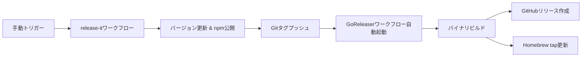

# コントリビューション

## 開発環境のセットアップ

```bash
# 依存関係のインストール
bun install

# すべてのチェックを実行
bun run ci
```

## スクリプト

| コマンド | 説明 |
|---------|-------------|
| `bun run build` | バイナリをビルド |
| `bun run typecheck` | 型チェック |
| `bun run lint` | リントと修正 |
| `bun test` | テストを実行 |
| `bun run ci` | すべてのCIチェック |

## プルリクエストプロセス

1. リポジトリをフォークしてクローン
2. 機能ブランチを作成
3. 変更を加える
4. `bun run ci`を実行
5. プルリクエストを送信

## リリースプロセス

リリースプロセスは2つの専用ワークフローを使用してGitHub Actionsで完全自動化されています：

### 概要



### 1. NPMリリース（release-it）

GitHub Actions経由で手動トリガー：
1. Actions → "Release (npm)" へ移動
2. バージョンタイプを選択（patch/minor/major）
3. ワークフローが以下を実行：
   - すべてのCIチェック
   - package.jsonのバージョン更新
   - CHANGELOG.md生成
   - gitタグの作成とプッシュ
   - npmへの公開

### 2. バイナリリリース（GoReleaser）

release-itがタグをプッシュすると自動的にトリガー：
- 全プラットフォーム用バイナリをビルド（macOS/Linux、x64/ARM）
- バイナリ付きGitHubリリースを作成
- `homebrew-ai-chat-md-export`リポジトリのHomebrewフォーミュラを更新

### 必要なシークレット

Settings → Secrets and variables → Actions で設定：

| シークレット | 説明 | 取得方法 |
|--------|-------------|---------------|
| `NPM_TOKEN` | npm公開用 | npm.com → Access Tokens → Generate (Automation) |
| `HOMEBREW_GITHUB_API_TOKEN` | Homebrew tap更新用 | GitHub → Settings → Developer settings → Personal access tokens → Generate (repoスコープ) |

### 手動リリース（メンテナー向け）

ローカルでリリースが必要な場合：

```bash
# すべてがクリーンであることを確認
bun run ci

# npmへリリース（バイナリリリースも自動的にトリガー）
bun run release -- patch --ci
```

### アーキテクチャの決定

npmとバイナリリリースを別々のワークフローにした理由：
- **release-it**：バージョン管理とnpm公開に特化
- **GoReleaser**：マルチプラットフォームバイナリビルドとHomebrew統合に特化
- 分離により独立したトラブルシューティングが可能
- 各ツールが得意とする機能を最大限活用