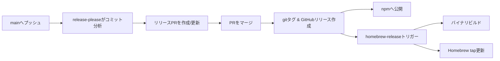
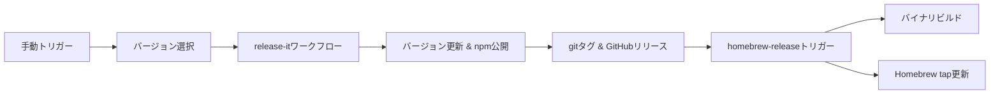

# コントリビューション

## 開発環境のセットアップ

```bash
# 依存関係のインストール
bun install

# すべてのチェックを実行
bun run ci
```

## スクリプト

| コマンド            | 説明               |
| ------------------- | ------------------ |
| `bun run build`     | バイナリをビルド   |
| `bun run typecheck` | 型チェック         |
| `bun run lint`      | リントと修正       |
| `bun test`          | テストを実行       |
| `bun run ci`        | すべてのCIチェック |

## プルリクエストプロセス

1. リポジトリをフォークしてクローン
2. 機能ブランチを作成
3. 変更を加える
4. `bun run ci`を実行
5. プルリクエストを送信

## リリースプロセス

2つの補完的なリリースワークフローを使用しています：

### 1. 自動リリース（主要方式） - release-please

コンベンショナルコミットに基づいて自動的にリリースを管理：



**動作の仕組み：**
- mainブランチへのプッシュごとにトリガー
- コミットメッセージを分析（feat、fixなど）
- 以下を含むリリースPRを作成または更新：
  - 提案されるバージョンアップ
  - 生成されたCHANGELOG
  - 更新されたバージョンファイル
- PRがマージされた時：
  - gitタグとGitHubリリースを作成
  - npmへ公開
  - バイナリビルドをトリガー

### 2. 手動リリース（緊急/特殊ケース） - release-it

即座にコントロールが必要な場合：



**使用方法：**
1. Actions → "Release Manual (npm + GitHub)" へ移動
2. バージョンタイプ（patch/minor/major）または具体的なバージョンを選択
3. ワークフローがすべてを処理

### バイナリリリース（両方の方式で共通）

`homebrew-release`ワークフローは、どちらの方式でもリリースが作成された時に自動的にトリガー：
- 全プラットフォーム用バイナリをビルド（macOS/Linux/Windows、x64/ARM）
- GitHubリリースにバイナリを添付
- `homebrew-tap`リポジトリのHomebrewフォーミュラを更新

### 必要なシークレット

Settings → Secrets and variables → Actions で設定：

| シークレット                | 説明               | 取得方法                                                                                  |
| --------------------------- | ------------------ | ----------------------------------------------------------------------------------------- |
| `NPM_TOKEN`                 | npm公開用          | npm.com → Access Tokens → Generate (Automation)                                           |
| `HOMEBREW_GITHUB_API_TOKEN` | Homebrew tap更新用 | GitHub → Settings → Developer settings → Personal access tokens → Generate (repoスコープ) |

### コミットメッセージのガイドライン

自動リリースが機能するには、コンベンショナルコミットメッセージを使用：

- `feat:` 新機能（マイナーバージョンアップをトリガー）
- `fix:` バグ修正（パッチバージョンアップをトリガー）
- `feat!:` または `fix!:` 破壊的変更（メジャーバージョンアップをトリガー）
- `chore:`、`docs:`、`style:`、`refactor:`、`test:`（バージョンアップなし）

例：
```bash
feat: 新しいチャット形式のサポートを追加
fix: 空の会話配列を処理
feat!: CLI引数構造を変更
```

### リリースプロセスのテスト

実際にリリースせずにリリースプロセスをテストする：

**重要：両方のコマンドともmainブランチを最新の状態にしてから実行すること**

```bash
# まず、mainブランチに切り替えて最新の状態にする
git checkout main
git pull origin main

# release-itが何をするかテスト
bun run release:it:dry-run

# release-pleaseが検出する変更を確認
bun run release:please:dry-run
```

### アーキテクチャの決定

2つのリリース方式を維持：

1. **自動（release-please）**：通常のリリースの主要方式
   - コンベンショナルコミットを分析
   - 変更履歴付きのリリースPRを作成
   - バージョンアップを自動処理
   - 最適な用途：コンベンショナルコミットに従った定期リリース

2. **手動（release-it）**：特殊ケースのバックアップ方式
   - バージョン番号を直接制御
   - 即座のリリース機能
   - 最適な用途：緊急パッチ、特定のバージョン要件

両方の方式が統合：
- **npm**：パッケージ配布
- **GoReleaser**：マルチプラットフォームバイナリビルド
- **Homebrew**：macOS/Linuxパッケージ管理