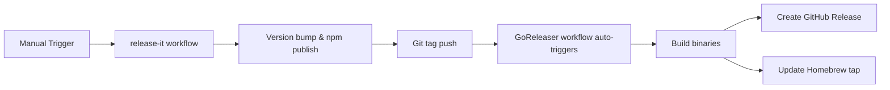

# Contributing

[日本語版](CONTRIBUTING.ja.md)

## Development Setup

```bash
# Install dependencies
bun install

# Run all checks
bun run ci
```

## Scripts

| Command | Description |
|---------|-------------|
| `bun run build` | Build binary |
| `bun run typecheck` | Type check |
| `bun run lint` | Lint and fix |
| `bun test` | Run tests |
| `bun run ci` | Run all CI checks |

## Pull Request Process

1. Fork and clone the repository
2. Create a feature branch
3. Make your changes
4. Run `bun run ci`
5. Submit a pull request

## Release Process

The release process is fully automated using GitHub Actions with two specialized workflows:

### Overview



### 1. NPM Release (release-it)

Triggered manually via GitHub Actions:
1. Go to Actions → "Release (npm)"
2. Choose version type (patch/minor/major)
3. The workflow will:
   - Run all CI checks
   - Bump version in package.json
   - Generate CHANGELOG.md
   - Create and push git tag
   - Publish to npm

### 2. Binary Release (GoReleaser)

Automatically triggered when release-it pushes a tag:
- Builds binaries for all platforms (macOS/Linux, x64/ARM)
- Creates GitHub Release with binaries
- Updates Homebrew formula in `homebrew-ai-chat-md-export` repo

### Required Secrets

Configure these in Settings → Secrets and variables → Actions:

| Secret | Description | How to obtain |
|--------|-------------|---------------|
| `NPM_TOKEN` | For npm publishing | npm.com → Access Tokens → Generate (Automation) |
| `HOMEBREW_GITHUB_API_TOKEN` | For Homebrew tap updates | GitHub → Settings → Developer settings → Personal access tokens → Generate (repo scope) |

### Testing Release Process

To test the release process without actually releasing:

```bash
# Test what would happen during a release
bun run release:dry-run
```

### Manual Release (for maintainers)

If you need to release locally (not recommended):

```bash
# Ensure everything is clean
bun run ci

# Release to npm (will trigger binary release automatically)
bun run release -- patch --ci
```

### Architecture Decision

We use separate workflows for npm and binary releases because:
- **release-it** excels at version management and npm publishing
- **GoReleaser** excels at multi-platform binary builds and Homebrew integration
- Separation allows independent troubleshooting
- Each tool does what it does best