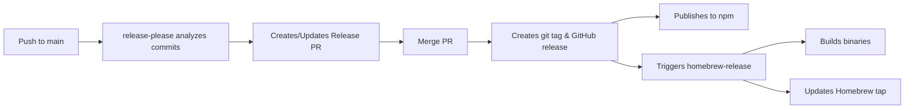
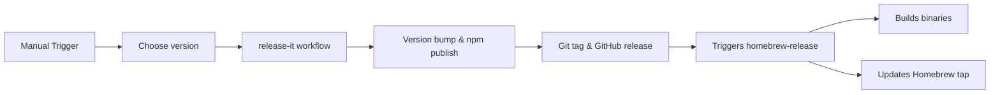

# Contributing

[Japanese](CONTRIBUTING.ja.md)

## Development Setup

```bash
# Install dependencies
bun install

# Run all checks
bun run ci
```

## Scripts

| Command             | Description       |
| ------------------- | ----------------- |
| `bun run build`     | Build binary      |
| `bun run typecheck` | Type check        |
| `bun run lint`      | Lint and fix      |
| `bun test`          | Run tests         |
| `bun run ci`        | Run all CI checks |

## Pull Request Process

1. Fork and clone the repository
2. Create a feature branch
3. Make your changes
4. Run `bun run ci`
5. Submit a pull request

## Release Process

We use two complementary release workflows:

### 1. Automatic Release (Primary Method) - release-please

Automatically manages releases based on conventional commits:



**How it works:**
- Triggered on every push to main branch
- Analyzes commit messages (feat, fix, etc.)
- Creates or updates a Release PR with:
  - Proposed version bump
  - Generated CHANGELOG
  - Updated version files
- When PR is merged:
  - Creates git tag and GitHub release
  - Publishes to npm
  - Triggers binary builds

### 2. Manual Release (Emergency/Special Cases) - release-it

For when you need immediate control:



**How to use:**
1. Go to Actions → "Release Manual (npm + GitHub)"
2. Choose version type (patch/minor/major) or specify exact version
3. The workflow will handle everything

### Binary Release (Common to Both Methods)

The `homebrew-release` workflow automatically triggers when either method creates a release:
- Builds binaries for all platforms (macOS/Linux/Windows, x64/ARM)
- Attaches binaries to the GitHub Release
- Updates Homebrew formula in `homebrew-tap` repo

### Required Secrets

Configure these in Settings → Secrets and variables → Actions:

| Secret                      | Description              | How to obtain                                                                           |
| --------------------------- | ------------------------ | --------------------------------------------------------------------------------------- |
| `NPM_TOKEN`                 | For npm publishing       | npm.com → Access Tokens → Generate (Automation)                                         |
| `HOMEBREW_GITHUB_API_TOKEN` | For Homebrew tap updates | GitHub → Settings → Developer settings → Personal access tokens → Generate (repo scope) |

### Commit Message Guidelines

For automatic releases to work, use conventional commit messages:

- `feat:` New features (triggers minor version bump)
- `fix:` Bug fixes (triggers patch version bump)
- `feat!:` or `fix!:` Breaking changes (triggers major version bump)
- `chore:`, `docs:`, `style:`, `refactor:`, `test:` (no version bump)

Examples:
```bash
feat: add support for new chat format
fix: handle empty conversation arrays
feat!: change CLI argument structure
```

### Testing Release Process

To test the release process without actually releasing:

**Important: Both commands should be run from the main branch with latest changes**

```bash
# First, ensure you're on main branch with latest changes
git checkout main
git pull origin main

# Test what release-it would do
bun run release:it:dry-run

# Test what release-please would detect
bun run release:please:dry-run
```

### Architecture Decision

We maintain two release methods:

1. **Automatic (release-please)**: Primary method for routine releases
   - Analyzes conventional commits
   - Creates release PRs with changelogs
   - Handles version bumps automatically
   - Best for: Regular releases following conventional commits

2. **Manual (release-it)**: Backup method for special cases
   - Direct control over version numbers
   - Immediate release capability
   - Best for: Emergency patches, specific version requirements

Both methods integrate with:
- **npm**: Package distribution
- **GoReleaser**: Multi-platform binary builds
- **Homebrew**: macOS/Linux package management