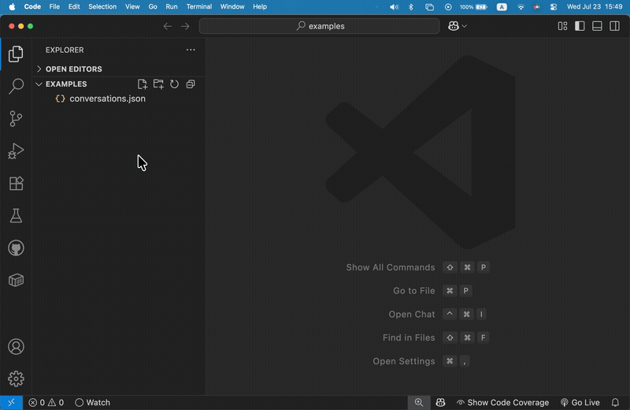

# ai-chat-md-export

[](https://www.npmjs.com/package/ai-chat-md-export)
[](https://github.com/sugurutakahashi-1234/homebrew-tap)
[](https://www.npmjs.com/package/ai-chat-md-export)
[](https://bundlephobia.com/package/ai-chat-md-export)
[](https://github.com/sugurutakahashi-1234/ai-chat-md-export/actions/workflows/ci-push-main.yml)
[](https://codecov.io/gh/sugurutakahashi-1234/ai-chat-md-export)
[](https://opensource.org/licenses/MIT)
[](https://github.com/sugurutakahashi-1234/ai-chat-md-export/actions/workflows/cd-npm-release.yml)
[](https://github.com/sugurutakahashi-1234/ai-chat-md-export/releases)
[](https://github.com/sugurutakahashi-1234/ai-chat-md-export/pulls)

ChatGPTとClaudeのチャット履歴を読みやすいMarkdownファイルに変換



[English](README.md) | [日本語](README.ja.md) | [简体中文](README.zh-CN.md)

## Table of Contents

- [What is ai-chat-md-export?](#what-is-ai-chat-md-export)
- [Quick Start](#quick-start)
- [Installation](#installation)
- [Usage](#usage)
- [Command-line Options](#command-line-options)
- [Getting conversations.json](#getting-conversationsjson)
- [Troubleshooting](#troubleshooting)
- [Roadmap](#roadmap)
- [Contributing](#contributing)
- [Contact](#contact)
- [License](#license)

## What is ai-chat-md-export?

`ai-chat-md-export`は、ChatGPTとClaudeの会話を整理された読みやすいMarkdownファイルに変換する**プライバシー最優先**のCLIツールです。完全にオフラインで動作します。

### 🔒 Privacy-First Design

このツールはお使いのデバイス上でローカルに動作します：

- **ローカル処理** - ファイルをお使いのマシン上で直接変換
- **データ送信なし** - 会話データはデバイス外に出ません
- **オープンソース** - [コード](https://github.com/sugurutakahashi-1234/ai-chat-md-export)を確認して、何をしているか正確に把握できます

AI会話を自分の管理下に置きたいプライバシーを重視するユーザー向けのシンプルなツールです。

### Key Features

- 🚀 **高速で効率的** - 数千の会話を数秒で処理
- 📝 **クリーンなMarkdown出力** - タイムスタンプと視覚的マーカー付きの整形されたファイル
- 🔍 **高度なフィルタリング** - 日付範囲、キーワードでフィルタ
- 📅 **スマートな整理** - サニタイズされた会話タイトルで日付別にファイル名を付与
- 💻 **クロスプラットフォーム** - Windows、macOS、Linuxで利用可能

### Why Use This Tool?

- **プレーンテキストで扱える** - お気に入りのテキストエディタ、grep、あらゆるテキスト処理ツールを使用可能
- **データを完全にコントロール** - 標準ツールで編集、検索、バージョン管理、分析が可能
- **AI会話を保存** - 消失や削除前に永続的な記録を保持
- **ワークフローに統合** - スクリプトで処理、ノートアプリにインポート、カスタムツールで分析

## Quick Start

```bash
# 1. ツールをインストール
npm install -g ai-chat-md-export

# 2. ChatGPTまたはClaudeから会話をエクスポート
# → conversations.jsonファイルを取得（下記の「Getting conversations.json」セクション参照）

# 3. Markdownに変換
ai-chat-md-export -i conversations.json -p chatgpt
```

これで完了！会話が整理され、検索可能なMarkdownファイルになりました。

### Example Output

上記のコマンドを実行すると、次のようなファイルが生成されます：

```
2025-01-15_Math_Question.md
2025-01-16_Recipe_Help.md
```

各ファイルには、タイムスタンプ、ユーザー/アシスタントマーカー、整形された会話が含まれています。

## What You'll Get

複雑なJSONエクスポートをクリーンで読みやすいMarkdownに変換：

### Input (conversations.json from ChatGPT)
```json
{
  "title": "Hello World",
  "create_time": 1736899200,
  "mapping": {
    "msg-1": {
      "message": {
        "author": { "role": "user" },
        "content": {
          "parts": ["こんにちは！元気ですか？"]
        }
      }
    },
    "msg-2": {
      "message": {
        "author": { "role": "assistant" },
        "content": {
          "parts": ["こんにちは！元気です、ありがとうございます。今日はどのようなお手伝いができますか？"]
        }
      }
    }
  }
}
```

### → Output (2025-01-15_Hello_World.md)
```markdown
# Hello World
Date: 2025-01-15 18:00:00 +09:00

---

## 👤 User
Date: 2025-01-15 18:00:00 +09:00

こんにちは！元気ですか？

---

## 🤖 Assistant
Date: 2025-01-15 18:00:10 +09:00

こんにちは！元気です、ありがとうございます。今日はどのようなお手伝いができますか？

---
```

✨ **特徴**: クリーンなフォーマット • タイムスタンプ • 視覚的マーカー • コードブロックと書式を保持

## Installation

### Homebrew (macOS/Linux)

```bash
brew tap sugurutakahashi-1234/tap
brew install ai-chat-md-export
```

### npm

```bash
npm install -g ai-chat-md-export
```

### Direct Download (Windows / Others)

ビルド済みバイナリは[リリースページ](https://github.com/sugurutakahashi-1234/ai-chat-md-export/releases/latest)から入手できます。

#### Windows
1. [ai-chat-md-export-windows-amd64.zip](https://github.com/sugurutakahashi-1234/ai-chat-md-export/releases/latest/download/ai-chat-md-export-windows-amd64.zip)をダウンロード
2. ZIPファイルを展開
3. 展開したフォルダをPATHに追加するか、直接実行:
   ```cmd
   ai-chat-md-export.exe -i conversations.json -p chatgpt
   ```

#### macOS / Linux
リリースページから適切な`.tar.gz`ファイルをダウンロードしてください。


## Usage

```bash
# 基本: conversations.jsonをMarkdownファイルに変換
ai-chat-md-export -i conversations.json -p chatgpt

# 出力ディレクトリを指定
ai-chat-md-export -i conversations.json -o output/ -p chatgpt

# 日付やキーワードでフィルタ
ai-chat-md-export -i conversations.json -p chatgpt --since 2024-01-01 --search "Python"

# JSON形式でエクスポート
ai-chat-md-export -i conversations.json -p claude -f json

# すべての会話を1つのファイルにまとめる
ai-chat-md-export -i conversations.json -p chatgpt --no-split
```

その他の例については、[examples](examples/)ディレクトリを参照してください。

## Command-line Options

| オプション                       | 説明                                                              | デフォルト |
| -------------------------------- | ----------------------------------------------------------------- | ---------- |
| `-h, --help`                     | ヘルプ情報を表示                                                  | -          |
| `-v, --version`                  | バージョン番号を表示                                              | -          |
| `-i, --input <path>`             | 入力ファイルパス（必須）                                          | -          |
| `-p, --platform <platform>`      | 入力プラットフォーム（`chatgpt`/`claude`）（必須）                | -          |
| `-o, --output <path>`            | 出力ディレクトリ                                                  | `.`        |
| `-f, --format <format>`          | 出力フォーマット（`markdown`/`json`）                             | `markdown` |
| `--since <date>`                 | 開始日でフィルタ（YYYY-MM-DD）                                    | -          |
| `--until <date>`                 | 終了日でフィルタ（YYYY-MM-DD）                                    | -          |
| `--search <keyword>`             | 会話内を検索。大文字小文字を区別せず、タイトルとメッセージを検索  | -          |
| `--filename-encoding <encoding>` | ファイル名エンコーディング（`standard`/`preserve`）               | `standard` |
| `--no-split`                     | すべての会話を1つのファイルにまとめる（デフォルト：ファイル分割） | -          |
| `--dry-run`                      | ファイルを作成せずにプレビューモード                              | -          |
| `-q, --quiet`                    | 進捗メッセージを抑制                                              | -          |

## Getting conversations.json

ChatGPTとClaudeはどちらも、チャット履歴を`conversations.json`ファイルとしてエクスポートできます。このファイルには、すべての会話が構造化された形式で含まれており、本ツールで処理できます。

### Export from ChatGPT (OpenAI)

1. ChatGPT (https://chat.openai.com) にログイン
2. プロフィール画像をクリック → Settings
3. 左メニューから「Data Controls」を開く
4. 「Export Data」→「Export」をクリック
5. 「Confirm export」をクリックして確認
6. 数分以内に「Your ChatGPT data export is ready」というメールが届きます
7. メールのリンクから`chatgpt-data.zip`をダウンロード（24時間で期限切れ）
8. ZIPファイルを展開すると、ルートディレクトリに`conversations.json`が含まれています

注意：ダウンロードリンクは24時間後に期限切れになるため、速やかにダウンロードしてください。

### Export from Claude (Anthropic)

1. Claude (https://claude.ai) にログイン
2. 左下のイニシャルをクリック → Settings
3. 「Privacy」タブを開く（エンタープライズの場合は「Data management」）
4. 「Export data」をクリックして確認
5. 数分以内に「Your Claude data export is ready」というメールが届きます
6. `claude-export.dms`またはZIPファイルをダウンロード
7. `.dms`ファイルを受け取った場合は、`.zip`にリネームして展開
8. ルートディレクトリに`conversations.json`が含まれています

## Troubleshooting

### Large files taking too long to process
非常に大きな会話履歴の場合：
- `--since`と`--until`を使用して特定の日付範囲を処理
- メモリ不足の場合は、一度に1つのファイルを処理
- `--search`を使用して関連する会話のみを抽出

### Character encoding issues
出力に文字化けが表示される場合：
- ターミナルがUTF-8エンコーディングをサポートしていることを確認
- `conversations.json`ファイルが適切にエンコードされていることを確認

ファイル名エンコーディングの問題については：
- `--filename-encoding standard`（デフォルト）：オペレーティングシステム間で最大の互換性を持つようにファイル名をサニタイズ
- `--filename-encoding preserve`：会話タイトルから元の文字を保持しますが、特殊文字を含む場合は一部のシステムで問題が発生する可能性があります

### Missing conversations
一部の会話が出力に表示されない場合：
- エクスポート日を確認 - エクスポート日までの会話のみが含まれます
- JSON構造がChatGPTまたはClaudeの形式と一致することを確認
- `--dry-run`を使用してどの会話が変換されるかをプレビュー

## Roadmap

### ✅ Completed Features

- [x] ChatGPT会話エクスポート対応
- [x] Claude会話エクスポート対応
- [x] 自動フォーマット検出
- [x] 日付範囲フィルタリング（`--since`、`--until`）
- [x] キーワード検索機能（`--search`）
- [x] タイムゾーン対応のタイムスタンプ変換
- [x] ドライランモード（`--dry-run`）
- [x] JSON形式へのエクスポート（`-f json`）
- [x] 会話を1つのファイルにまとめる（`--no-split`）
- [x] npmパッケージ配布
- [x] Homebrewフォーミュラサポート

### 📋 Planned Features

- [ ] **JSONストリーミング処理** - 大きなファイルをメモリに全て読み込まずに処理

## Contributing

コントリビューションを歓迎します！開発環境のセットアップ、テストガイドライン、プルリクエストの提出方法については、[CONTRIBUTING.md](CONTRIBUTING.md)を参照してください

## Contact

ご質問やフィードバックがございましたら、X/Twitterでお気軽にご連絡ください: [@ikuraikuraaaaaa](https://x.com/ikuraikuraaaaaa)

## License

MIT © [Suguru Takahashi](https://github.com/sugurutakahashi-1234)