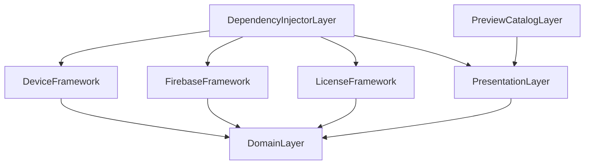
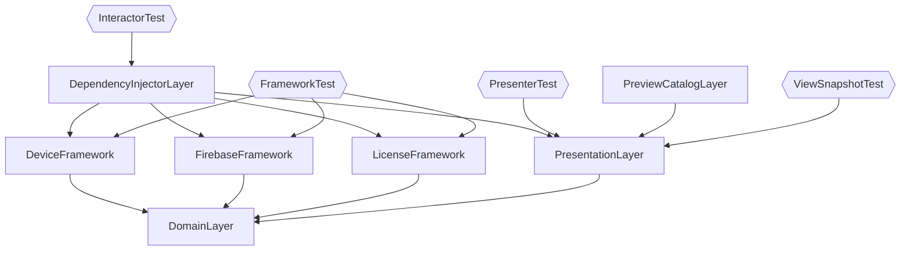
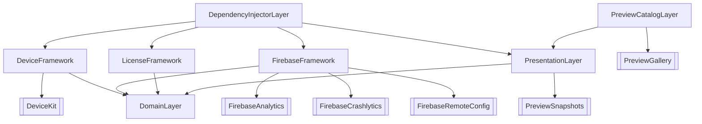
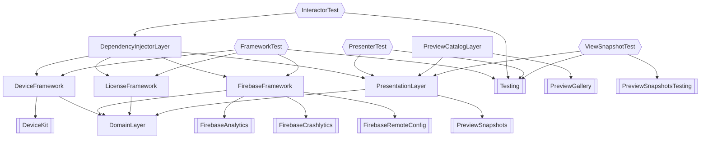

# Mermaidファイルを分割

Date: 2024-03-22

---

## 👤 User
*2024-03-22 14:35:56*

READMEに以下に4つのmermaidファイルがあるが別ファイルに分けたい
。
# DISample

## Swift-DocC

- [Domainlayer](https://sugurutakahashi-1234.github.io/DISample/documentation/domainlayer/)

## Swift Package Manager Dependencies Diagrams

### My Targets



### Including Test Targets



### Including Library



### Including All



---

## 🤖 Assistant
*2024-03-22 14:36:32*

READMEファイルに含まれる4つのMermaidファイルを別ファイルに分けるためには、各Mermaidコードを個別のファイルに移動し、それぞれを参照する方法をREADMEに記述する必要があります。以下はその手順です：

1. **個別のMermaidファイルを作成する**
   - それぞれのMermaid図を別々のファイルに保存します。ファイルの拡張子は `.mmd` とすることが一般的です。例えば、`my_targets.mmd`, `including_test_targets.mmd`, `including_library.mmd`, そして `including_all.mmd` というファイル名が考えられます。

2. **ファイル内容の例**
   - `my_targets.mmd` ファイルの内容は、"My Targets"のMermaidコードになります。
     ```
     flowchart TD
         DependencyInjectorLayer-->DeviceFramework
         DependencyInjectorLayer-->FirebaseFramework
         DependencyInjectorLayer-->LicenseFramework
         DependencyInjectorLayer-->PresentationLayer
         DeviceFramework-->DomainLayer
         DomainLayer
         FirebaseFramework-->DomainLayer
         LicenseFramework-->DomainLayer
         PresentationLayer-->DomainLayer
         PreviewCatalogLayer-->PresentationLayer
     ```
   - 他のファイルも同様に、それぞれの図に対応するMermaidコードを保存します。

3. **READMEに参照を追加する**
   - これらのファイルをGitHubなどのプラットフォームにアップロードした後、README.mdファイル内でこれらのファイルへのリンクを提供します。Markdownを使用して、以下のように記述することができます。

     ```
     ## Swift Package Manager Dependencies Diagrams

     ### My Targets

     [My Targets Diagram](path/to/my_targets.mmd)

     ### Including Test Targets

     [Including Test Targets Diagram](path/to/including_test_targets.mmd)

     ### Including Library

     [Including Library Diagram](path/to/including_library.mmd)

     ### Including All

     [Including All Diagram](path/to/including_all.mmd)
     ```

   - `path/to/`は、実際のファイルが置かれているパスに置き換えてください。GitHubの場合、ファイルがリポジトリ内にある場合はそのリポジトリ内のパスを使用します。

このようにすることで、READMEファイルをすっきりと整理し、各Mermaid図へのアクセスを直接提供することができます。また、必要に応じてこれらのMermaidファイルを編集や更新が簡単になります。

---

## 👤 User
*2024-03-22 14:38:12*

README の md ファイルだったたり、mmd ファイルのフォルダ構成の大堂があれば教えていただきたいです。

---

## 👤 User
*2024-03-22 14:38:48*

既に docs が存在しているんだ。

---

## 👤 User
*2024-03-22 14:39:23*

docs の他にreadme専用フォルダを作りたい

---

## 🤖 Assistant
*2024-03-22 14:39:54*

既に`docs`フォルダが存在し、README専用のフォルダを作成したい場合、プロジェクトの構造と文書の整理に役立つ清潔で効果的なフォルダ構成を提案します。ここでは、`readme-assets`という名前の新しいフォルダをREADMEの資材用に作成し、その中にさらに細分化した構造を設計します。以下は一例です。

```
プロジェクトルート/
│
├── docs/
│   └── ... (既存のdocsフォルダの内容)
│
├── readme-assets/ (新しいREADME専用フォルダ)
│   ├── diagrams/ (Mermaid図などの図表を保存するためのフォルダ)
│   │   ├── my_targets.mmd
│   │   ├── including_test_targets.mmd
│   │   ├── including_library.mmd
│   │   └── including_all.mmd
│   │
│   └── images/ (READMEで使用する画像ファイルを保存するフォルダ)
│       └── ... (画像ファイル)
│
└── README.md (プロジェクトのREADMEファイル)
```

この構造により、プロジェクトのドキュメントとREADMEに関連する資材を明確に区別し、整理することができます。特に、`readme-assets`フォルダ内に`diagrams`と`images`の二つのサブフォルダを設定することで、図表と画像資材を分かりやすく管理できます。

README.mdファイルからこれらの資材にリンクする際は、相対パスを使用して参照します。例えば、`my_targets.mmd`へのリンクを以下のように記述できます。

```markdown
[My Targets Diagram](readme-assets/diagrams/my_targets.mmd)
```

この方法を使うと、プロジェクトのドキュメントがよりナビゲートしやすく、メンテナンスしやすいものになります。また、将来的にREADMEに更に多くの資材を追加する場合でも、この構造を基に簡単に拡張することができます。

---
