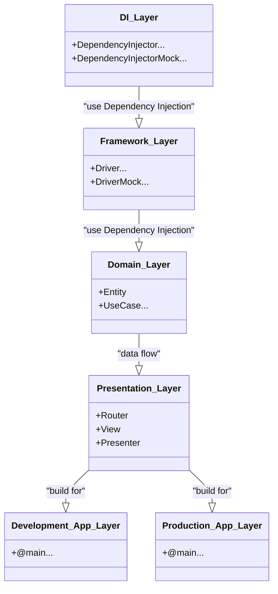

# MermaidでUMLを作成

日付: 2024-04-10

---

## 👤 ユーザー
*2024/4/10 10:50:07*

このUMLをmermaidで記述してほしい。

---

## 🤖 アシスタント
*2024/4/10 10:52:32*

ファイルを確認し、その内容に基づいてMermaidでの記述を行います。少々お待ちください。

---

## 🤖 アシスタント
*2024/4/10 10:52:32*

ファイルの内容から、いくつかのラベルとそれらが指し示す可能性のある関係を抽出しました。Mermaid記法によるUML表現を作成するには、これらのラベル間の関係（例えば、継承、依存、アソシエーションなど）を理解する必要があります。

ここで見つかったラベルには、複数のレイヤーやクラス、プロトコル、関数、およびいくつかの操作（例えば、「create」、「hold」、「use Dependency Injection」）が含まれます。これらの情報から、特定のレイヤーやクラスがどのように相互作用するかについての簡単なMermaid記述を試みます。

MermaidでのUML図の記述は通常、クラスやコンポーネントの関係を中心に構成されます。しかし、具体的な関係性や構造が文書から直接読み取れないため、以下に示す記述はあくまで推測に基づいた一例です。

### Mermaid記述例

この例では、レイヤー間の一般的な関係を表現していますが、具体的な操作やプロトコルの詳細（例えば、`<<protocol>>`で示されるインターフェイス）は含まれていません。また、"adopt"や"hold"などの操作をどのように表現するかはMermaidの文脈によって異なります。Mermaidは通常、クラスの関係性を中心に記述するため、動的な動作やメソッドの呼び出しを詳細に表現するのは限界があります。

---

## 👤 ユーザー
*2024/4/10 10:54:13*

{
  "content_type": "image_asset_pointer",
  "asset_pointer": "file-service://file-alFE2V2HOJTyqWteddf9oPrg",
  "size_bytes": 68307,
  "width": 522,
  "height": 679,
  "fovea": null,
  "metadata": null
}
これをMermaidで記述してほしい。

---

## 🤖 アシスタント
*2024/4/10 10:55:23*

UML図の内容を見て、Mermaidの文法で記述しますので、少々お待ちください。

---

## 🤖 アシスタント
*2024/4/10 10:55:23*

OCR処理中にエラーが発生しました。環境に日本語の言語データが存在しないようです。このため、画像からテキストの抽出ができませんでした。MermaidでのUML記述を進めるには、図に含まれる要素とその関係を別の方法で把握する必要があります。

画像を直接見て解析することはできないため、手動で画像の内容を教えていただけますか？例えば、各要素（クラスやインターフェースなど）とその関連性（継承、関連、依存など）を具体的に指定していただければ、Mermaid構文で表現することができます。

---

## 👤 ユーザー
*2024/4/10 10:55:51*

{
  "content_type": "image_asset_pointer",
  "asset_pointer": "file-service://file-AUqjBzTe2VT4ontKEeap7paf",
  "size_bytes": 252187,
  "width": 1290,
  "height": 1642,
  "fovea": null,
  "metadata": null
}
これでも読み込めない？

---

## 🤖 アシスタント
*2024/4/10 10:56:07*

画像ファイルの内容は直接読み取ることはできませんが、アップロードされた画像の名前から図が表示されていることがわかります。もし画像からMermaid記法でUML図を作成するための具体的な内容を教えていただければ、それに基づいてMermaidのコードを手動で書くことができます。例えば、どのクラスが存在して、それらがどのように関連しているのか（継承、依存、アソシエーションなど）を教えてください。

---
