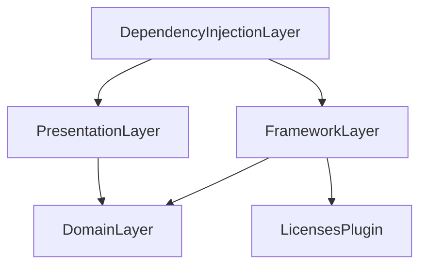

# フレームワークに関する説明

日付: 2024-04-23

---

## 👤 ユーザー
*2024/4/23 17:10:31*

{
  "content_type": "image_asset_pointer",
  "asset_pointer": "file-service://file-r11Yv6rzhHgh5aedn6V4RZNn",
  "size_bytes": 50173,
  "width": 533,
  "height": 603,
  "fovea": null,
  "metadata": null
}
{
  "content_type": "image_asset_pointer",
  "asset_pointer": "file-service://file-376AqK73C5Hn39T9A6bjT0tY",
  "size_bytes": 88581,
  "width": 527,
  "height": 519,
  "fovea": null,
  "metadata": null
}
ここの説明のどこかにここでの Framework-Independent の Framework は図での Framework Layer を表しており、Clean Architecture の最も外側のレイヤーに該当し、Data Access Layer やInfrastructure Layer とも呼ばれる旨を記述してほしい。

```
# Framework-Independent Architecture (FIA)

## 概要

Framework-Independent Architecture（FIA）は、Swift でのアプリ開発における Swift Package Manager を用いたマルチモジュール、マルチプロジェクト構成を取り入れ、Clean Architecture の設計概念をベースにしたアーキテクチャです。

FIA を採用する主な目的は、Clean Architecture に由来する独立性とテスタビリティといったメリットを享受しつつ、Xcode でのビルド時間を短縮することにあります。

FIA では、アプリケーションのエントリーポイントにおける依存性の注入により、プレゼンテーション層だけではなくアプリケーション層にもクリーンな領域を保持することを可能にしています。

これによりフレームワーク層に依存しない高速なアプリケーションビルドが可能となり、Xcode でのビルド作業の時間短縮に寄与し、全体的な開発体験の向上が期待できます。

## FIA のアーキテクチャの概観

FIA のアーキテクチャ全体像と依存関係の方向性を以下の図に示します。特に、開発用のアプリケーションレイヤーまで拡張されたクリーンな領域が視覚的に表現されています。

<div align="center">

</div>

次に示す円形の図は、FIA のアーキテクチャでの依存関係が内側への方向に限定されていることを示しています。

<div align="center">

</div>
```

---

## 🤖 アシスタント
*2024/4/23 17:12:25*

Framework-Independent Architecture（FIA）では、"Framework"という用語は、上記の図における"Framework Layer"を指しています。これはClean Architectureの最も外側のレイヤーに相当し、データアクセス層（Data Access Layer）やインフラストラクチャ層（Infrastructure Layer）とも呼ばれます。FIAはこのフレームワーク層を非クリーンな領域として位置付け、アプリケーション層の生産的な開発をサポートしています。

FIAの特徴は、開発（Development）と本番（Production）のアプリケーション層が異なることを許容し、依存性の注入（DI）を通してこれらのレイヤー間の独立性を確保しています。これにより、外部フレームワークやサードパーティ製ライブラリの影響を受けずに、より柔軟で、テスト可能で、再利用可能なコードベースを実現することを目指しています。

したがって、FIAはSwiftやXcodeを利用したアプリケーション開発において、ビルドの時間短縮や開発の効率化を実現するためのアーキテクチャとして設計されています。

---

## 👤 ユーザー
*2024/4/23 17:30:28*

どこに挿入される文章？

---

## 🤖 アシスタント
*2024/4/23 17:31:47*

申し訳ありませんが、どちらの文書に挿入するかの明示がございませんでした。下記の段落を適切な場所に挿入することを提案します。この段落は、図に示されている「Framework」の用語が指しているのが「Framework Layer」であることと、Clean Architectureにおけるその役割を説明しています。

---

FIA では、"Framework" という用語は、アーキテクチャの概要図で示されている "Framework Layer" を指しており、Clean Architecture の最も外側のレイヤーに相当します。このレイヤーは、データアクセス層（Data Access Layer）やインフラストラクチャ層（Infrastructure Layer）とも呼ばれ、アプリケーションの外部フレームワークやデータベース、ネットワークなどの詳細に依存する部分です。FIA ではこのレイヤーを非クリーン領域として区分し、開発（Development）用と本番（Production）用のアプリケーションレイヤーの間にDIレイヤーを通じて橋渡しを行うことで、ビルド時間の短縮とテスタビリティの向上を目指しています。

---

この段落は「FIA のアーキテクチャの概観」の下、図とその説明の直前に挿入することを推奨します。これにより、読者は視覚的な図表を確認する前に、FIA のコンセプトに関する重要な前提知識を得ることができます。

---

## 👤 ユーザー
*2024/4/23 17:33:44*

もう少し自然な日本語にしてほしい。

FIA では、"Framework" という用語は、アーキテクチャの概要図で示されている "Framework Layer" を指しており、Clean Architecture の最も外側のレイヤーに相当します。このレイヤーは、データアクセス層（Data Access Layer）やインフラストラクチャ層（Infrastructure Layer）とも呼ばれ、アプリケーションの外部フレームワークやデータベース、ネットワークなどの詳細に依存する部分です。FIA ではこのレイヤーを非クリーン領域として区分し、開発（Development）用と本番（Production）用のアプリケーションレイヤーの間にDIレイヤーを通じて橋渡しを行うことで、ビルド時間の短縮とテスタビリティの向上を目指しています。

---

## 🤖 アシスタント
*2024/4/23 17:34:31*

FIAにおける「Framework」という語は、概観図において「Framework Layer」を示しており、Clean Architectureの構造における最も外側の層を表します。この層は、データアクセス層やインフラストラクチャ層としても知られており、アプリケーションが外部フレームワークやデータベース、ネットワークなどの具体的な実装に依存する部分を担っています。FIAはこのフレームワーク層をクリーンでない領域として明確に分け、開発用と本番用のアプリケーション層をつなぐためにDI層を設けています。これにより、ビルド時間の削減とテストのしやすさを実現しようとしています。

---

## 👤 ユーザー
*2024/4/24 16:20:24*

以下を読んで、修正した方がいい点を教えてほしい。

```
# Framework-Independent Architecture (FIA)

## Overview

Framework-Independent Architecture（FIA）は、Swift でのアプリ開発における Swift Package Manager を用いたマルチモジュール、マルチプロジェクト構成を取り入れ、Clean Architecture の設計概念をベースにしたアーキテクチャです。

FIA を採用する主な目的は、Clean Architecture に由来する独立性とテスタビリティといったメリットを享受しつつ、Xcode でのビルド時間を短縮することにあります。

FIA では、アプリケーションのエントリーポイントにおける依存性の注入により、プレゼンテーション層だけではなくアプリケーション層にもクリーンな領域を保持することを可能にしています。

これによりフレームワーク層に依存しない高速なアプリケーションビルドが可能となり、Xcode でのビルド作業の時間短縮に寄与し、全体的な開発体験の向上が期待できます。

FIA のアーキテクチャ全体像および依存関係の方向性は以下の図で示しています。特に、開発用のアプリケーションレイヤーまで拡張されたクリーンな領域が視覚的に表現されています。

<div align="center">

</div>

次に示す円形の図は、FIA のアーキテクチャでの依存関係が内側への方向に限定されていることを示しています。

<div align="center">

</div>

FIA では、"Framework" という用語は、図で示されている "Framework Layer" を指しており、Clean Architecture の最も外側のレイヤーに相当します。このレイヤーは、データアクセス層 (Data Access Layer) やインフラストラクチャ層 (Infrastructure Layer) とも呼ばれ、外部フレームワークやデータベース、ネットワーク疎通などの詳細に依存する部分です。FIA ではこのレイヤーを非クリーン領域として区分し、開発用と本番用のアプリケーションレイヤーの間に DI レイヤーを通じて橋渡しを行うことで、ビルド時間の短縮とテスタビリティの向上を目指しています。

## Swift Package Manager による FIA の実現

Swfit Package Manager の登場によって、[isowords](https://github.com/pointfreeco/isowords) に見られるように、アプリケーションをマルチモジュールやマルチプロジェクト構成へ簡単に適用できるようになりました。

Swift Package Manager におけるモジュールの分割は通常、機能に応じて行われますが、FIA では Clean Architecture の設計概念に基づいて、各レイヤーごとにモジュールを分割する手法を採用しています。

また、Package.swift での依存関係の記述を通じて、Swift Package Manager はモジュール間の依存方向の管理を容易に行うことができます。
この点で、依存の方向を重視する Clean Architecture との相性が良く、Swift Package Manager は Clean Architecture を実現するのに適していると言えるでしょう。

さらに、FIA ではアプリケーションのエントリーポイントで依存性を注入することにより、適切な DI コンテナを選択することが可能です。
これにより、マルチプロジェクト構成を活用して、フレームワーク層に依存しないモックの DI コンテナを使用する開発用プロジェクトと、フレームワーク層に依存する実際の DI コンテナを使用する本番用プロジェクトをそれぞれ設定できます。

開発用のプロジェクトでは、Firebase SDKのようなビルド時間が長い外部ライブラリに依存せず、アプリケーションのビルド時間を大幅に短縮することができます。
この効果は、Xcode Previews のビルド速度の向上にも寄与します。
```

---

## 🤖 アシスタント
*2024/4/24 16:22:33*

ドキュメントは概ね良く書かれていますが、以下にいくつかの提案を行います。これらの提案は文書の明確さを増すため、及び技術的な正確性と言語の自然さを向上させるためのものです。

1. "Swfit Package Manager" を "Swift Package Manager" に修正してください。タイポがあります。
2. "Framework-Independent Architecture（FIA）は、Swift でのアプリ開発における Swift Package Manager を用いたマルチモジュール、マルチプロジェクト構成を取り入れ、Clean Architecture の設計概念をベースにしたアーキテクチャです。" この部分は、文が長くなっているため、2文に分けても良いかもしれません。
   例えば: "Framework-Independent Architecture（FIA）は、Swift でのアプリ開発における新たなアプローチです。Swift Package Manager を用いたマルチモジュール、マルチプロジェクト構成に加えて、Clean Architecture の設計概念に基づいています。"
3. "依存の方向" という言葉は "依存関係の方向性" に変更すると、より技術的な正確さが増します。
4. "開発用のプロジェクトでは、Firebase SDKのようなビルド時間が長い外部ライブラリに依存せず" この部分で、"Firebase SDK"は具体的な例を挙げていますが、もし文書が一般的な説明を目指しているのであれば、このような具体的な名前は避け、"ビルド時間が長い外部ライブラリ"という形にするか、一例として明記したほうが良いかもしれません。
   例えば: "開発用のプロジェクトでは、Firebase SDKのような一例として挙げると、ビルド時間が長い外部ライブラリに依存しないことで..."
5. "FIA では、"Framework" という用語は" の部分は、もう少し自然な流れになるように調整することをお勧めします。
   例えば: "図中の 'Framework Layer' に言及されている 'Framework' は、Clean Architecture の外側のレイヤー、すなわちデータアクセス層やインフラストラクチャ層を指します。"
6. "ネットワーク疎通"よりも、"ネットワーク通信"の方が一般的な表現です。

これらの修正により、文書がより洗練され、技術的な情報が明確かつ正確に伝えられるようになるでしょう。

---

## 👤 ユーザー
*2024/4/24 16:24:09*

もう一度確認してほしい

```
## Overview

Framework-Independent Architecture（FIA）は、Swift でのアプリ開発における Swift Package Manager を用いたマルチモジュール、マルチプロジェクト構成を取り入れ、Clean Architecture の設計概念をベースにしたアーキテクチャです。

FIA を採用する主な目的は、Clean Architecture に由来する独立性とテスタビリティといったメリットを享受しつつ、Xcode でのビルド時間を短縮することにあります。

FIA では、アプリケーションのエントリーポイントにおける依存性の注入により、プレゼンテーション層だけではなくアプリケーション層にもクリーンな領域を保持することを可能にしています。

これによりフレームワーク層に依存しない高速なアプリケーションビルドが可能となり、Xcode でのビルド作業の時間短縮に寄与し、全体的な開発体験の向上が期待できます。

FIA のアーキテクチャ全体像および依存関係の方向性は以下の図で示しています。特に、開発用のアプリケーションレイヤーまで拡張されたクリーンな領域が視覚的に表現されています。

<div align="center">

</div>

次に示す円形の図は、FIA のアーキテクチャでの依存関係が内側への方向に限定されていることを示しています。

<div align="center">

</div>

Framework-Independent Architecture の、"Framework" という用語は、図で示されている "Framework Layer" を指しており、Clean Architecture の最も外側のレイヤーに相当します。このレイヤーは、データアクセス層 (Data Access Layer) やインフラストラクチャ層 (Infrastructure Layer) とも呼ばれ、外部フレームワークやデータベース、ネットワーク通信などの詳細に依存する部分です。FIA ではこのレイヤーを非クリーン領域として区分し、開発用と本番用のアプリケーションレイヤーの間に DI レイヤーを通じて橋渡しを行うことで、ビルド時間の短縮とテスタビリティの向上を目指しています。

## Swift Package Manager による FIA の実現

Swift Package Manager の登場によって、[isowords](https://github.com/pointfreeco/isowords) に見られるように、アプリケーションをマルチモジュールやマルチプロジェクト構成へ簡単に適用できるようになりました。

Swift Package Manager におけるモジュールの分割は通常、機能に応じて行われますが、FIA では Clean Architecture の設計概念に基づいて、各レイヤーごとにモジュールを分割する手法を採用しています。

また、Package.swift での依存関係の記述を通じて、Swift Package Manager はモジュール間の依存方向の管理を容易に行うことができます。
この点で、依存関係の方向性を重視する Clean Architecture との相性が良く、Swift Package Manager は Clean Architecture を実現するのに適していると言えるでしょう。

さらに、FIA ではアプリケーションのエントリーポイントで依存性を注入することにより、適切な DI コンテナを選択することが可能です。
これにより、マルチプロジェクト構成を活用して、フレームワーク層に依存しないモックの DI コンテナを使用する開発用プロジェクトと、フレームワーク層に依存する実際の DI コンテナを使用する本番用プロジェクトをそれぞれ設定できます。

開発用のプロジェクトでは、Firebase SDK のような一例として挙げると、ビルド時間が長い外部ライブラリに依存しないことで、アプリケーションのビルド時間を大幅に短縮することができます。
この効果は、Xcode Previews のビルド速度の向上にも寄与します。

```

---

## 🤖 アシスタント
*2024/4/24 16:26:12*

全体として、文章は構造的にも内容的にも良く整理されていますが、以下の点を微調整することをお勧めします：

1. 「Framework-Independent Architecture（FIA）は、Swift でのアプリ開発における Swift Package Manager を用いたマルチモジュール、マルチプロジェクト構成を取り入れ、Clean Architecture の設計概念をベースにしたアーキテクチャです。」の部分で、二つの異なる概念が一文で語られているため、分けた方が読みやすいかもしれません。
   
   例：「Framework-Independent Architecture（FIA）は、Swift でのアプリ開発に新たな方法論を提供します。これは、Swift Package Manager を活用したマルチモジュール及びマルチプロジェクトの構成と、Clean Architecture の設計概念を融合したアーキテクチャです。」

2. 「Framework-Independent Architecture の、"Framework" という用語は、図で示されている "Framework Layer" を指しており、Clean Architecture の最も外側のレイヤーに相当します。」の部分は少し冗長に感じられます。「Framework-Independent Architecture（FIA）における "Framework" は図の "Framework Layer" を指し、Clean Architecture の最外層、すなわちデータアクセスやインフラストラクチャ層を表しています。」と簡潔にすることを提案します。

3. 「さらに、FIA ではアプリケーションのエントリーポイントで依存性を注入することにより、適切な DI コンテナを選択することが可能です。」の部分は、FIAの特徴を説明する文脈では重複しているため、削除するか、この文の新しい情報を提供するように内容を変更することを検討することを提案します。

4. 「開発用のプロジェクトでは、Firebase SDK のような一例として挙げると、ビルド時間が長い外部ライブラリに依存しないことで、」の部分について、具体例を挙げることで理解は深まりますが、「一例として」という断りを入れることで、Firebase SDKに特化した文脈でないことが明確になります。これは良い修正です。

5. 最後の「この効果は、Xcode Previews のビルド速度の向上にも寄与します。」は新しい段落として分けた方が、文章の流れとしては自然になります。

文章の修正や再構成は、情報の明瞭性、簡潔性、および読みやすさを向上させることを目的としています。以上の点を考慮して、最終的な文書を仕上げてください。

---

## 👤 ユーザー
*2024/4/24 16:26:14*

こちらについて、概ね同意であるが、Framework-Independent Architecture は一般的な用語ではなくて、これからで紹介するアーキテクチャを名付けたものなんだ。

「Framework-Independent Architecture（FIA）は、Swift でのアプリ開発における Swift Package Manager を用いたマルチモジュール、マルチプロジェクト構成を取り入れ、Clean Architecture の設計概念をベースにしたアーキテクチャです。」の部分で、二つの異なる概念が一文で語られているため、分けた方が読みやすいかもしれません。例：「Framework-Independent Architecture（FIA）は、Swift でのアプリ開発に新たな方法論を提供します。これは、Swift Package Manager を活用したマルチモジュール及びマルチプロジェクトの構成と、Clean Architecture の設計概念を融合したアーキテクチャです。」

---

## 🤖 アシスタント
*2024/4/24 16:27:03*

了解しました。その場合、「Framework-Independent Architecture（FIA）」を紹介する文章として、あなたが提案した分割した形での説明が適しています。文書が提供する情報を明確にし、読者にとって理解しやすいものにするためには、新しいアーキテクチャの紹介とその特徴の説明を分けるのは良い方法です。

ただし、FIAがこれまでに存在しない新しい用語であることを強調したいのであれば、その導入部に少し手を加えて、「このドキュメントで紹介するFramework-Independent Architecture（FIA）は、...」のように書くと良いでしょう。これにより、FIAが文書内で紹介されている独自の概念であることが読者に対してより明確になります。

修正した文章は以下のようになります：

```
## 概要

このドキュメントで紹介するFramework-Independent Architecture（FIA）は、Swift でのアプリ開発に新たな方法論を提供します。これはSwift Package Managerを活用したマルチモジュール及びマルチプロジェクトの構成を実現し、Clean Architecture の設計概念と融合させたアーキテクチャです。
```

この文章によって、読者はFIAが特定の文書で提案されている新しいアーキテクチャであるという文脈を理解しやすくなるでしょう。

---

## 👤 ユーザー
*2024/4/24 16:28:08*

もう少し今の文章を取りいえてほしいが概ねいい感じです。

---

## 🤖 アシスタント
*2024/4/24 16:29:37*

もちろんです。以下の文章は、既存の内容を保ちつつ、FIAが新しいアーキテクチャであることを強調し、かつ読みやすさを向上させたものです：

```
## 概要

Framework-Independent Architecture（FIA）とは、私たちが新たに提案するアーキテクチャで、Swift 開発環境において、Swift Package Managerを駆使したマルチモジュールおよびマルチプロジェクト構成を採用しています。これは、既存のClean Architectureの設計原則を基盤としながらも、それを独立性と拡張性のある形で再解釈したものです。

FIAの主目的は、Clean Architectureが提供する独立性とテスタビリティのメリットを享受すると同時に、Xcode のビルド時間の短縮を実現することにあります。このアーキテクチャは、アプリケーションのエントリーポイントでの依存性の注入を通じて、プレゼンテーション層だけでなくアプリケーション層においてもクリーンな領域を維持することを可能にします。

結果として、フレームワーク層に依存しない高速なアプリケーションビルドが可能になり、Xcodeでのビルド作業時間の削減と、全体的な開発プロセスの効率化を推進します。以下に示すアーキテクチャの全体像と依存関係の方向性は、開発用アプリケーションレイヤーまで拡張されたクリーンな領域を視覚的に表現しています。

<div align="center">

</div>

また、下図の円形のアーキテクチャは、FIAにおける依存関係が内向きであることを示しており、各レイヤー間の明確な境界と独立性を保っています。

<div align="center">

</div>

図に示される 'Framework Layer' は、FIAにおける 'Framework' の概念と密接に関連しており、Clean Architecture の最外層に当たります。これは、外部フレームワーク、データベース、ネットワーク通信といった実装の詳細に依存する層であり、FIAではこれを明確な非クリーン領域として位置づけ、開発用と本番用のアプリケーションレイヤー間にDIレイヤーを設けることで、ビルド時間の短縮とテスタビリティの向上を目指しています。
```

この修正は、FIAが新しいアーキテクチャであるという文脈を保ちつつ、文章を少し明瞭にし、文書の流れをスムーズにしています。

---

## 👤 ユーザー
*2024/4/24 16:37:23*

意味としては以下にしてほしい。
全体をもう一度見直してほしい

Framework-Independent Architecture (FIA) における "Framework" は図の "Framework Layer" を指し、Clean Architecture の最も外側のレイヤーに相当します。このレイヤーは、データアクセス層 (Data Access Layer) やインフラストラクチャ層 (Infrastructure Layer) とも呼ばれ、外部フレームワークやデータベース、ネットワーク通信などの詳細に依存する部分です。FIA ではこのレイヤーを非クリーン領域として区分し、本番用のアプリケーションレイヤーのみが非クリーン領域に依存するようにして、開発用のアプリケーションでのビルド時間の短縮とテスタビリティの向上を目指しています。

```
## Overview

Framework-Independent Architecture (FIA) とは、新たに提案するアーキテクチャであり、Swift でのアプリ開発における Swift Package Manager を用いたマルチモジュール、マルチプロジェクト構成を取り入れ、Clean Architecture の設計概念をベースにしたアーキテクチャです。

FIA の主な目的は、Clean Architecture が提供する独立性やテスタビリティといったメリットを享受すると同時に、Xcode のビルド時間の短縮を実現することにあります。

このアーキテクチャは、アプリケーションのエントリーポイントでの依存性の注入を通じて、プレゼンテーション層だけでなくアプリケーション層においてもクリーンな領域を維持することを可能にします。

結果として、フレームワーク層に依存しない高速なアプリケーションビルドが可能となり、Xcode でのビルド時間の削減と全体的な開発体験の向上が期待できます。

以下に示すアーキテクチャの全体像と依存関係の方向性は、開発用のアプリケーションレイヤーまで拡張されたクリーンな領域を視覚的に表現しています。

<div align="center">

</div>

また、下図の円形のアーキテクチャは、FIA における依存関係が内向きであることを示しており、各レイヤー間の明確な境界と独立性を保っています。

<div align="center">

</div>

Framework-Independent Architecture (FIA) における "Framework" は図の "Framework Layer" を指し、Clean Architecture の最も外側のレイヤーに相当します。このレイヤーは、データアクセス層 (Data Access Layer) やインフラストラクチャ層 (Infrastructure Layer) とも呼ばれ、外部フレームワークやデータベース、ネットワーク通信などの詳細に依存する部分です。FIA ではこのレイヤーを非クリーン領域として区分し、本番用のアプリケーションレイヤーのみが非クリーン領域に依存するようにして、開発用のアプリケーションでのビルド時間の短縮とテスタビリティの向上を目指しています。
```

---

## 🤖 アシスタント
*2024/4/24 16:40:05*

文書を再確認し、提案された意味を反映させつつ、流れを滑らかにし、情報を明確に伝えるために以下のように修正します。

```
## 概要

Framework-Independent Architecture（FIA）は、Swiftにおけるアプリケーション開発のために新しく提案されるアーキテクチャです。このアーキテクチャはSwift Package Managerを活用し、マルチモジュールとマルチプロジェクトの構成を組み込み、Clean Architectureの設計原則に基づいています。

FIAの主な目的は、Clean Architectureから派生する独立性とテスタビリティのメリットを享受しつつ、Xcodeにおけるビルド時間を短縮することです。このアーキテクチャは、アプリケーションのエントリーポイントにおける依存性の注入を利用して、プレゼンテーション層だけでなくアプリケーション層にもクリーンな領域を確保します。

これにより、フレームワーク層に依存しない迅速なアプリケーションビルドが可能になり、Xcodeでのビルド作業時間の削減と全体的な開発プロセスの向上を促進します。

以下に示す図は、FIAのアーキテクチャ全体像と依存関係の方向性を表しています。ここで注目すべきは、開発用アプリケーションレイヤーまで拡張されたクリーンな領域が視覚的に明示されている点です。

<div align="center">

</div>

下記の円形図は、FIAのアーキテクチャ内の依存関係が内向きであること、そしてそれが各レイヤーの明確な境界線と独立性を保つのに寄与していることを示しています。

<div align="center">

</div>

FIAにおいて、「Framework」という語は、上記の図で示される「Framework Layer」に対応しており、Clean Architectureで最も外側のレイヤーに位置します。このレイヤーは、データアクセス層（Data Access Layer）またはインフラストラクチャ層（Infrastructure Layer）としても知られ、外部フレームワーク、データベース、ネットワーク通信などの詳細に依存する領域です。FIAではこのレイヤーを明確な非クリーン領域として位置づけ、開発用のアプリケーションレイヤーをクリーンに保ちつつ、本番環境のアプリケーションレイヤーが非クリーン領域に依存する構造を採用しています。このアプローチは、開発中のアプリケーションビルドの時間短縮とテストの容易さを目指すものです。
```

提案された変更を組み込みつつ、文書全体の一貫性を保つためにいくつかの微調整を行いました。これにより、読みやすさと技術的な詳細のバランスが取れた文書になるはず

---

## 🤖 アシスタント
*2024/4/24 16:44:51*

です。

---

## 👤 ユーザー
*2024/4/24 16:45:03*

以下の分章をもう一度見直してほしい

```

## Overview

Framework-Independent Architecture (FIA) とは、Swift でのアプリ開発において、新たに提案するアーキテクチャです。
このアーキテクチャは Swift Package Manager を用いたマルチモジュール、マルチプロジェクト構成を取り入れ、Clean Architecture の設計原則に基づいています。

FIA の主な目的は、Clean Architecture が提供する独立性やテスタビリティといったメリットを享受すると同時に、Xcode のビルド時間の短縮を実現することにあります。

このアーキテクチャは、アプリケーションのエントリーポイントにおける依存性の注入を利用して、プレゼンテーション層だけでなくアプリケーション層にもクリーンな領域を提供します。

結果として、フレームワーク層に依存しない高速なアプリケーションビルドが可能となり、Xcode でのビルド時間の削減が期待できます。

以下に示す図は、FIAのアーキテクチャ全体像と依存関係の方向性を表しています。開発用のアプリケーションレイヤーまで拡張されたクリーンな領域を視覚的に表現しています。

<div align="center">

</div>

また、下図の円形のアーキテクチャは、FIA における依存関係が内向きであることを示しており、各レイヤー間の明確な境界と独立性を保っています。

<div align="center">

</div>

Framework-Independent Architecture (FIA) における "Framework" は図の "Framework Layer" を指し、Clean Architecture の最も外側のレイヤーに相当します。このレイヤーは、データアクセス層 (Data Access Layer) やインフラストラクチャ層 (Infrastructure Layer) とも呼ばれ、外部フレームワークやデータベース、ネットワーク通信などの詳細に依存する部分です。FIA ではこのレイヤーを非クリーン領域として位置づけ、開発用のアプリケーションレイヤーをクリーンに保ちつつ、本番環境のアプリケーションレイヤーのみが非クリーン領域に依存する構造を採用しています。このアプローチは、開発中のアプリケーションビルドの時間短縮を目指すものです。

## Swift Package Manager による FIA の実現

Swift Package Manager の登場によって、[isowords](https://github.com/pointfreeco/isowords) に見られるように、アプリケーションをマルチモジュールやマルチプロジェクト構成へ簡単に適用できるようになりました。

Swift Package Manager におけるモジュールの分割は通常、機能に応じて行われますが、FIA では Clean Architecture の設計概念に基づいて、各レイヤーごとにモジュールを分割する手法を採用しています。

また、Package.swift での依存関係の記述を通じて、Swift Package Manager はモジュール間の依存方向の管理を容易に行うことができます。
この点で、依存関係の方向性を重視する Clean Architecture との相性が良く、Swift Package Manager は Clean Architecture を実現するのに適していると言えるでしょう。

さらに、FIA ではアプリケーションのエントリーポイントで依存性を注入することにより、適切な DI コンテナを選択することが可能です。
これにより、マルチプロジェクト構成を活用して、フレームワーク層に依存しないモックの DI コンテナを使用する開発用プロジェクトと、フレームワーク層に依存する実際の DI コンテナを使用する本番用プロジェクトをそれぞれ設定できます。

開発用のプロジェクトでは、Firebase SDK を一例とするようなビルド時間が長い外部ライブラリに依存しないことで、アプリケーションのビルド時間を大幅に短縮することができます。
この効果は、Xcode Previews のビルド速度の向上にも寄与します。

```

---

## 🤖 アシスタント
*2024/4/24 16:47:00*

全体的に、この文章は技術的な概念を説明するために十分に整理され、明確であると感じます。しかし、いくつか微調整することでさらに理解しやすくなるでしょう。

### 概要

- **第一段落**の冒頭で「Framework-Independent Architecture (FIA) とは」と続けることで、「FIA」という用語の紹介と説明が自然にリンクします。
- **第二段落**において、「主な目的は」の部分を「その目的は」に変更すると、FIAの意図がより直接的に伝わります。
- **第四段落**で、「結果として」を「このような設計により」と置き換えることで、FIAの利点への言及がより流れるようになります。
- **最後の段落**では、レイヤーの説明を少し簡潔にすることで、読み手に対する負担を減らすことができます。

修正された概要部分の文章は次のようになります：

```markdown
## 概要

Framework-Independent Architecture (FIA) とは、Swift でのアプリ開発のために新しく提案されるアーキテクチャです。このアーキテクチャは Swift Package Manager を活用してマルチモジュールやマルチプロジェクトの構成を取り入れ、Clean Architecture の設計原則を採用しています。

その目的は、Clean Architecture が提供する独立性やテスタビリティといったメリットを享受しつつ、Xcode のビルド時間を短縮することにあります。

このアーキテクチャは、アプリケーションのエントリーポイントにおける依存性の注入を利用し、プレゼンテーション層だけでなくアプリケーション層にもクリーンな領域を提供します。

このような設計により、フレームワーク層に依存しない迅速なアプリケーションビルドが可能となり、Xcode でのビルド時間の削減が期待できます。

以下に示す図は、FIA のアーキテクチャ全体像と依存関係の方向性を視覚的に表しています。特に、開発用アプリケーションレイヤーまで拡張されたクリーンな領域が示されています。

<div align="center">

</div>

下図の円形のアーキテクチャは、FIA における依存関係が内向きであり、各レイヤー間の明確な境界と独立性を保っています。

<div align="center">

</div>

FIA でいう "Framework" は、図の "Framework Layer" に相当し、Clean Architecture の最も外側のレイヤー、つまりデータアクセス層やインフラストラクチャ層を指します。これは、外部フレームワーク、データベース、ネットワーク通信の実装に依存する部分で、FIA ではこのレイヤーを非クリーン領域と位置づけています。開発用アプリケーションレイヤーをクリーンに保つ一方で

---

## 🤖 アシスタント
*2024/4/24 16:47:56*

、本番環境のアプリケーションレイヤーのみが非クリーン領域に依存するよう設計されており、ビルド時間の短縮とテスタビリティの向上を実現しています。
```

### Swift Package Manager による FIA の実現

この節については、特に大きな変更の必要はありませんが、文章の流れをさらにスムーズにするために、次のような微調整を提案します。

- 「Swift Package Manager の登場によって」の部分を「Swift Package Manager の導入により」に変更して、文体を他の部分と統一します。
- 最後のパラグラフで「開発用のプロジェクトでは」を「例えば開発段階のプロジェクトでは」に変更して、具体例を提示していることを明確にします。

これらの微調整により、文書全体の品質と読みやすさが向上します。

---

## 👤 ユーザー
*2024/4/24 16:48:43*

全体を通して見直してほしい。

```
[English](./README.md) | 日本語

# Framework-Independent Architecture (FIA)

## Overview

Framework-Independent Architecture (FIA) とは、Swift でのアプリ開発のための新たに提案されるアーキテクチャです。
このアーキテクチャは Swift Package Manager を用いたマルチモジュール、マルチプロジェクト構成を取り入れ、Clean Architecture の設計原則に基づいています。

FIA の主な目的は、Clean Architecture が提供する独立性やテスタビリティといったメリットを享受すると同時に、Xcode のビルド時間の短縮を実現することにあります。

このアーキテクチャは、アプリケーションのエントリーポイントにおける依存性の注入を利用して、プレゼンテーション層だけでなくアプリケーション層にもクリーンな領域を提供します。

このような設計により、フレームワーク層に依存しない高速なアプリケーションビルドが可能となり、Xcode でのビルド時間の削減が期待できます。

以下に示す図は、FIAのアーキテクチャ全体像と依存関係の方向性を表しています。開発用のアプリケーションレイヤーまで拡張されたクリーンな領域を視覚的に表現しています。

<div align="center">

</div>

また、下図の円形のアーキテクチャは、FIA における依存関係が内向きであることを示しており、各レイヤー間の明確な境界と独立性を保っています。

<div align="center">

</div>

Framework-Independent Architecture (FIA) における "Framework" は図の "Framework Layer" を指し、Clean Architecture の最も外側のレイヤーに相当します。このレイヤーは、データアクセス層 (Data Access Layer) やインフラストラクチャ層 (Infrastructure Layer) とも呼ばれ、外部フレームワークやデータベース、ネットワーク通信などの詳細に依存する部分です。FIA ではこのレイヤーを非クリーン領域として位置づけ、開発用のアプリケーションレイヤーをクリーンに保ちつつ、本番環境のアプリケーションレイヤーのみが非クリーン領域に依存する構造を採用しています。このアプローチは、開発中のアプリケーションビルドの時間短縮を目指すものです。

## Swift Package Manager による FIA の実現

Swift Package Manager の登場によって、[isowords](https://github.com/pointfreeco/isowords) に見られるように、アプリケーションをマルチモジュールやマルチプロジェクト構成へ簡単に適用できるようになりました。

Swift Package Manager におけるモジュールの分割は通常、機能に応じて行われますが、FIA では Clean Architecture の設計概念に基づいて、各レイヤーごとにモジュールを分割する手法を採用しています。

また、Package.swift での依存関係の記述を通じて、Swift Package Manager はモジュール間の依存方向の管理を容易に行うことができます。
この点で、依存関係の方向性を重視する Clean Architecture との相性が良く、Swift Package Manager は Clean Architecture を実現するのに適していると言えるでしょう。

さらに、FIA ではアプリケーションのエントリーポイントで依存性を注入することにより、適切な DI コンテナを選択することが可能です。
これにより、マルチプロジェクト構成を活用して、フレームワーク層に依存しないモックの DI コンテナを使用する開発用プロジェクトと、フレームワーク層に依存する実際の DI コンテナを使用する本番用プロジェクトをそれぞれ設定できます。

開発用のプロジェクトでは、Firebase SDK を一例とするようなビルド時間が長い外部ライブラリに依存しないことで、アプリケーションのビルド時間を大幅に短縮することができます。
この効果は、Xcode Previews のビルド速度の向上にも寄与します。

## Example Projects

以下のリンクは、FIA のコンセプトを実際のプロジェクトに適用したサンプル・コードを含むリポジトリです。これらの例は、FIA の設計原則をよりよく理解し、自身のプロジェクトに適用するのに役立ちます。

- [framework-independent-architecture/FIASmaple](https://github.com/suguruTakahashi-1234/framework-independent-architecture) (this repository)
- [FIA Practical Sample](https://github.com/suguruTakahashi-1234/fia-practical-sample.git)

> [!NOTE]
> FIA のアーキテクチャを採用したさらなるサンプルコードを募集しています。自身のプロジェクトで FIA を採用した場合、ぜひリポジトリのリンクを共有してください。共有されたプロジェクトは、このセクションで紹介します。

## Architecture Detail

FIA の実装における詳細なアーキテクチャは以下の図に示します。

<div align="center">

</div>

この図に示されている構成はあくまでも一例に過ぎず、プロジェクトの要件に応じてカスタマイズが可能です。また、実際にこれから紹介するコードは、このリポジトリのコードを一部改変したものですが、基本的な構成は同じです。

### Sample App (Demo)

以下は、本章で紹介するサンプルコードによって作成されたアプリケーションのデモです。このアプリは、ライセンス情報を表示するシンプルな View を提供します。

<div align="center">

</div>

### Sample Code

<details><summary>Package.swift</summary>

#### Package.swift

```swift
let package = Package(
    // ... omitted ...
    dependencies: [
        // sample third party library
        .package(url: "https://github.com/maiyama18/LicensesPlugin", from: "0.1.6"),
    ],
    targets: [
        .target(
            name: "DependencyInjectionLayer",
            dependencies: ["FrameworkLayer", "PresentationLayer"]
        ),
        .target(
            name: "DomainLayer"
        ),
        .target(
            name: "FrameworkLayer",
            dependencies: ["DomainLayer"],
            plugins: [.plugin(name: "LicensesPlugin", package: "LicensesPlugin")]
        ),
        .target(
            name: "PresentationLayer",
            dependencies: ["DomainLayer"]
        )
    ]
)
```

#### Dependency Diagram



</details>

<details><summary>Domain layer</summary>

#### Entity

```swift
public struct License: Identifiable, Equatable {
    public let id: String
    public let name: String
    public let body: String
    
    public init(id: String, name: String, body: String) {
        self.id = id
        self.name = name
        self.body = body
    }
}
```

#### Driver Protocol

```swift
public protocol LicenseDriverProtocol {
    func getLicenses() -> [License]
}
```

</details>

<details><summary>Presentation layer</summary>

#### View

```swift
public struct LicenseListView<DIContainer: DIContainerDependency>: View {
    private let diContainer: DIContainer
    @State private var presenter: LicenseListPresenter<DIContainer>

    public init(diContainer: DIContainer) {
        self.diContainer = diContainer
        presenter = LicenseListPresenter(diContainer: diContainer)
    }
    
    public var body: some View {
        List {
            ForEach(presenter.licenses) { license in
                Button {
                    presenter.onTapLicense(license)
                } label: {
                    Text(license.name)
                }
            }
        }
        .navigationTitle("Licenses")
        .sheet(item: $presenter.selectedLicense, content: { license in
            NavigationStack {
                ScrollView {
                    Text(license.body).padding()
                }
                .navigationTitle(license.name)
            }
        })
        .onAppear {
            presenter.onAppear()
        }
    }
}
```

#### Presenter Dependency

```swift
public protocol LicenseListPresenterDependency {
    associatedtype LicenseDriverProtocolAssocType: LicenseDriverProtocol

    var licenseDriver: LicenseDriverProtocolAssocType { get }
}
```

#### Presenter

```swift
@Observable
final class LicenseListPresenter<DIContainer: LicenseListPresenterDependency> {
    private(set) var licenses: [License] = []
    var selectedLicense: License?
    
    private let diContainer: DIContainer
    
    init(diContainer: DIContainer) {
        self.diContainer = diContainer
    }

    func onAppear() {
        licenses = diContainer.licenseDriver.getLicenses()
    }

    func onTapLicense(_ license: License) {
        selectedLicense = license
    }
}
```

#### DI Container Dependency

```swift
public protocol DIContainerDependency: LicenseListPresenterDependency {}
```

#### Mock DI Container

```swift
public final class MockDIContainer<LicenseDriver: LicenseDriverProtocol>: DIContainerDependency {
    public let licenseDriver: LicenseDriver
    
    public init(licenseDriver: LicenseDriver = MockLicenseDriver(getLicenses: [
        License(id: UUID().uuidString, name: "Sample License 1", body: "Sample License Body 1"),
        License(id: UUID().uuidString, name: "Sample License 2", body: "Sample License Body 2"),
        License(id: UUID().uuidString, name: "Sample License 3", body: "Sample License Body 3"),
    ])) {
        self.licenseDriver = licenseDriver
    }
}

public final class MockLicenseDriver: LicenseDriverProtocol {
    private let _getLicenses: [License]
    
    public init(getLicenses: [License] = []) {
        self._getLicenses = getLicenses
    }

    public func getLicenses() -> [License] {
        return _getLicenses
    }
}
```

</details>

<details><summary>Framework Layer</summary>

#### Driver

```swift
public class LicenseDriver: LicenseDriverProtocol {
    public init() {}
    
    public func getLicenses() -> [DomainLayer.License] {
        LicensesPlugin.licenses.map { library in
            License(from: library)
        }
    }
}

extension DomainLayer.License {
    // Convert Framework Entity to Domain Entity 
    init(from licensesPluginLicense: LicensesPlugin.License) {
        self.init(id: licensesPluginLicense.id, name: licensesPluginLicense.name, body: licensesPluginLicense.licenseText ?? "")
    }
}
```

※ UseCase, Interactor は Presenter での複雑な処理をまとめる用途で用いられます。今回のケースでは UseCase, Interactor は採用していないため、[こちら](https://github.com/suguruTakahashi-1234/framework-independent-architecture)のより実践的なサンプルプロジェクトで確認してください。

</details>

<details><summary>DI Layer</summary>

#### DI Container

```swift
public final class DIContainer<LicenseDriver: LicenseDriverProtocol>: DIContainerDependency {
    public let licenseDriver: LicenseDriver
    
    public init(licenseDriver: LicenseDriver = FrameworkLayer.LicenseDriver()) {
        self.licenseDriver = licenseDriver
    }
}
```

</details>

<details><summary>Application layer (Entry Point)</summary>

#### Development App

```swift
@main
struct DevelopmentApp: App {
    var body: some Scene {
        WindowGroup {
            NavigationStack {
                // Mock DI Container
                LicenseListView(diContainer: MockDIContainer())
            }
        }
    }
}
```

#### Production App

```swift
@main
struct ProductionApp: App {
    var body: some Scene {
        WindowGroup {
            NavigationStack {
                // Actual DI Container
                LicenseListView(diContainer: DIContainer())
            }
        }
    }
}
```

</details>

## テスト

FIA は Clean Architecture をベースにしています。このアーキテクチャはサードパーティ製のライブラリや外部 API との疎通をモックに置き換える依存性の注入が可能です。
これにより、各レイヤーで独立したテストコードを記述することができます。

以下の表は、FIA で実施可能なテストの種類と、それぞれのテストがカバーする範囲を示しています。

| Test Type          | DI Container  |    Test Target:     |                   |           |            |        |
| ------------------ | :-----------: | :-----------------: | :---------------: | :-------: | :--------: | :----: |
|                    |               | View<br>Interaction | View<br>Variation | Presenter | Interactor | Driver |
| UI Test (XCUITest) | Actual / Mock |          ◎          |         ◯         |     ◯     |     ◯      | ◯ / -  |
| Xcode Previews     |     Mock      |          -          |         ◎         |     ◯     |     ◯      |   -    |
| Presenter UT       | Actual / Mock |          -          |         -         |     ◎     |     ◯      | ◯ / -  |
| Interactor UT      | Actual / Mock |          -          |         -         |     -     |     ◎      | ◯ / -  |
| Driver UT          |    Actual     |          -          |         -         |     -     |     -      |   ◎    |

※ ◎ : テスト対象、◯ : 付随的にテストされる対象

この表を参照することで、各テストの実施でカバーできるテスト対象の範囲が明確になり、テストコードの質を向上させる手助けとなります。

## FIA のメリットとデメリット

#### メリット

FIA は Clean Architecture の設計原則に基づいており、独立性、テスタビリティ、メンテナンス性、再利用性、拡張性といったメリットを提供します。特に、ビルド時間の短縮に重点を置いており、これは FIA の大きな利点となっています。

#### デメリット

一方、Clean Architecture を採用することによる実装の複雑化、学習コストの増加、オーバーエンジニアリングのリスクといったデメリットも存在します。

### FIA の実装課題とその解決策

FIA を実装する過程で遭遇する可能性のある技術的課題を以下にまとめました：

- **型の複雑性**：
  - `protocol` を用いる際に、`any` ではなく `some` を使用する場合は、型の解決が必要となり、コードが複雑になります。
- **ボイラーコードの増加**：
  - アーキテクチャの実現のために多くのボイラーコードが必要になり、たとえ単純な View を 1 つ追加する場合でも、多くのコードを実装する必要があります。
- **モック用の DI コンテナの準備**：
  - 依存関係が変更されるたびにモック用 DI コンテナを修正する必要があります。この作業は頻繁に発生し、多くの手間がかかります。
- **View のテスト制約**：
  - View のテストは XCUITest でのテスト実行、または Xcode Previews での目視での確認になります。
    - XCUITest は、実行時間が長く、また、複数のテストケースの作成や変更があった際のメンテナンス性が低いです。
    - Xcode Previews では、スナップショットテストが標準機能として提供されていないため、目視での確認が必要であり、問題があっても自動的には検出されません。

これらの問題に対処するためには [Sourcery](https://github.com/krzysztofzablocki/Sourcery)、[Mockolo](https://github.com/uber/mockolo)、[PreviewSnapshots](https://github.com/doordash-oss/swiftui-preview-snapshots) といったライブラリが有効です。それらのライブラリを採用した具体的な実装例については、[こちらの FIA のサンプルリポジトリ](https://github.com/suguruTakahashi-1234/fia-practical-sample.git) を参照してください。

## License

ライセンスの権利と制限については [LICENSE](./LICENSE.md) ファイルをご覧ください（MIT）。

## Additional Resources

FIA について補足する日本語の Speaker Deck スライドを以下で紹介しています。興味があれば、ぜひ参考にしてください。

<div align="center">
  <a href="https://speakerdeck.com/sugurutakahashi/framework-independent-architecture-fia-clean-architecture-de-ios-apuriwobao-su-debirudosuru">
    
  </a>
</div>

## Contact

ご質問やコラボレーションについては、[](https://twitter.com/ikuraikuraaaaaa)
 または GitHub の [Issue](https://github.com/suguruTakahashi-1234/framework-independent-architecture/issues) までお気軽にご連絡ください。

```

---

## 🤖 アシスタント
*2024/4/24 16:48:57*

全体を通して文書を見直し、以下のように調整しました。内容の明確化、文法の正確性、読みやすさに重点を置きました。

---

\[English\](./README.md) | 日本語

# Framework-Independent Architecture (FIA)

## 概要

Framework-Independent Architecture（FIA）はSwiftでのアプリ開発に向けて新たに提案されるアーキテクチ

---
