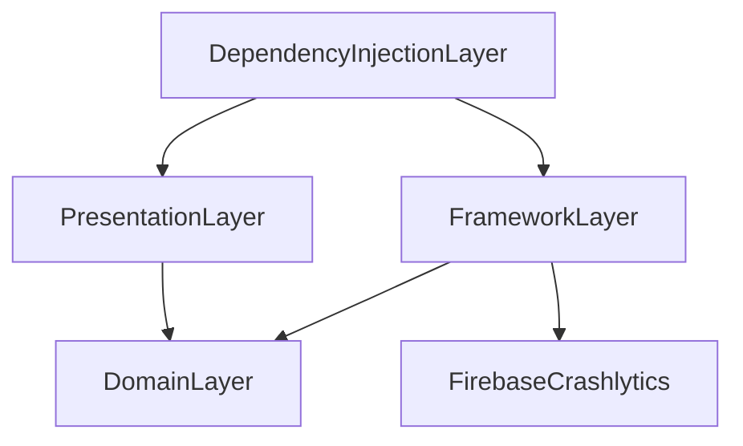

# Mermaid センター配置

Date: 2024-04-24

---

## 👤 User
*2024-04-24 11:12:01*

readme の mermaid をセンター にする方法

---

## 🤖 Assistant
*2024-04-24 11:12:25*

Mermaid ダイアグラムを Markdown の README ファイルで中央揃えにするには、Markdown の標準機能では直接的な方法がありませんが、HTML タグを利用して中央揃えを実現することができます。以下はその一例です。

```markdown
<div align="center">

```mermaid
graph LR;
    A--&gt;B;
    B--&gt;C;
    C--&gt;D;
```

</div>
```

この方法では、`div` タグの `align="center"` 属性を使って、Mermaid ダイアグラムを囲むことで中央揃えにします。ただし、この方法が GitHub などのプラットフォームで正常に機能するかは、プラットフォームの Markdown レンダリングに依存します。GitHub はセキュリティの観点から一部の HTML タグの使用を制限しているため、すべての場で機能するわけではないことに注意が必要です。

試してみて、もしプラットフォームが対応していなければ、別の方法を検討する必要があります。

---

## 👤 User
*2024-04-24 11:13:15*

以下でセンターにならなかった


&lt;div align="center"&gt;

&lt;/div&gt;

---

## 🤖 Assistant
*2024-04-24 11:13:43*

GitHub の Markdown では HTML タグを使った方法で Mermaid ダイアグラムを中央揃えにすることが正しく動作しないことがあります。GitHub はセキュリティと整合性を保つために、Markdown 内での HTML の挙動を限定しています。

残念ながら、GitHub Markdown で Mermaid ダイアグラムを中央に配置するための直接的なサポートは提供されていません。ダイアグラムが左寄せになるのは GitHub のレンダリング方式に基づいています。現時点で、GitHub の Markdown 内でダイアグラムを中央揃えにするための標準的な方法は存在しないのが実情です。

解決策としては、ダイアグラムのビジュアルを事前に画像ファイルとして生成し、画像を Markdown に挿入して中央揃えにする方法が考えられます。この方法ならば、以下のように画像を中央に配置することができます：

```markdown
<div align="center">


</div>
```

この方法であれば、HTML の `div` タグを使って画像を中央に配置することが可能です。しかし、これには Mermaid ダイアグラムを先に画像として生成しておく必要があります。

---

## 👤 User
*2024-04-24 11:15:46*

ソースコードで中略する表現はどうすればいいか？

```swift
let package = Package(
    // 中略
    dependencies: [
        // An example of a heavy third-party library
        .package(url: "https://github.com/firebase/firebase-ios-sdk", from: "10.24.0"),
    ],
    targets: [
        .target(
            name: "DependencyInjectionLayer",
            dependencies: ["FrameworkLayer", "PresentationLayer"]
        ),
        .target(
            name: "DomainLayer"
        ),
        .target(
            name: "FrameworkLayer",
            dependencies: ["DomainLayer", .product(name: "FirebaseCrashlytics", package: "firebase-ios-sdk")]
        ),
        .target(
            name: "PresentationLayer",
            dependencies: ["DomainLayer"]
        )
    ]
)
```

---

## 🤖 Assistant
*2024-04-24 11:16:24*

ソースコードで一部を省略する際には、通常、省略された部分を示すためにコメントを使用します。具体的には、`// ...` や `// 中略` などのコメントを挿入して、読者に対してその部分が省略されていることを明示的に示します。省略の具体的な方法は、省略する内容とコードの可読性を保つために必要な情報に基づいて変わる場合があります。

以下は、Swift のコード例で省略部分を示す方法です：

```swift
let package = Package(
    // 必要な設定を省略
    name: "MyLibrary",
    platforms: [
        .iOS(.v14)
    ],
    // その他の設定を省略
    dependencies: [
        // 重いサードパーティライブラリの例
        .package(url: "https://github.com/firebase/firebase-ios-sdk", from: "10.24.0"),
    ],
    targets: [
        .target(
            name: "DependencyInjectionLayer",
            dependencies: ["FrameworkLayer", "PresentationLayer"]
        ),
        .target(
            name: "DomainLayer"
        ),
        .target(
            name: "FrameworkLayer",
            dependencies: ["DomainLayer", .product(name: "FirebaseCrashlytics", package: "firebase-ios-sdk")]
        ),
        .target(
            name: "PresentationLayer",
            dependencies: ["DomainLayer"]
        )
    ],
    // 追加の設定があればここに記述
    swiftLanguageVersions: [.v5]
)
```

この例では、`// 必要な設定を省略` や `// その他の設定を省略` といったコメントを使って、実際のコードの中でどこが省略されているかを示しています。これにより、コードを短くしながらも、重要な部分が強調され、全体の構造が理解しやすくなります。

---

## 👤 User
*2024-04-24 11:16:26*

英語だとどう表すの？

---

## 🤖 Assistant
*2024-04-24 11:16:57*

英語でソースコード内の省略部分を示す場合、よく使われる表現は `// ...` または `// omitted` です。これらのコメントは、省略されたコードの部分を明示的に示し、読者にコードの全体的な構造や流れを理解させるのに役立ちます。

以下は、先ほどの Swift のコード例を英語で表現したものです：

```swift
let package = Package(
    // Configuration details omitted
    name: "MyLibrary",
    platforms: [
        .iOS(.v14)
    ],
    // Other settings omitted
    dependencies: [
        // An example of a heavy third-party library
        .package(url: "https://github.com/firebase/firebase-ios-sdk", from: "10.24.0"),
    ],
    targets: [
        .target(
            name: "DependencyInjectionLayer",
            dependencies: ["FrameworkLayer", "PresentationLayer"]
        ),
        .target(
            name: "DomainLayer"
        ),
        .target(
            name: "FrameworkLayer",
            dependencies: ["DomainLayer", .product(name: "FirebaseCrashlytics", package: "firebase-ios-sdk")]
        ),
        .target(
            name: "PresentationLayer",
            dependencies: ["DomainLayer"]
        )
    ],
    // Additional settings here
    swiftLanguageVersions: [.v5]
)
```

ここでは `// Configuration details omitted` や `// Other settings omitted` などのコメントが使用されています。これにより、読者は省略されている部分が具体的にどのような内容かをある程度推測できます。

---
