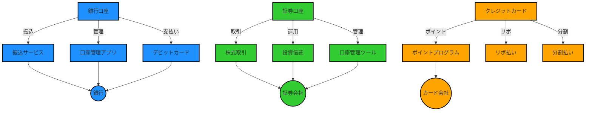
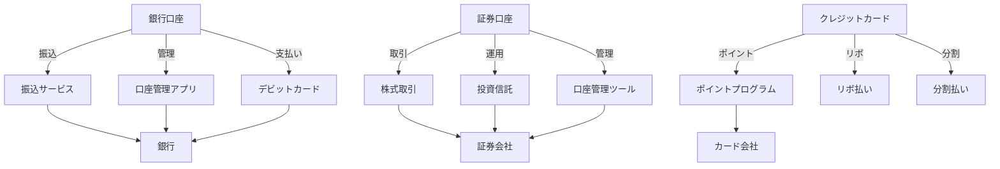
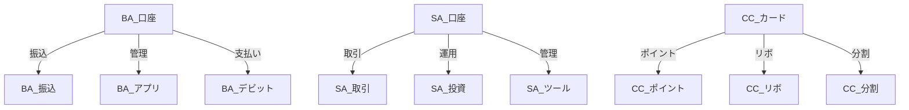
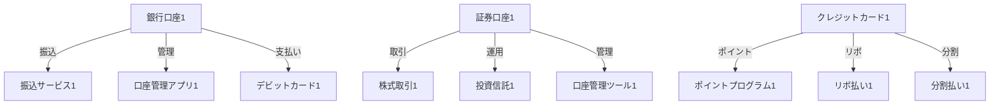
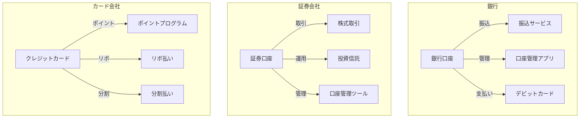
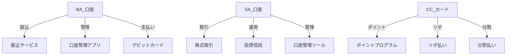
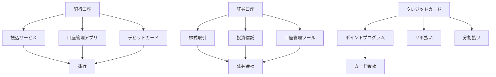
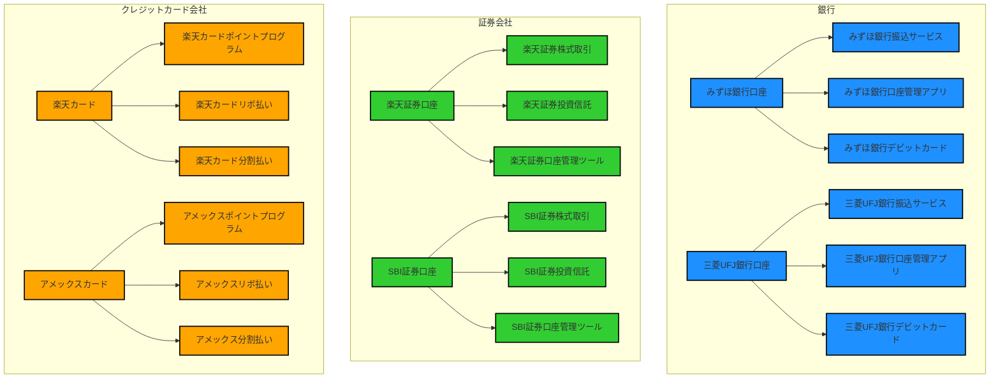
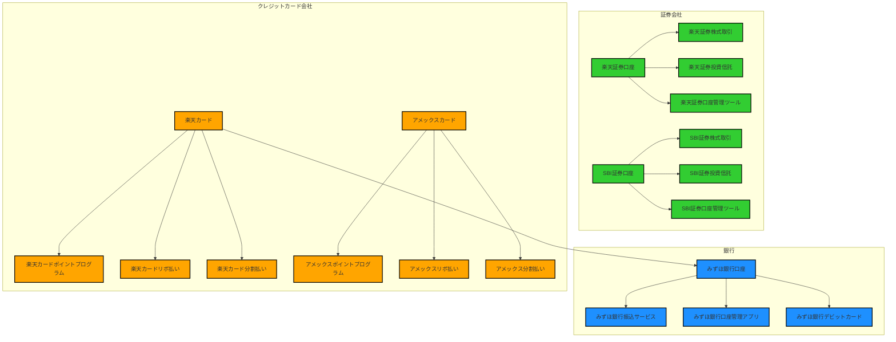
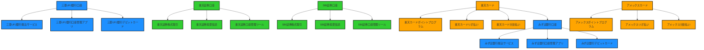

# 視覚的な区別方法

日付: 2024-09-08

---

## 👤 ユーザー
*2024/9/8 11:56:46*

銀行やサービス、証券会社などを視覚的に区別できるようにしたい

graph TD;
  A[銀行口座] --&gt; B[振込サービス]
  A --&gt; C[口座管理アプリ]
  A --&gt; D[デビットカード]

  E[証券口座] --&gt; F[株式取引]
  E --&gt; G[投資信託]
  E --&gt; H[口座管理ツール]

  I[クレジットカード] --&gt; J[ポイントプログラム]
  I --&gt; K[リボ払い]
  I --&gt; L[分割払い]

  B --&gt; M[銀行]
  C --&gt; M[銀行]
  D --&gt; M[銀行]
  
  F --&gt; N[証券会社]
  G --&gt; N[証券会社]
  H --&gt; N[証券会社]

  J --&gt; O[カード会社]

---

## 🤖 アシスタント
*2024/9/8 11:56:58*

視覚的に区別できるようにするためには、銀行、証券会社、カード会社などの各カテゴリーに異なる色や形を使うと良いでしょう。以下のような改善が考えられます。

1. **銀行**関連のノード（銀行口座、振込サービス、口座管理アプリ、デビットカード）には、例えば青色の四角形を使う。
2. **証券会社**関連のノード（証券口座、株式取引、投資信託、口座管理ツール）には緑色の丸を使う。
3. **カード会社**関連のノード（クレジットカード、ポイントプログラム、リボ払い、分割払い）には、オレンジ色の菱形を使う。

これにより、関係性が分かりやすくなるだけでなく、直感的にカテゴリーを区別できるようになります。

具体的に例を挙げると、以下のようにGraphvizのコードに変更できます。

これにより、色や形で銀行、証券会社、カード会社のカテゴリを視覚的に区別できます。

---

## 👤 ユーザー
*2024/9/8 11:57:39*

ABCDなどを振るのは一般的なのか？直感に可読性がよくない気がする

---

## 🤖 アシスタント
*2024/9/8 11:57:48*

おっしゃる通り、一般的な可読性を考慮すると、ノードに「A」「B」「C」「D」といった短縮的なラベルを使うことは直感的でない場合が多いです。特に、金融サービスや証券会社、銀行口座のような具体的な要素を扱う場合は、ノード名をより説明的にする方が可読性が向上します。

例えば、以下のように変更すると、直感的で可読性が高くなります：

このように、各ノードに説明的な名前（例：`bankAccount` や `securitiesAccount`）を使用することで、読み手にとって内容がすぐに理解できるようになります。また、具体的な名前を使うことで、後にノードを追加・編集する際にも管理しやすくなります。

このアプローチにより、可読性と直感性が向上し、図全体がどの要素を表しているのかが一目でわかりやすくなります。

---

## 👤 ユーザー
*2024/9/8 11:58:18*

これもわかりずらいです
100個ぐらいノードが出てきそうなんだ

---

## 🤖 アシスタント
*2024/9/8 11:58:42*

User is working with a graph that could potentially have up to 100 nodes and wants to improve the clarity and readability of the node labeling system.

---

## 🔧 ツール
*2024/9/8 11:58:42*

Model set context updated.

---

## 🤖 アシスタント
*2024/9/8 11:58:42*

100個ほどのノードがある場合、全てに説明的なラベルをつけるのは逆に可読性が下がるかもしれません。そこで、いくつかのアプローチが考えられます：

### 1. **カテゴリごとの命名ルールを使う**
各カテゴリに共通のプレフィックスや命名ルールを設けて、その範囲内でシンプルなラベルにします。たとえば、「銀行口座」「証券口座」「クレジットカード」などのカテゴリを区別できるようにした上で、ノード名を短縮します。

例：
- 銀行関連のノードには **BA_**（Bank Accountの略）
- 証券関連のノードには **SA_**（Securities Accountの略）
- クレジットカード関連には **CC_**（Credit Cardの略）

### 2. **番号付けを併用**
説明的な名前が難しい場合、番号を使用してノードを整理します。例えば、銀行口座や証券口座に関するノードに番号を付けて管理しやすくします。

例：
- 銀行関連のノードは **BA1**, **BA2** など番号で区別
- 証券関連のノードは **SA1**, **SA2** など

### 3. **グループ分けして階層を作る**
多くのノードがある場合、グループ化して階層的に管理するのも一案です。これにより、ノードの整理がしやすくなり、視覚的にわかりやすくなります。

例：

この方法では、ノードが大量にあっても各グループ内でわかりやすく管理できます。

### 4. **シンボルやアイコンの利用**
視覚的に情報を伝えるために、アイコンやシンボルを使うことも一案です。各カテゴリごとに異なるシンボルを使うことで、名前を短縮しても内容がわかりやすくなります。

---

## 👤 ユーザー
*2024/9/8 11:58:58*

ノードメイト表示名を一致できないのか？

---

## 🤖 アシスタント
*2024/9/8 11:59:07*

ノード名（内部的な識別子）と表示名を一致させることが可能です。ただし、ノード名自体は短くして、表示されるラベルにはフルネームを使用することで、可読性を向上させながら、ノードが大量にある場合でも管理がしやすくなります。

以下はその具体的な例です：

上記の例では、ノードの内部名（`bankAccount`, `securitiesAccount`, `creditCard`など）は短くしつつ、表示されるラベルにはわかりやすい説明を表示しています。

### どうして一致しないのか？
Mermaidのようなツールでは、内部的に扱うノード名は一意である必要がありますが、表示名としては何でも自由に設定できます。ノード名を短縮したり、管理しやすい名前にしても、ラベル（表示される部分）は自由に指定可能です。そのため、ノード名と表示名が一致しないように設定しても、表示自体には影響がありません。

### ノード名と表示名を一致させる方法
もしノード名と表示名を完全に一致させたい場合は、短縮せずそのまま長い名前を使うこともできます。ただし、100個ほどのノードがある場合、全て長い名前にすると管理が難しくなるため、通常は短縮名を使用してラベルだけを変更する方が便利です。

---

## 👤 ユーザー
*2024/9/8 11:59:31*

では変数名と表示名を一致させてほしい

---

## 🤖 アシスタント
*2024/9/8 11:59:40*

ノードの変数名（内部名）と表示名を一致させたい場合、ノードの定義をシンプルに書き、変数名をそのまま表示名として使うことができます。以下はその具体的な例です：

### ポイント
- この場合、ノード名（変数名）をそのまま表示名として扱っています。
- ノードの名前として「銀行口座」「証券口座」「クレジットカード」など、日本語のわかりやすい名前を使い、それをそのまま表示名として表示しています。
  
### 利点
- 変数名と表示名が一致しているため、コードを見たときに表示される内容がすぐに理解でき、管理が簡単です。
- 100個程度のノードがあっても、ノード名と表示名が同じため、メンテナンスや変更が直感的に行えます。

この方法では、変数名と表示名が常に一致するため、可読性と管理のしやすさが両立できます。

---

## 👤 ユーザー
*2024/9/8 12:00:32*

これはいいね
複数のクレジットカードや複数の銀行があるんだ
これが視覚的に区別しやすいようにして5位

---

## 🤖 アシスタント
*2024/9/8 12:00:50*

複数のクレジットカードや銀行がある場合、それらを視覚的に区別するためには、各カードや銀行に異なる色や形を割り当てると良いでしょう。また、ノード名やラベルを使って簡潔かつ直感的に情報を伝えることが重要です。

### 例：色や形を使って区別

以下のように、クレジットカードや銀行に異なる色や形を割り当てることで、視覚的に区別しやすくできます。

### 説明：
1. **銀行（みずほ、三菱UFJ）**は青色で区別され、それぞれ異なるサービス（振込サービス、口座管理アプリ、デビットカード）が関連付けられています。
2. **証券会社（楽天証券、SBI証券）**は緑色で区別され、株式取引や投資信託、管理ツールなどが視覚的に整理されています。
3. **クレジットカード会社（楽天カード、アメックス）**はオレンジ色で、リボ払い、分割払い、ポイントプログラムを含むサービスが整理されています。

### 視覚的な工夫：
- **色の違い**で各カテゴリを区別しています（銀行、証券会社、クレジットカード会社）。
- **サブグラフ**でカテゴリごとにノードをグループ化することで、さらに視覚的に整理されています。

このようにすることで、複数の銀行やクレジットカードが含まれていても、それぞれのカテゴリが一目でわかるようになり、さらに内容が整理されます。

---

## 👤 ユーザー
*2024/9/8 12:01:16*

このときにE1とか降らないでほしい そのままの名前はつかえないのか？

---

## 🤖 アシスタント
*2024/9/8 12:01:34*

ノードにそのまま名前を使うことは可能です。内部的な識別子としてノード名を短縮せず、ラベルと一致させて表現することで、E1などの代わりにそのままフルネームを表示できます。

以下のようにノードの名前をそのまま使用し、ラベルも一致させることができます：

### 説明：
- **そのままの名前をノードに使う**：例えば、「みずほ銀行口座」や「楽天カード」をそのままノードの名前として使用しています。
- **ラベル名とノード名を一致**させているため、追加の識別子（E1など）は不要です。
  
### メリット：
- ノード名とラベルが一致するため、視覚的に直感的でわかりやすい。
- ノードが大量にあっても、変数名に頭を悩ませる必要がなく、管理しやすい。
- サブグラフによって各カテゴリごとに整理されているので、全体の構造が明確です。

この方法により、クレジットカードや銀行の複数のノードがあっても、それぞれを簡単に区別でき、視覚的にも整理された状態を保つことができます。

---

## 👤 ユーザー
*2024/9/8 12:02:26*

いいね
例えばここで、楽天カードをみずほ銀行に紐付けたい

---

## 🤖 アシスタント
*2024/9/8 12:02:41*

楽天カードをみずほ銀行に紐付けるためには、ノード間に新しい関係を追加することができます。具体的には、楽天カードからみずほ銀行口座に向かう矢印を追加すれば、それが視覚的に「楽天カードがみずほ銀行に関連している」という関係性を表します。

以下にその例を示します：

### 変更点：
- 楽天カードが「みずほ銀行口座」に紐付いていることを示すため、`楽天カード --> みずほ銀行口座` という新しいリンクを追加しました。

### 結果：
- これにより、視覚的に楽天カードがみずほ銀行と関連していることが明確になります。
- 他のクレジットカードや銀行間の関係を追加したい場合も、同様の手法で紐付けることができます。

このようにすることで、金融機関間の関係性をより視覚的に表現し、複雑な構造もわかりやすく表現できます。

---

## 👤 ユーザー
*2024/9/9 15:25:01*

subgraph入らないかな。

---

## 🤖 アシスタント
*2024/9/9 15:25:13*

`subgraph`を使用しない場合でも、ノード間の関連を示しながら視覚的に整然とした図を作成することは可能です。`subgraph`を外したシンプルな形式で、銀行やカード会社、証券会社の関係を明確にしつつ、楽天カードをみずほ銀行に紐付ける例は以下の通りです：

### 説明：
1. **subgraphを使わない**：ノードを直接定義して関連付けていますが、視覚的にすっきりした図になります。
2. **色の違いで区別**：銀行、証券会社、クレジットカード会社に対して異なる色（青、緑、オレンジ）を適用しています。
3. **楽天カードをみずほ銀行に紐付ける**：`楽天カード --> みずほ銀行口座` という関係を示しています。

### メリット：
- `subgraph`がなくても、銀行、証券会社、クレジットカードの関係が明確です。
- 色分けによってカテゴリの区別が視覚的にしやすいです。

この方法でも、構造を整理しながら関連を視覚化できますし、subgraphを使わないことで全体がシンプルに見えるようになります。

---

## 👤 ユーザー
*2024/9/9 15:25:48*

{
  "content_type": "image_asset_pointer",
  "asset_pointer": "file-service://file-OJtehLb2vCInyzzMzvhSNk6Z",
  "size_bytes": 1030894,
  "width": 2048,
  "height": 1252,
  "fovea": null,
  "metadata": {
    "dalle": null,
    "gizmo": null,
    "generation": null,
    "container_pixel_height": null,
    "container_pixel_width": null,
    "emu_omit_glimpse_image": null,
    "emu_patches_override": null,
    "sanitized": true,
    "asset_pointer_link": null,
    "watermarked_asset_pointer": null
  }
}
では以下のPDFからmermaid形式に変換して欲しい

---

## 🤖 アシスタント
*2024/9/9 15:26:05*

The uploaded file is an image, not a PDF, so it cannot be directly converted into a Mermaid diagram.

To help you convert this into Mermaid format, I can guide you on extracting the relationships and nodes from the image and then translating them into Mermaid syntax. Here's the process:

1. **Identify the Nodes**: Look for each entity (such as companies, services, or systems) in the image.
2. **Identify the Links**: Observe the lines connecting the nodes and determine the relationships between them.
3. **Convert to Mermaid Syntax**: Using Mermaid's `graph TD;` syntax, we can translate these relationships.

Since it's a large and complex graph, you could describe the main connections, and I can help you build the Mermaid code based on that. Alternatively, you could try uploading a PDF version for more precise processing.

Would you like to proceed with this approach? If so, feel free to describe some of the key relationships in the image!

---
