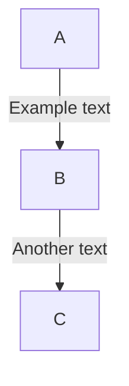
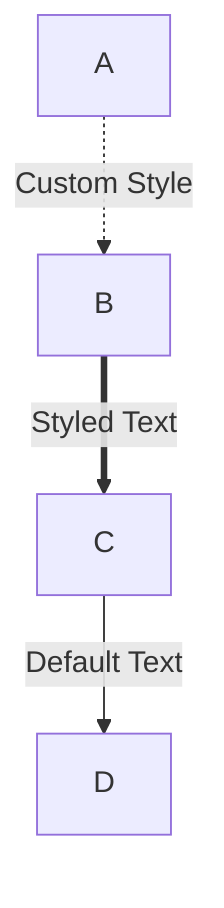
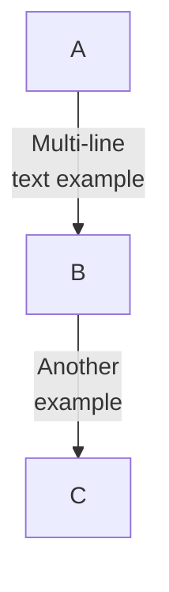
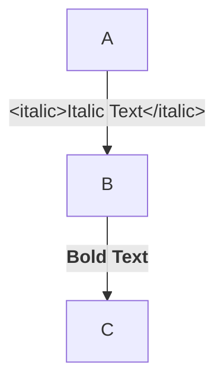
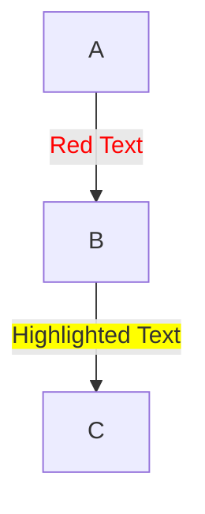
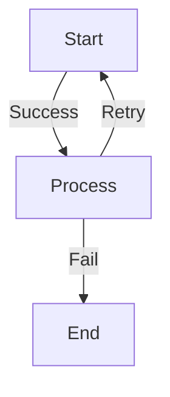

# 矢印 テキスト Mermaid

日付: 2025-01-14

---

## 👤 ユーザー
*2025/01/14 21:34:13*

marmaid の記法で矢印にテキストを記述したい
いろいろな手法を推してほしい

---

## 🤖 アシスタント
*2025/01/14 21:34:25*

Mermaidでは、矢印にテキストを記述するための方法を複数提供しています。ここでは、一般的な手法とカスタマイズの例を紹介します。

---

### **1. 矢印に直接テキストを追加**
基本的な方法は、矢印部分に `|text|` を記述することです。



この形式は最もシンプルで、直感的に矢印にテキストを追加できます。

---

### **2. カスタマイズしたラベルを使う**
矢印に特定のスタイルや意味を持たせたい場合、カスタマイズしたラベルを使用することも可能です。



- `-. .->`：点線で矢印を引く
- `==> `：太線で矢印を引く

---

### **3. 矢印のテキストのレイアウト調整**
矢印のテキストを改行して見やすくするには、`\n` を使用します。



---

### **4. 文字のフォーマット（HTMLエンティティ）**
Mermaidでは、矢印のテキストにHTMLエンティティを使用してフォーマットを追加できます。



---

### **5. 矢印のテキストをスタイルで装飾**
Mermaidのスタイルを使って矢印のテキストに独自の装飾を追加する方法です。



---

### **6. 複数の矢印に異なるテキストを設定**
複雑なフローを描く場合、それぞれの矢印に個別のテキストを割り当てることができます。



---

### **7. リンクをテキストに埋め込む**
矢印のテキストにリンクを埋め込むことも可能です。

```mermaid
graph TD
    A -->|[Click Here](https://example.com)| B
    B -->|Visit [Link](https://example.org)| C
```

---

### **まとめ**
- 矢印にテキストを記述するには、`|text|` を使うのが基本。
- カスタムラベルやHTMLエンティティを活用してデザイン性を向上。
- 必要に応じて改行やリンク埋め込みで情報を整理。

さらに複雑な例が必要な場合や、具体的な構成に関する質問があれば教えてください！

---
