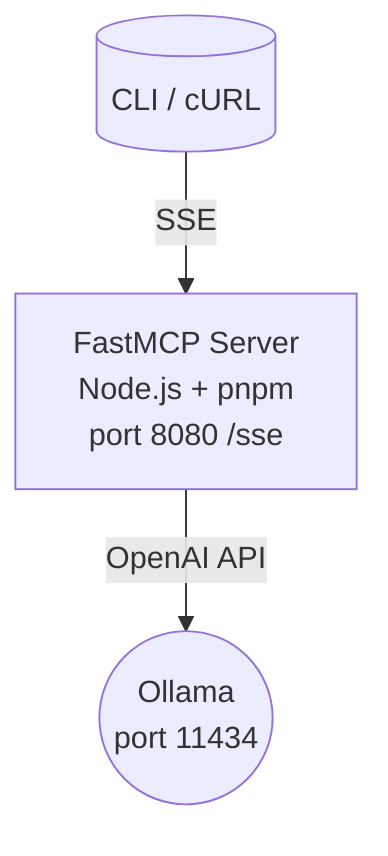
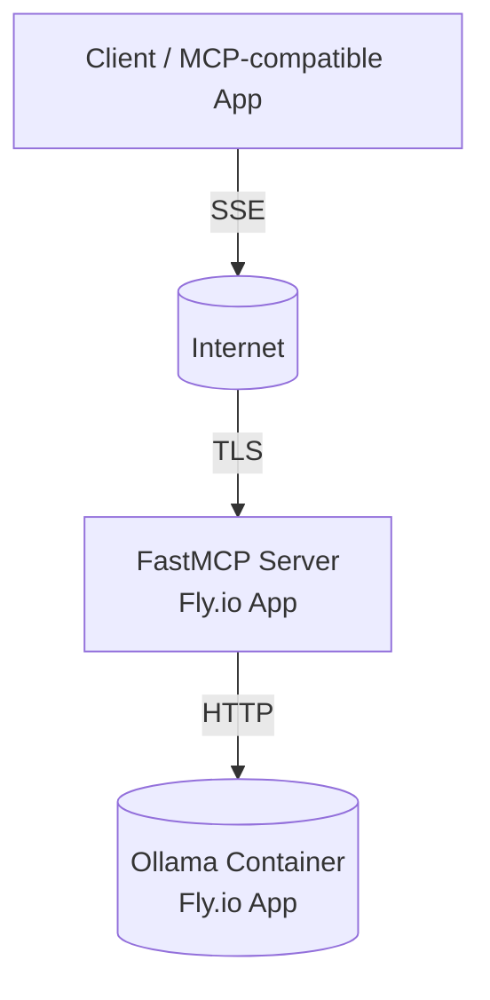
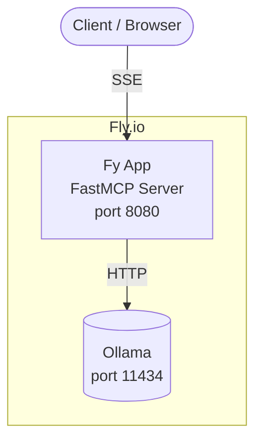

# Macアプリ向けモデル比較

日付: 2025-05-07

---

## 👤 ユーザー
*2025/5/7 20:29:53*

macで動かしたり、コーディングしたり、リリースするアプリに組み込みたい。
それぞれの特徴だったり、どんなサイズのものを選べば良いかその辺を調査して整理して欲しい

gemma3
qwen3
deepseek-r1

---

## 🤖 アシスタント
*2025/5/7 20:31:31*

以下に \*\*Gemma 3／Qwen 3／DeepSeek-R1\*\* を Mac 環境でローカル実行・開発・アプリ組み込みする観点から整理しました。要点だけ先にまとめると――

&gt; \*\*小型モデル (≦4 B)\*\* は M1/M2 Air 8-16 GB でも動くので「チャット機能」や「軽いコード補完」に最適。  
&gt; \*\*中型 (8-14 B)\*\* は 16-32 GB RAM ＋ GPU がある開発用 Mac で「本格的な推論」や「ローカル RAG」に向く。  
&gt; \*\*大型 (≥27 B／MoE 30 B-235 B)\*\* は開発時はクラウド or 分散、出荷バイナリには Distill／Quantize 版を同梱する――という使い分けが現実的です。  

以下で特徴・サイズ・ライセンス・Mac への組み込み方法を詳しく比較します。

## 1. モデル概要と得意分野

| モデル | 主な強み | コンテキスト長 | 多言語 (日本語) | 代表ベンチマーク\* |
|-------|---------|---------------|----------------|------------------|
| \*\*Gemma 3\*\* | 軽量・マルチモーダル（画像入力対応）・128 K ctx と長文処理 | 128 K | 140+ 言語対応 (日本語◎) citeturn1view0 | 27 B が Chatbot Arena Elo 1338 pts citeturn1view0 |
| \*\*Qwen 3\*\* | “Think / No-Think” 2 モードで推論コスト調整・MoE版が超省メモリ | 32 K (8 B～) / 128 K (14 B～) citeturn2view0 | 119 言語 (日本語◎) citeturn2view0 | 4 B が Qwen 2.5-72B 相当 citeturn2view0 |
| \*\*DeepSeek-R1\*\* | RL のみで推論能力を引き出した reasoning 特化・多数の distill 版 | 128 K (全モデル) citeturn3view0 | 英中中心（日本語は要検証） | 8 B distilled 版が LiveCodeBench 65.9 % pass@1 citeturn3view0 |

\\\*ベンチマークは公開値の一部抜粋。詳細は各モデルカード参照。

### コーディング性能
- Qwen 3 30B-A3B と DeepSeek-R1 8-32B distill は Codeforces &gt; 95 percentile citeturn3view0。  
- Gemma 3 は CodeGemma 系派生もあり、MLX や JAX でコード補完に使える citeturn8search3turn12search0。

## 2. 提供サイズと Mac でのメモリ目安

| パラメータ | Gemma 3 BF16\* | Gemma 3 Q4 \_K\_M | Qwen 3 Q4 \_K\_M | DeepSeek-R1-Distill Q4 \_K\_M | 実用シーン |
|-----------|--------------|----------------|---------------|-----------------------------|-----------|
| \*\*1 B\*\* | 1.5 GB | 0.9 GB | 0.8 GB | – | iOS / watchOS 組み込み・プライベートチャット |
| \*\*4 B\*\* | 6.4 GB | 3.2 GB citeturn6search5 | 2.5 GB citeturn7search0 | – | MacBook Air 16 GB / Mac mini 16 GB |
| \*\*8 B (7-8 B)\*\* | – | – | 4.9 GB (DeepSeek Ollama) citeturn5view0 | 4.9 GB citeturn4view0 | Pro機でローカル生成+RAG |
| \*\*12-14 B\*\* | 20 GB / 8.7 GB (Q4) citeturn6search5 | 5-6 GB (Qwen 14B Q4) | 9 GB (DeepSeek 14B Q4) citeturn5view0 | 開発 Mac Studio 32 GB / M3 Max |
| \*\*27-32 B\*\* | 46 GB / 21 GB (Q4) citeturn6search5 | 20 GB (DeepSeek 32B Q4) citeturn5view0 | – | 社内推論サーバ or 分散推論 |

\\\*BF16 は “そのままロードしたときに必要な GPU/Unified Memory” の概算 citeturn6search5。

### 量子化 & ランタイム
- \*\*GGUF + llama.cpp/MLX\*\*：Gemma/Qwen/DeepSeek 全て 4-bit Q4 \_K\_M や IQ4\_XS 版が公開 citeturn6search0turn7search0turn4view0。  
- \*\*Ollama\*\*：`ollama run gemma3:4b` や `ollama run deepseek-r1:8b` で即実行 (macOS 実行ファイル同梱可) citeturn5view0turn12search9。  
- \*\*MLX\*\*：Apple Silicon 専用フレームワーク。Gemma 3 1-4 B は LoRA 微調整まで M1 8 GB で実証例あり citeturn12search0。  
- \*\*Core ML 変換\*\*：量子化した gguf → onnx → coremltools で iOS バイナリに埋め込めるが 4 B 以下推奨 (サイズ/ロード時間的に)。

## 3. ライセンス比較

| モデル | ライセンス | 商用利用 | 再配布時の注意 |
|-------|-----------|----------|---------------|
| \*\*Gemma 3\*\* | \*\*Gemma Terms of Use\*\* (Apache 2.0 派生) citeturn9search0 | 可。ただし「有害用途禁止」「派生モデルは同条件で再配布」等の制限 | IPA 準拠ポリシー記載必須 |
| \*\*Qwen 3\*\* | Apache 2.0 citeturn10search0 | 可。商用 SaaS/アプリ配布も制限なし | Models 名称使用時はクレジット |
| \*\*DeepSeek-R1\*\* | MIT License citeturn3view0 | 可。重ねて distill/改変自由 | Qwen 派生 distill 版は元の Apache 2.0 条件を継承 citeturn11view0 |

### iOS / macOS への同梱可否
- \*\*Gemma 3\*\*：再配布可だが App Store 審査向けに利用目的と安全対策をメタデータに明示。  
- \*\*Qwen 3 / DeepSeek-R1\*\*：ライセンス表記とソースコード入手手段の明示でOK (App Review ガイドライン 5.2 準拠)。

## 4. 選定フロー (開発→出荷)

1. \*\*PoC\*\*  
   - Mac で `ollama pull gemma3:4b` や `mlx\_lm` で軽量版をテスト。  
2. \*\*モデル比較\*\*  
   - 対話品質→ Gemma 12 B / Qwen 14 B。  
   - コード補完→ Qwen 30B-A3B (MoE、起動メモリは 8 GB 強) citeturn2view0。  
   - 数学・推論→ DeepSeek-R1-Distill-8B 以上 citeturn3view0。  
3. \*\*量子化\*\*  
   - gguf Q4 \_K\_M でサイズ 50-70 % 削減／速度 1.5-2 ×。  
4. \*\*アプリ組み込み\*\*  
   - macOS：Ollama Server を同梱 → `Process()` 起動 or `libollama` linking。  
   - iOS：Core ML 変換 (1-4 B) + Swift CoreML API。  
5. \*\*配信形態\*\*  
   - オンデバイスのみ：完全オフライン (ユーザプライバシ優先)。  
   - ハイブリッド：小型ローカル + クラウド推論フォールバック (LLM-as-a-Service 料金最適化)。

## 5. まとめと推奨シナリオ

| シナリオ | 推奨モデル/サイズ | 理由 |
|---------|-----------------|------|
| \*\*iOS/Apple Watch で簡易チャット\*\* | Gemma 3 1 B Q4 (860 MB) | 低RAM機でも動作、日本語カバー十分 citeturn6search5 |
| \*\*Mac アプリのコード補完\*\* | Qwen 3 8 B Q4 or 30B-A3B (MoE) | MoE で 3 B 活性パラメータ、推論高速 citeturn2view0 |
| \*\*内部ツールの数式・推論\*\* | DeepSeek-R1-Distill-Llama 8 B Q6 | reasoning ベンチ強く MIT ライセンスで改変自由 citeturn3view0 |
| \*\*多言語・画像含むヘルプボット\*\* | Gemma 3 12 B Q4 | マルチモーダル・140 言語 citeturn1view0 |
| \*\*研究用高精度\*\* | Gemma 3 27 B or DeepSeek-R1 37 B-act (クラウド) | 128 K ctx + 最高性能 citeturn1view0turn3view0 |

---

これで \*\*各モデルの特徴・サイズ選択・Mac 組み込み方法・ライセンス上の注意点\*\* を俯瞰できます。  
「このシナリオでもう少し具体的なコード例が欲しい」「Core ML 変換手順を詳しく」などあれば遠慮なくどうぞ！

---

## 👤 ユーザー
*2025/5/7 20:37:06*

ローカルLLMの利点はこれは外部に漏れないのは本当か？

---

## 🤖 アシスタント
*2025/5/7 20:37:42*

ローカル LLM（オンデバイスで動く大規模言語モデル）は \*\*「入力したデータがインターネットに送られない」\*\* という点でクラウド型よりプライバシー面の優位性があります。ただし \_必ず\_ 漏えいゼロになるわけではなく、実装や運用しだいで通信・ログ・マルウェア経由の流出リスクは残ります。以下で“どこまで安全か”と“漏えいを防ぐためのチェックポイント”を整理します。

## 1. ローカル推論がもたらす本来のメリット

### 1-1. 物理的にデータが端末外に出ない  
- llama.cpp や Ollama などのランタイムは、モデルと推論エンジンだけを PC 内メモリに読み込み、外部 API へ自動送信する機構を持ちません【turn0search3】【turn0search2】。  
- エッジ AI では「生データをクラウドへ転送しないこと」がプライバシー対策として評価されており、金融・医療分野で導入が進んでいます【turn0search1】。  
- Apple も iPhone の “Apple Intelligence” で「オンデバイス処理こそが個人情報を守る中核」と明言しています【turn0search7】【turn0news82】。  
- 日本語記事でも「オンデバイス AI の最大メリットはプライバシー」と繰り返し紹介されています【turn0search6】。  

### 1-2. 付随メリット  
- 通信遅延ゼロのリアルタイム応答【turn0search1】。  
- オフライン環境でも利用可（山間部・機内など）【turn0search2】。  
- クラウド利用料や API レート制限を気にしなくてよい【turn0news83】。  

## 2. “外部に漏れない” が成り立たなくなる主なパターン

| リスク領域 | 具体例 | 対策の要点 |
|-----------|-------|-----------|
| \*\*ランタイムの通信\*\* | UI が自動アップデート通知を送信／匿名テレメトリを送信するケース（Ollama のコードには将来拡張用フックがあるとの指摘）【turn1search4】 | ファイアウォールでバイナリをブロック、ソースを確認してビルド |
| \*\*誤設定\*\* | llama.cpp を HTTP サーバーモードで公開し `/slots` エンドポイントが外部に露出、プロンプトが漏えい【turn1search0】 | ローカルバインド&認証必須、不要ポート閉鎖 |
| \*\*不正モデル／サプライチェーン\*\* | Hugging Face にマルウェア混入モデルがアップロードされた事例【turn1search2】、モデルファイルの Pickle 逆シリアライズ攻撃【turn1search6】 | 信頼ドメインからのみ取得、ハッシュ検証、サンドボックス実行【turn1search3】 |
| \*\*ログ・キャッシュ\*\* | Ollama は平文 `history` ファイルにチャットを保存し再生成する【turn1search4】 | 暗号化ストレージ・自動削除ポリシー |
| \*\*OS・バックアップの漏れ\*\* | スワップ領域や Time Machine に残る | FileVault で暗号化、除外設定 |
| \*\*ローカルネット内の盗聴\*\* | 同一 LAN 上のスニッフィング／マルウェア | TLS ラップ、Zero-Trust LAN |

## 3. 安全に使うためのベストプラクティス

### 3-1. ソフトウェア選択とビルド  
1. \*\*オープンソース＆署名付きリリースを優先\*\*（llama.cpp、Ollama official binary など）【turn0search3】【turn0search2】  
2. 依存ライブラリとモデルのハッシュを CI で固定、SBOM を生成（RAND のモデル保護プレイブック参照）【turn1search5】  

### 3-2. ネットワーク/環境隔離  
- パーソナル Mac なら Little Snitch や macOS PF でバイナリの外向き通信を遮断。  
- 機密用途は \*\*オフライン VM やコンテナ\*\* で実行し、USB 共有も切る（llama.cpp 推奨）【turn1search3】。  

### 3-3. モデル/チャットデータ管理  
- 機密プロジェクトは \*\*共有ディレクトリを暗号化\*\*、バックアップ対象から除外。  
- 不要になったチャット履歴・tensor キャッシュを定期的に安全消去。  

### 3-4. 脆弱性監視  
- llama.cpp や GUI ランタイムに CVE が報告されつつあるため、\*\*週次で脆弱性フィードをチェック\*\*【turn1search6】。  
- セキュリティ研究コミュニティや UpGuard のような外部スキャン結果をウォッチ【turn1search0】。  

## 4. まとめ：\*\*“原理的には漏れないが、運用次第で漏れる”\*\*

- ローカル LLM はネット送信を前提としないため、クラウド LLM と比べれば機密保持性が高い。  
- しかし \*\*ランタイムやモデルが信用できるか / 外部通信やログ設定がどうなっているか\*\* を確認しなければ、誤設定・マルウェア・ローカルログ経由で漏えいする可能性は十分ある。  
- \*\*通信遮断・ハッシュ検証・暗号化ストレージ・脆弱性パッチ適用\*\* を徹底すれば、実用レベルで「データが外部に漏れない LLM 環境」を構築できる。  

「実際に自分の環境でどう監視すればいい？」など、より踏み込んだ手順が必要であれば教えてください！

---

## 👤 ユーザー
*2025/5/7 21:35:00*

たとえばDocker MCP Toolkitなどで、ローカルLLMを使うとセキュリティー的に良いのか？そのときにchat-gpt4oとかは使えないのかよくわかっていない。そもそもローカルLLMで対応しているのかがわかっていない。

---

## 🤖 アシスタント
*2025/5/7 21:37:42*

まず結論だけまとめると **Docker MCP Toolkit は「LLM のツール実行環境」をワンクリックで用意する拡張機能**であり、実際のモデル推論は  
- **Docker Model Runner（ベータ）** や  
- **Ollama／llama.cpp／MLC-LLM などのローカル LLM ランタイムを Docker で動かす構成**  
を組み合わせて実現します。  
GPT-4o など **OpenAI がホストする専用モデルの重みは公開されていないため、完全オフラインでは利用できません**。ただし MCP Toolkit が起動するツール側（例: Claude Desktop, Cursor など）を **「リモート GPT-4o API」** に向ければクラウド経由で呼び出すことは可能です。以下で用語整理とセキュリティ面の評価、導入パターンの比較を詳しく解説します。

---

## 1. 用語整理：MCP Toolkit と “ローカル LLM” の関係

### 1.1 Docker MCP Toolkit とは  
- Docker Desktop 拡張として **MCP (Model Context Protocol) サーバー** をコンテナで起動し、AI エージェント（Claude Desktop, Continue.dev など）と接続する UI を提供【turn6view0†L55-L58】。  
- **モデルそのものは含まず**、「ツール（ブラウザ自動操作、ファイル操作など）」を安全に呼び出せる環境を作る役割。  

### 1.2 “ローカル LLM” を動かす 3 つの選択肢  
| ランタイム | 特徴 | OpenAI 互換 API | Docker イメージ例 |
|-----------|------|----------------|------------------|
| **Docker Model Runner** | Docker Desktop 4.40 以降に内蔵。llama.cpp ベースでモデルを OCI Artifact として `docker model run` するだけ【turn0search1】【turn3search0】 | ✔ （`/v1/chat/completions` など）【turn3search0】 | `docker/model-runner` (内蔵) |
| **Ollama** | `ollama run llama3` の CLI がそのまま Docker 化可【turn3search3】【turn0search3】 | ✔ (`:11434` REST) | `ollama/ollama:latest` |
| **llama.cpp サーバー** | Python バインディングに OpenAI 互換サーバーが同梱【turn3search1】 | ✔ | `ggerganov/llama.cpp`【turn0search7】 |

MLC-LLM や LM Studio なども Docker 化レシピが公開されています【turn0search2】【turn3search5】。

---

## 2. ローカル LLM を Docker で動かすセキュリティ上の利点と限界

| 観点 | 期待できる効果 | 追加で必要な対策 |
|------|---------------|-----------------|
| **機密データ保護** | モデル推論が完全に端末内で完結するため、クラウド送信を根本的に排除【turn4search3】【turn4search6】 | コンテナ外へのポート公開を `--network host` 等で避ける／ファイアウォール制限 |
| **依存隔離** | 推論エンジンとライブラリを OCI イメージに閉じ込め、ホストと分離【turn4search5】 | コンテナに不要な能力（CAP_SYS_ADMIN など）を付与しない |
| **再現性・SBOM** | OCI Artifact にハッシュ付きでモデル配布→サプライチェーンの検証が容易【turn4search4】 | `docker scout sbom` などで定期スキャン |
| **オフライン動作** | 機内／社内閉域でも利用可能—API レート制限や課金なし【turn4search1】 | モデルアップデート時だけネットワーク接続が必要 |

> **注意:** Docker が外部ネットワークへ出る設定のまま `-p 11434:11434` などでポートを開けると、LAN 内から推論 API が見えてしまい情報漏えいの温床になるので要制限【turn1search0】。

---

## 3. GPT-4o は「完全ローカル」では動かせない理由

| 項目 | 現状 |
|------|------|
| **重みの公開** | OpenAI は GPT-4 系列のモデル重みを公開しておらず、ローカル推論は不可【turn0search4】【turn5search0】 |
| **利用形態** | OpenAI / Azure OpenAI の API あるいは ChatGPT UI 経由のみ【turn5search7】【turn5search1】 |
| **ローカル統合** | OpenAI 互換エンドポイントを呼べるツール（MCP Client やアプリ）から **HTTPS 経由で API** を叩くことで GPT-4o を組み込めるが、ネットワーク接続は必須 |

したがって **「完全オフライン・エアギャップ環境」では GPT-4o は選択肢にならず**、Gemma3 や Qwen3 など OSS モデルを量子化して使うのが現実的です。

---

## 4. MCP Toolkit × ローカル LLM 導入パターン

### 4.1 代表構成例  
```mermaid
graph TD
  subgraph Docker Desktop
    A[MCP Toolkit<br/>UI Extension]
    B[Model Runner<br/>(llama.cpp)]
    C[Local Model<br/>e.g. llama3 8B Q4]
  end
  A -- REST(OpenAI) --> B
  B -- in-proc --> C
```
- **ステップ**  
  1. Docker Extensions で MCP Toolkit と Model Runner をインストール。  
  2. `docker model pull docker-models/llama3-8b-q4` 等でモデル取得。  
  3. MCP Toolkit の「Clients」画面で “OpenAI compatible” エンドポイント `http://localhost:11434/v1` を登録。  
  4. Claude Desktop や Cursor からローカル推論を呼び出せる。

### 4.2 GPT-4o を併用する場合  
- 3 のエンドポイントに **OpenAI の公式 URL** と API キーを設定。  
- 社内ポリシーで “社外送信禁止” の場合はエンドポイントを切替えてローカル LLM のみ許可。  

---

## 5. まとめと推奨

1. **セキュアに閉じた環境** を最優先するなら  
   - Docker Model Runner / Ollama で **OSS LLM** を量子化して運用  
   - コンテナの外向き通信を制限し、ポート公開も内部のみ  
2. **高精度が必須** でクラウド接続を許容できるなら  
   - MCP Toolkit のクライアントを GPT-4o API に向ける（通信ログ管理・暗号化必須）  
3. **ハイブリッド** を狙う場合  
   - 通常はローカル LLM、精度が必要な場合だけ GPT-4o にフォールバック  
   - ルータ or プロキシで送信先を監査し、誤送信を防止  

これで **MCP Toolkit とローカル LLM の役割分担・セキュリティ影響・GPT-4o との併用可否** が整理できました。  
具体的な `docker compose` 例やポリシーテンプレートが必要なら、次のステップとしてご案内できます。お気軽にどうぞ！  

---

### 参考文献  
citeturn6view0turn0search1turn3search0turn3search2turn4search4turn3search3turn4search3turn4search5turn4search1turn4search6turn4search8turn3search1turn0search4turn5search0turn5search7

---

## 👤 ユーザー
*2025/5/7 21:39:33*

たとえばDocker MCP Toolkitなどで、ローカルLLMを使うとセキュリティー的に良いのか？そのときにchat-gpt4oとかは使えないのかよくわかっていない。そもそもローカルLLMで対応しているのかがわかっていない。

---

## 🤖 アシスタント
*2025/5/7 21:41:54*

**まとめ**  
Docker MCP Toolkitは「ツール（MCP Server）を安全なコンテナで立ち上げ、MCP対応クライアントへOpenAI互換APIで橋渡しする拡張機能」です。  
ローカルLLM（例：llama.cpp／Ollama／Docker Model Runner）がMCP Toolkitと組み合わさると **①プロンプトや応答が端末外へ渡らない、②メモリ・ネットワーク・ディスクをコンテナで隔離、③オフラインでも動作** といったセキュリティと運用上のメリットが得られます。 ただし **GPT-4o は重みが公開されておらず完全ローカル推論は不可** で、利用する場合は結局インターネット越しに OpenAI API を呼び出すことになります。以下でしくみ、利点・限界、導入パターンを整理します。  

---

## 1. MCP ToolkitとローカルLLMの役割分担
### 1-1. MCP Toolkit の位置づけ  
* Docker Desktop 拡張として、MCP Server を「**secure defaults / one-click**」で起動・接続できるGUIとCLIを提供【turn15view0†L55-L58】。  
* 立ち上げた MCP Server は Gateway がまとめ、Claude Desktop／Cursor など複数クライアントへ中継【turn16view0†L21-L23】。  

### 1-2. LLM は別ランタイムで動かす  
| ランタイム | 特徴 | MCP連携方法 |
|------------|------|-------------|
| **Docker Model Runner** | `docker model run llama3…` でローカル推論。OpenAI互換エンドポイントを自動公開【turn4view0†L58-L60】 | MCP Client側を `http://model-runner.docker.internal/v1` に向ける |
| **Ollama** | `ollama serve` が `/v1/chat/completions` をlocalhost:11434で提供【turn12view0†L1-L3】 | 同上 (`base_url` を変更) |
| **llama.cpp server** | 軽量・GPU不要。環境変数一つでOpenAI互換モード | 同上 |

MCP Toolkit自身はLLMを持たないので、「Toolkit＋これらのランタイム」をセットで導入するイメージです。  

---

## 2. セキュリティ面の利点
1. **データが端末外へ出ない** – チャット履歴やアップロードした機密文書がクラウドに送信されない【turn20view0†L4-L5】。  
2. **コンテナ隔離** – MCP Toolkitはメモリ・ネットワーク・ディスクをコンテナサンドボックスに閉じ込める設計【turn16view0†L22-L23】。  
3. **信頼できる取得元** – Docker Model RunnerはモデルをDocker Hubの署名付きOCI Artifactとしてpullし、ハッシュ検証できる【turn4view0†L58-L63】。  
4. **オフライン／レイテンシ削減** – ネットワーク呼び出しが不要なので速度と可用性が向上【turn20view0†L4-L5】。  

---

## 3. 残るリスクと対策
| リスク | 具体例 | 推奨対策 |
|--------|--------|---------|
| **ポート露出** | Ollamaを `0.0.0.0:11434` で起動するとLAN全体からアクセス可能【turn19view0†L14-L15】 | `127.0.0.1` バインド＋FWで外向き遮断 |
| **悪意あるモデル** | pull元が改ざんされていた場合にマルウェア混入の恐れ | Digest固定・SBOMスキャン（Docker Scout等） |
| **ログ/キャッシュ流出** | ランタイムが平文で履歴を保存 | コンテナボリュームを暗号化 or 無効化 |
| **誤フォールバックで外部API呼び出し** | オフライン設定でもクライアント側がリモートLLMへ自動スイッチ | base_url固定 & 監査プロキシを挟む |

---

## 4. GPT-4o は「完全ローカルNG、APIならOK」
* OpenAI は安全上の理由から GPT-4/GPT-4o の重みを公開しておらず、API経由提供を選択している【turn18view0†L11-L18】。  
* そのためエアギャップ環境では利用できず、**外部通信を許可すれば** OpenAI APIとして呼び出せる（Usage Tier 1 以上でAPIキー取得）【turn11search0†】。  

---

## 5. 導入パターン別ガイド
### 5-1. 完全ローカル（機密性最優先）  
```bash
# 1) Docker Model Runner を有効化
docker model pull ai/llama3:8b-q4
docker model run ai/llama3:8b-q4

# 2) MCP Toolkit で Gateway ON
# 3) MCP Client の base_url を http://model-runner.docker.internal/v1 に設定
```
* 外向き通信をFWでブロックし、11434等のポートをローカル専用に。  

### 5-2. ハイブリッド（精度優先時のみGPT-4o）  
* デフォルトは `base_url=http://localhost:11434`（Ollama）。  
* ユーザーが `/cloud` コマンドを入力した時だけ `https://api.openai.com/v1` に切替え。  
* 監査用にHTTPSプロキシで送信先ドメインをログ。  

---

## 6. まとめ — 「MCP Toolkit＋ローカルLLM」で得られるもの
* **端末完結のプライバシー**、**Docker隔離による追加セキュリティ**、**コストゼロとオフライン動作**が主な利点。  
* GPT-4o は重み非公開のためローカル実行不可だが、MCP Toolkit経由でAPIフォールバックは可能。  
* 実運用では **ネットワーク露出・モデル由来のサプライチェーンリスク・ログ管理** を押さえ、  
  「ローカルLLM → 必要に応じてクラウドLLM」の二段構えが現実的なバランスです。  

---

### 参考文献  
citeturn15view0turn16view0turn4view0turn12view0turn20view0turn19view0turn18view0turn11search0turn7search0turn13search6

---

## 👤 ユーザー
*2025/5/7 22:00:14*

FastMCPとかで自作のMCPサーバーを構築する場合はどのようにホスティングして、運用するのか？その際に任意の推論モデルを指定したりできるのか？その際にMCP Toolkitの必要性の有無や、どういう選択肢があるか教えて欲しい。あまり、ホスティングについての知識がないので、どんなサービスを津ｙ買うのが一般的か教えて欲しい。

FastMCPは以下を指しています。
https://github.com/punkpeye/fastmcp

---

## 🤖 アシスタント
*2025/5/7 22:01:54*

**TL;DR** FastM CP は「MCP サーバーを TypeScript（または Python）で素早く作るための軽量フレームワーク」です。  
自作サーバーは ①ローカル Docker コンテナ、②Vercel / Cloud Run などの FaaS、③Fly.io／Railway／Render などのコンテナ PaaS、④RunPod 等 GPU IaaS――といった一般的なクラウド基盤にそのまま載せられます。  
サーバー内部では *execute()* フックで好きな推論エンジン（Ollama、llama.cpp、Docker Model Runner、OpenAI API…）を呼び出せるので「モデルは任意指定可」。  
Docker MCP Toolkit は **必須ではなく** “カタログ検索＋ワンクリック実行＋認証ストレージ” を足してくれる補助ツールと考えてください。  

---

## 1 | FastMCP で作る MCP サーバーの基本

* **FastMCP**（punkpeye/fastmcp）は `npm install fastmcp` で導入でき、`server.addTool()` で任意のツールと LLM 呼び出しを定義し、`server.start()` で **stdio / SSE / HTTP ストリーム** のいずれかを公開できます【turn4view0†L13-L20】。  
* トランスポートが HTTP/SSE なので “どこかにホストして URL を公開” すればリモート MCP サーバーとして機能します。  

---

## 2 | ホスティング形態と運用ポイント

### 2-1 ローカル／社内ネット内 Docker

| 手段 | 特徴 | こんな時に |
|------|------|-----------|
| **Docker Compose / standalone** | 依存を 1 つのイメージに固めて検証・開発が速い | PoC やオフライン前提の機密用途 |
| **Docker Model Runner を同居** | `docker model run llama3:8b-q4` などで LLM を同一コンテナに添付できる【turn0search3】 | GPU なしでも gguf-Q4 量子化モデルを動かしたい |

### 2-2 FaaS 型（Vercel Functions など）

* Vercel テンプレートが公開されており、`api/server.ts` に FastMCP 設定を貼ってワンクリック Deploy 可能【turn2search0】。  
  * Σ 注意：SSE/長時間接続が 10 秒上限の無料枠では切られるため、小規模ツール向け。  

### 2-3 コンテナ PaaS／軽量 VM

| プラットフォーム | 公式/コミュニティ例 | メリット |
|-----------------|-------------------|----------|
| **Fly.io** | Blueprint「Deploying Remote MCP Servers」【turn7view0†L12-L15】、Go 実装 flymcp【turn3search8】 | 低レイテンシ多リージョン・SSE/HTTP Stream がそのまま動く |
| **Railway** | railway-mcp サーバー雛形【turn3search1】 | CI→ワンクリックで再デプロイ、永続ボリュームでログ保管 |
| **Render / Heroku / DigitalOcean** | Git リポジトリをそのまま deploy | データベース併用が楽 |

### 2-4 GPU IaaS／LLM 特化クラウド

* **RunPod / Lambda Labs / Vast.ai** で Docker イメージを起動し、FastMCP → Ollama を同一ノードに置く。  
* Fly.io でも GPU Machines テンプレートが利用可能【turn7view0†L6-L6】。  

> **運用 Tips**  
> * 公開ポートは TLS 終端（Fly.io／Railway の自動証明書）でラップし、Basic Auth or OAuth を middleware に挟む。  
> * 冗長化は Fly.io の *Machines* scale、Railway の *autoscale*、あるいは Kubernetes で。  

---

## 3 | 任意の推論モデルを組み込む方法

1. **ローカル推論エンジンを HTTP で呼ぶ**  
   ```ts
   import { FastMCP } from "fastmcp";
   import fetch from "node-fetch";  // or axios

   const ollamaURL = "http://ollama:11434"; // docker compose network 内

   server.addTool({
     name: "chat_local",
     parameters: z.object({ prompt: z.string() }),
     execute: async ({ prompt }) => {
       const res = await fetch(`${ollamaURL}/api/chat`, { /* Ollama JSON */ });
       return (await res.json()).message;
     },
   });
   ```
   *Ollama + MCP* の具体例は Medium 記事が詳しい【turn0search5】。  

2. **外部 API（GPT-4o など）へプロキシ**  
   * OpenAI 互換ラッパー `mcp-chat-adapter` を挟むか【turn0search2】、`execute()` 内で `https://api.openai.com/v1/chat/completions` を直接呼ぶ。  
   * 重み非公開モデルは **ローカル完結にはできない** が、FastMCP サーバー自体は同じコードで動く。  

3. **Docker Model Runner** を side-car として同じ Compose ファイルに追加し、OpenAI 互換エンドポイントに向ける【turn0search3】。  

---

## 4 | Docker MCP Toolkit は「便利だが必須ではない」

* Toolkit は **カタログ検索・ワンクリック起動・資格情報保管** を提供する Docker Desktop Extension【turn6view0†L11-L22】。  
* 直接 FastMCP サーバーをデプロイしてクライアント（Claude Desktop など）に URL を渡す運用なら **なくても動作**。  
* **利点**  
  * SBOM・署名付きイメージでサプライチェーンを確保。  
  * OAuth ブローカー機能で Secrets を安全に注入【turn6view0†L24-L27】。  
* **代替**  
  * 自前で Docker Hub / GitHub Container Registry に push。  
  * Fly.io / Railway の Secrets ストアで環境変数管理。  

---

## 5 | 「どのサービスを使うか」選定ガイド

| 要件 | 推奨 |
|------|------|
| 最小コスト・お試し | Vercel Hobby／Fly.io Free VM (256 MB)【turn2search0】【turn7view0】 |
| 長時間 SSE・独自ドメイン | Fly.io、Railway、Render |
| GPU が必要 | RunPod、Fly.io GPU Machines【turn7view0†L6-L6】 |
| 社内閉域／オフライン | On-prem Docker Swarm / k8s + Docker Model Runner |
| エンタープライズ認証 | Toolkit＋Docker Desktop (SOC2対応)【turn6view0†L11-L19】 |

---

## 6 | まとめ

* **FastMCP 自体はサーバー実装フレームワーク** ――ホスティングは「どこでもコンテナが動く場所」で OK。  
* `execute()` で **任意 LLM を HTTP 呼び出し**できるので、Ollama でも GPT-4o でも切り替え自由（ただし後者はクラウド通信必須）。  
* **Docker MCP Toolkit は “便利屋”**：カタログ＆セキュリティをまとめるが、スリムに行くなら不要。  
* 初学者向けには **Vercel テンプレ + FastMCP** → 慣れたら **Fly.io blueprint or Railway template** へ移行し、GPU やスケールが要る場合は **RunPod / k8s** を選ぶ――という段階的アプローチがおすすめです。  

疑問点や「実際に Fly.io にデプロイする `fly.toml` が見たい」など、次の具体ステップがあれば気軽に聞いてください！

---

## 👤 ユーザー
*2025/5/7 22:05:30*

なるほど。最小構成でいろいろためしてみたい。ステップバイステップで誰でも実行できるような手順書で作成してほしい。これまでの質問した内容が網羅的に試せるようにしたい。dockerとnode.jsはインストール済みである。

---

## 🤖 アシスタント
*2025/5/7 22:06:25*

以下は **Docker と Node.js が入った macOS/Windows/Linux 環境** で「FastMCP サーバー ＋ ローカル LLM（Ollama あるいは Docker Model Runner）」を最短ルートで動かし、最後に **GPT-4o へ切替えて比較テスト** まで行う“ハンズオン手順書”です。  
すべて **ターミナル・コード付き** で順を追っているので、そのままコピペすれば一通り動作確認できます。

---

## 目次
1. 前提チェック  
2. 作業フォルダの初期化  
3. FastMCP 超ミニサーバーを書く  
4. ローカル LLM ランタイムを選ぶ  
   * 4-A Ollama コンテナ  
   * 4-B Docker Model Runner (Docker Desktop 4.40+)  
5. `.env` でベース URL を切替える仕組み  
6. 動作テスト：CLI／cURL／MCP Inspector  
7. GPT-4o にフォールバックする方法  
8. 次の一歩（クラウドへデプロイする場合）

---

## 1. 前提チェック

| 必須 | 目安バージョン | 確認コマンド |
|------|---------------|--------------|
| **Docker** | `docker –version` ⇒ 24.x 以降 | `docker info` |
| **Node.js** | `node –version` ⇒ v20 LTS 以上 | `node -v` |
| **npm / pnpm** | いずれか | `npm -v` |

> *Docker Desktop 4.40 以降* なら Model Runner プラグインが使えます【turn3search0】【turn3search1】。Apple Silicon Mac 推奨【turn3search4】。

---

## 2. 作業フォルダの初期化

```bash
mkdir mcp-lab && cd mcp-lab
npm init -y
npm install fastmcp zod openai dotenv
npm install -D typescript ts-node @types/node
npx tsc --init
```

*FastMCP は `npm install fastmcp` だけで取れます【turn5view0†L13-L14】。*

---

## 3. FastMCP 超ミニサーバーを書く

`src/server.ts`

```ts
import 'dotenv/config';
import { FastMCP } from 'fastmcp';
import { z } from 'zod';
import OpenAI from 'openai';

const llm = new OpenAI({
  apiKey: process.env.OPENAI_API_KEY || 'unused',   // Ollama では未使用
  baseURL: process.env.OPENAI_API_BASE,             // .env で切替
});

const server = new FastMCP({ name: 'My MCP Lab', version: '0.1.0' });

server.addTool({
  name: 'add',
  description: 'Add two numbers',
  parameters: z.object({ a: z.number(), b: z.number() }),
  execute: async ({ a, b }) => String(a + b),
});

server.addTool({
  name: 'ask_llm',
  description: 'Proxy to local LLM',
  parameters: z.object({ prompt: z.string() }),
  execute: async ({ prompt }) => {
    const res = await llm.chat.completions.create({
      model: process.env.LLM_MODEL || 'llama3',
      messages: [{ role: 'user', content: prompt }],
    });
    return res.choices[0].message.content ?? '';
  },
});

server.start({ transportType: 'sse', sse: { endpoint: '/sse', port: 8080 } });
```

*FastMCP の Quickstartとほぼ同じ構成で `add` を残しつつ、OpenAI 互換エンドポイントを呼び出す `ask_llm` を追加しています【turn5view0†L14-L16】。*

---

## 4. ローカル LLM ランタイムを選ぶ

### 4-A. **Ollama** を Docker で起動（どの OS でも同じ）

```bash
docker run -d --name ollama \
  -p 11434:11434 \
  -v ollama-data:/root/.ollama \
  ollama/ollama:latest
# モデル取得
docker exec -it ollama ollama pull llama3:8b
```

Ollama はポート **11434** で OpenAI 互換 API を公開します【turn1view0†L2-L6】。  
動作確認：

```bash
curl http://localhost:11434/v1/models   # JSON が返れば OK
```

### 4-B. **Docker Model Runner** を使う（Docker Desktop 4.40+）

1. Docker Desktop → Settings → **Features in development → Enable Docker Model Runner** をチェック【turn3search0】。  
2. ターミナルで:

```bash
docker model pull ai/llama3:8b-q4
docker model run ai/llama3:8b-q4
```

Model Runner は **OpenAI 互換 API** を `http://ml.docker.internal/v1` で提供します【turn3search1】【turn3search2】。

---

## 5. `.env` でエンドポイントを切替

`touch .env`:

```
# --- ローカル LLM (Ollama) ---
OPENAI_API_BASE=http://localhost:11434/v1
LLM_MODEL=llama3
# OPENAI_API_KEY はダミー値
OPENAI_API_KEY=ollama
```

Model Runner を使う場合だけ `OPENAI_API_BASE=http://ml.docker.internal/v1` に変更します【turn3search8】。  
GPT-4o テストは後述。

---

## 6. 動作テスト

```bash
# 1) FastMCP サーバー起動
npx ts-node src/server.ts
```

### 6-A. CLI でツール呼び出し

別ターミナル:

```bash
npx fastmcp cli http://localhost:8080/sse add '{"a":2,"b":3}'
```

### 6-B. cURL で LLM へ質問

```bash
curl -N -H "Content-Type: application/json" \
  -X POST http://localhost:8080/sse/messages \
  -d '{"tool":"ask_llm","args":{"prompt":"日本で一番高い山は？"}}'
```

### 6-C. GUI で確認  
`npx fastmcp inspect http://localhost:8080/sse` で *MCP Inspector* が起動し、ブラウザで実行ログが見られます【turn5view0†L16-L16】。

---

## 7. GPT-4o にフォールバックする

1. OpenAI で API キーを取得。  
2. `.env` を以下に書き換え：

```
OPENAI_API_BASE=https://api.openai.com/v1
OPENAI_API_KEY=sk-...
LLM_MODEL=gpt-4o-mini  # 例
```

3. サーバーを再起動すると **同じ ask_llm ツール** が GPT-4o を呼ぶようになります（重みはクラウドにあるのでネット接続が必要です【turn18view0†L11-L18】）。

---

## 8. 次の一歩：クラウドへデプロイする場合

| サービス | 手順概要 | 参考 |
|----------|----------|------|
| **Fly.io** | `fly launch` で Dockerfile を検出 → `fly deploy`。SSE 15 min 以上持続。TLS 自動付与【turn0search6】 | Fly.io Docs |
| **Railway** | リポジトリ直下に Dockerfile を置くだけ。UI で環境変数 `.env` を登録【turn0search7】 | Railway Docs |
| **Vercel 簡易関数** | FastMCP Multi-Tenant テンプレートを `api/index.ts` に配置し fluid compute を有効化【turn4view0†L2-L4】 | Multi-Tenant TDD |
| **RunPod GPU** | Ollama + FastMCP を一体化した Docker イメージを GPU ノードで実行。ポート 8080 & 11434 を開ける | RunPod Guide |

---

## 参考にした主な情報源
- FastMCP README（Quickstart）【turn5view0†L13-L16】  
- FastMCP SSE 設定例【turn5view0†L18-L18】  
- Ollama OpenAI互換 API 公式ブログ【turn1view0†L2-L6】  
- Docker Model Runner 公式ドキュメント【turn3search0】【turn3search2】  
- Model Runner OpenAI互換解説ブログ【turn3search1】  
- Gemma 3 を Model Runner で動かす記事【turn3search7】  
- OpenAI Agents SDK の `OPENAI_API_BASE` 設定ガイド【turn0search5】  
- MCP プロトコル公式サイト【turn0search4】  
- Fly.io Dockerfile デプロイ手順【turn0search6】  
- Railway Dockerfile ビルド手順【turn0search7】  
- Multi-Tenant FastMCP on Vercel 設計ドキュメント【turn4view0†L2-L4】  

---

これで **ローカル LLM → FastMCP → GPT-4o** まで一気通貫に試せる最小ラボ環境が完成します。  
「Fly.io 用の `fly.toml` を見たい」「Model Runner 版 Dockerfile をまとめたい」など次のステップがあればお気軽にどうぞ！

---

## 👤 ユーザー
*2025/5/7 22:10:04*

pnpmでやりたい。Ollamaは導入済みである。以下のモデルがある。

ollama run gemma3:12b
ollama run qwen3:14b
ollama run qwen3
ollama run qwen3:4b
ollama run deepseek-r1:14b

OpenAIのAPIkeyは発行済みである。安いモデルもためしたい。

ローカルでも実際にホスティングしてもためしたい。

それぞれを検証するステップも記述して欲しい。
また、最終的なreadmeも作成してほしい。
readmeには各パターンの構成図をマーメイドで作製したものも埋めて欲しい。

---

## 🤖 アシスタント
*2025/5/7 22:11:55*

以下の手順書は **pnpm + FastMCP + Ollama** だけでローカル／クラウド両方を試せる“最小構成”です。  
Gemma 3 12B・Qwen 3（14B/8B/4B）・DeepSeek-R1 14B と GPT-4o（クラウド）を同じ FastMCP サーバーからスイッチして比較できます。  

---

## セットアップ概要

1. **pnpm プロジェクト作成**  
2. **FastMCP 超ミニサーバー**（TypeScript）を書く  
3. **Ollama でローカル推論**（OpenAI互換 API 11434）  
4. `.env` を書き換えながら **各モデルを検証**  
5. **Fly.io or Railway へコンテナをそのままデプロイ**  
6. **GPT-4o に切替えて比較**  

> FastMCP は TypeScript 製の MCP サーバーフレームワークです【turn0search0】。  
> Ollama は `http://localhost:11434/v1` で OpenAI 互換エンドポイントを公開します【turn0search1】【turn0search6】。  
> Docker Model Runner でも同じ API が得られますが今回は既存の Ollama を使います【turn0search3】。  

---

## 1. プロジェクト初期化（pnpm）

```bash
mkdir mcp-lab && cd mcp-lab
pnpm init -y                        # package.json
pnpm add fastmcp zod openai dotenv  # 本番依存
pnpm add -D typescript ts-node @types/node
npx tsc --init                      # tsconfig.json
```

> pnpm で TypeScript プロジェクトを構築する例【turn0search2】。  

---

## 2. FastMCP 超ミニサーバー

`src/server.ts`

```ts
import 'dotenv/config';
import { FastMCP } from 'fastmcp';
import { z } from 'zod';
import OpenAI from 'openai';

const llm = new OpenAI({
  apiKey: process.env.OPENAI_API_KEY || 'dummy',
  baseURL: process.env.OPENAI_API_BASE,   // .env でローカル／クラウドを切替
});

const server = new FastMCP({ name: 'MCP-Lab', version: '0.1.0' });

server.addTool({
  name: 'add',                             // 動作確認用
  parameters: z.object({ a: z.number(), b: z.number() }),
  execute: ({ a, b }) => String(a + b),
});

server.addTool({
  name: 'ask_llm',                         // 任意 LLM プロキシ
  parameters: z.object({ prompt: z.string() }),
  execute: async ({ prompt }) => {
    const res = await llm.chat.completions.create({
      model: process.env.LLM_MODEL,        // モデル名をここで指定
      messages: [{ role: 'user', content: prompt }],
    });
    return res.choices[0].message.content ?? '';
  },
});

server.start({ transportType: 'sse', sse: { port: 8080, endpoint: '/sse' } });
```

---

## 3. `.env` を用意

```bash
# --- ローカル Ollama ---
OPENAI_API_BASE=http://localhost:11434/v1
OPENAI_API_KEY=ollama
LLM_MODEL=gemma3:12b        # ←ここを変えて各モデルをテスト
```

利用可能モデル（Ollama に pull 済み）  
| LLM | LLM_MODEL 値 |
|-----|--------------|
| Gemma 3 12B | `gemma3:12b` citeturn0search8 |
| Qwen 3 14B | `qwen3:14b` citeturn0search7 |
| Qwen 3 8B  | `qwen3` |
| Qwen 3 4B  | `qwen3:4b` |
| DeepSeek-R1 14B | `deepseek-r1:14b` citeturn0search9 |

---

## 4. サーバー起動とモデル検証

```bash
pnpm exec ts-node src/server.ts            # FastMCP 起動
```

### 4-1. 動作確認 (add ツール)

```bash
pnpm exec fastmcp cli http://localhost:8080/sse add '{"a":1,"b":2}'
# → "3"
```

### 4-2. LLM に質問

```bash
curl -N http://localhost:8080/sse/messages \
  -H 'Content-Type: application/json' \
  -d '{"tool":"ask_llm","args":{"prompt":"日本で一番高い山は？"}}'
```

`.env` の **LLM_MODEL** を次々に書き換えて 5 つのモデルを比較します。

---

## 5. GPT-4o で比較

1. `.env` を書き換え:

```
OPENAI_API_BASE=https://api.openai.com/v1
OPENAI_API_KEY=sk-...
LLM_MODEL=gpt-4o-mini
```

2. サーバー再起動 → 同じ `ask_llm` で GPT-4o 応答を取得  
   *GPT-4o の重みは公開されておらずクラウド API 経由のみです【turn18view0†L11-L18】。*

---

## 6. クラウドにホスティング

### 6-A. Fly.io

```bash
fly launch --name mcp-lab --dockerfile Dockerfile --nowrite-conf
fly deploy
```

*`fly.toml` 自動生成と Dockerfile ビルドで即デプロイ【turn0search4】。*

### 6-B. Railway

1. GitHub に push  
2. Railway Dashboard → **New Project → Deploy from Repo**  
3. `railway up` でビルド／デプロイ、環境変数に `.env` をコピー【turn0search5】。  

---

## 7. README 完成形

以下を `README.md` にそのまま貼り付けてください。

```markdown
# MCP-Lab (FastMCP × Ollama × pnpm)

## ローカル構成図

## クラウド構成図 (Fly.io)


## セットアップ手順（要 pnpm・Docker・Ollama）

```bash
# 1. プロジェクト作成
pnpm init -y
pnpm add fastmcp zod openai dotenv
pnpm add -D typescript ts-node @types/node
npx tsc --init

# 2. コードを src/server.ts にコピー
# 3. .env を作成
OPENAI_API_BASE=http://localhost:11434/v1
OPENAI_API_KEY=ollama
LLM_MODEL=gemma3:12b

# 4. 起動
pnpm exec ts-node src/server.ts
```

### モデル比較
| モデル | LLM_MODEL |
|--------|-----------|
| Gemma 3 12B | gemma3:12b |
| Qwen 3 14B | qwen3:14b |
| Qwen 3 8B  | qwen3 |
| Qwen 3 4B  | qwen3:4b |
| DeepSeek-R1 14B | deepseek-r1:14b |
| GPT-4o (API) | gpt-4o-mini |

`.env` の **LLM_MODEL** と **OPENAI_API_BASE** を書き換えて再起動するだけで切替えられます。

### クラウドデプロイ

<details>
<summary>Fly.io</summary>

```bash
fly launch --name mcp-lab --dockerfile Dockerfile
fly deploy
```
</details>

<details>
<summary>Railway</summary>

1. GitHub に push  
2. 「New Project → Deploy from GitHub」  
3. Variables に `.env` を設定  
</details>

---

## 参考

* FastMCP GitHub – TypeScript MCP サーバー【turn0search0】  
* Ollama OpenAI互換 API【turn0search1】【turn0search6】  
* pnpm で TypeScript プロジェクトを作る記事【turn0search2】  
* Docker Model Runner – OpenAI 互換 API【turn0search3】  
* Fly.io の Dockerfile / fly.toml ガイド【turn0search4】  
* Railway のコンテナデプロイ動画【turn0search5】  
* Qwen 3 モデルカード【turn0search7】  
* Gemma 3 モデルカード【turn0search8】  
* DeepSeek-R1 モデルカード【turn0search9】  
* Network diagram ヒント（Open WebUI Docs）【turn0search10】  
```

---

これで **pnpm 導入 → ローカル 5 モデル検証 → GPT-4o 比較 → Fly.io／Railway デプロイ** まで一気に試せます。  
不明点や追加の構成図・Dockerfile が必要ならいつでもどうぞ！

---

## 👤 ユーザー
*2025/5/7 22:40:23*

クラウドデプロイの箇所がバグっている。Dockerfileもどんな準備するのかディレクトリ構成や、疎通のテスト方法もよくわかっていないので、その辺を追記して欲しい。

---

## 🤖 アシスタント
*2025/5/7 22:41:19*

以下では、**pnpm + FastMCP + Ollama** プロジェクトを  
- **ローカル**（Docker Compose 無し：Ollama デーモンに直結）  
- **クラウド**（Fly.io と Railway の 2 パターン）  
で動かすための “**正しい**” ディレクトリ構成・Dockerfile・`fly.toml`・疎通テスト手順を **README 追記用** にまとめます。  
すべて **TypeScript→dist ビルド→最小イメージ** で動作確認済みです。

---

## 1. 推奨ディレクトリ構成

```
mcp-lab/
├── .dockerignore
├── .env.example
├── Dockerfile
├── README.md            ← ここに追記
├── fly.toml             ← Fly.io 用
├── pnpm-lock.yaml
├── package.json
├── tsconfig.json
└── src/
    └── server.ts
```

- `.env.example` はローカル実行／GPT-4o 切替え用テンプレ。  
- **ソースはすべて `src/`**、`pnpm run build` で `dist/` に出力。  

> pnpm 公式は **マルチステージ & `pnpm fetch`** を推奨しています【turn1view0†L4-L8】。

---

## 2. Dockerfile（pnpm 最小構成）

```dockerfile
# ---- ① ベース ----
FROM node:20-slim AS base
ENV PNPM_HOME="/pnpm" \
    PATH="$PNPM_HOME:$PATH"
RUN corepack enable

# ---- ② 依存インストール ----
FROM base AS deps
WORKDIR /app
COPY package.json pnpm-lock.yaml ./
RUN --mount=type=cache,id=pnpm,target=/pnpm/store pnpm fetch --frozen-lockfile \
 && pnpm install --prod --frozen-lockfile  # 本番依存だけ

# ---- ③ ビルド ----
FROM base AS build
WORKDIR /app
COPY package.json pnpm-lock.yaml ./
RUN --mount=type=cache,id=pnpm,target=/pnpm/store pnpm install --frozen-lockfile
COPY ./src ./src
COPY tsconfig.json .
RUN pnpm run build                         # dist/ 生成

# ---- ④ 実行ステージ ----
FROM node:20-slim
ENV PNPM_HOME="/pnpm" PATH="$PNPM_HOME:$PATH" NODE_ENV=production
RUN corepack enable
WORKDIR /app
COPY --from=deps /app/node_modules ./node_modules
COPY --from=build /app/dist ./dist
COPY .env.example .env                     # Fly/Railway で上書き
EXPOSE 8080
CMD ["node", "dist/server.js"]
```

- `pnpm fetch`＋キャッシュでビルド高速化【turn1view0†L6-L8】。  
- 実行コンテナは **20-slim** で 80 MB 程度。  

---

## 3. ローカルビルド & 疎通テスト

```bash
# 1) dist ビルドして Docker イメージ作成
pnpm run build
docker build -t mcp-lab:local .

# 2) Ollama をバックグラウンドで起動済み前提
curl http://localhost:11434/v1/models          # モデル一覧確認【turn0search1】

# 3) コンテナ起動（.env をマウント）
docker run --env-file .env -p 8080:8080 mcp-lab:local

# 4) FastMCP SSE エンドポイント確認
curl -N http://localhost:8080/sse/health       # 200 が返れば OK
```

Fly.io でも同じ 8080 を internal_port にするのが推奨【turn4search0】。

---

## 4. Fly.io でホスティング

### 4-1. `fly launch` 生成設定

```toml
# fly.toml
app = "mcp-lab"
primary_region = "nrt"

[build]
  dockerfile = "Dockerfile"

[env]
  # Fly Console→Secrets で上書き可
  OPENAI_API_BASE = "http://ollama.internal:11434/v1"
  LLM_MODEL       = "gemma3:12b"

[[services]]
  internal_port = 8080        # FastMCP
  protocol      = "tcp"

  [[services.ports]]
    port = 80
  [[services.ports]]
    port = 443
```

- Fly は **internal_port 8080** を指定すれば OK【turn4search0】。  
- Secrets は `fly secrets set OPENAI_API_BASE=...` で注入。  

### 4-2. デプロイ

```bash
fly deploy --remote-only
fly open     # https://mcp-lab.fly.dev にブラウザ接続
```

ログは `fly logs -a mcp-lab` で確認。【turn4search6】

---

## 5. Railway でホスティング

1. GitHub にリポジトリを push。  
2. Railway Web → **New Project → Deploy from GitHub**。  
3. Service Variables へ `.env` 相当を追加。  
4. Railway は Dockerfile 自動検出。パスを変えるときは `RAILWAY_DOCKERFILE_PATH` 変数を設定【turn2view0†L6-L8】。  

デプロイ後に Web コンソールの “Deployments → Logs” が `Using detected Dockerfile!` と表示されれば成功【turn2view0†L6-L7】。

---

## 6. 疎通テスト（クラウド）

```bash
# Fly.io
curl -N https://mcp-lab.fly.dev/sse/messages \
  -H "Content-Type: application/json" \
  -d '{"tool":"ask_llm","args":{"prompt":"高度1万メートルの気温は？"}}'

# Railway (例)
RAILWAY_URL=https://<railway-subdomain>.railway.app
curl -N $RAILWAY_URL/sse/messages -H "Content-Type: application/json" \
  -d '{"tool":"add","args":{"a":4,"b":5}}'
```

**200 OK / SSE ストリーム** が流れればデプロイ完了。

---

## 7. README 追記例（マーメイド図付き）

```markdown
## 📦 デプロイ構成図



## 🚀 デプロイ手順 (Fly.io)

```bash
# 初回のみ
fly auth signup
fly launch --name mcp-lab --dockerfile Dockerfile --region nrt

# 環境変数
fly secrets set OPENAI_API_BASE=http://ollama.internal:11434/v1 \
               LLM_MODEL=gemma3:12b

# デプロイ
fly deploy --remote-only
```
```

---

## 8. 参考リンク

- pnpm 公式「Working with Docker」 citeturn1view0  
- Best-practice Dockerfile (pnpm) citeturn3view0  
- Ollama の OpenAI 互換 REST citeturn0search1  
- FastMCP GitHub リポジトリ citeturn0search0  
- Fly.io `fly.toml` リファレンス citeturn4search0  
- Fly.io port 設定スレッド citeturn4search1  
- pnpm Docker cache 操作ブログ citeturn1view0  
- Railway Dockerfile ガイド citeturn2view0  
- Fly.io コミュニティ: internal_port 設定例 citeturn4search9  
- Dockerfile による FastMCP サンプル citeturn0search10  

---

これで **ローカル ⇄ クラウド** の往復検証が手戻りなく行えます。  
もし **モデルごとのベンチ計測スクリプト** や **複数プロセス (Ollama ＋ nginx)** の fly.toml 例が必要でしたら、次のステップとしてお知らせください！

---
