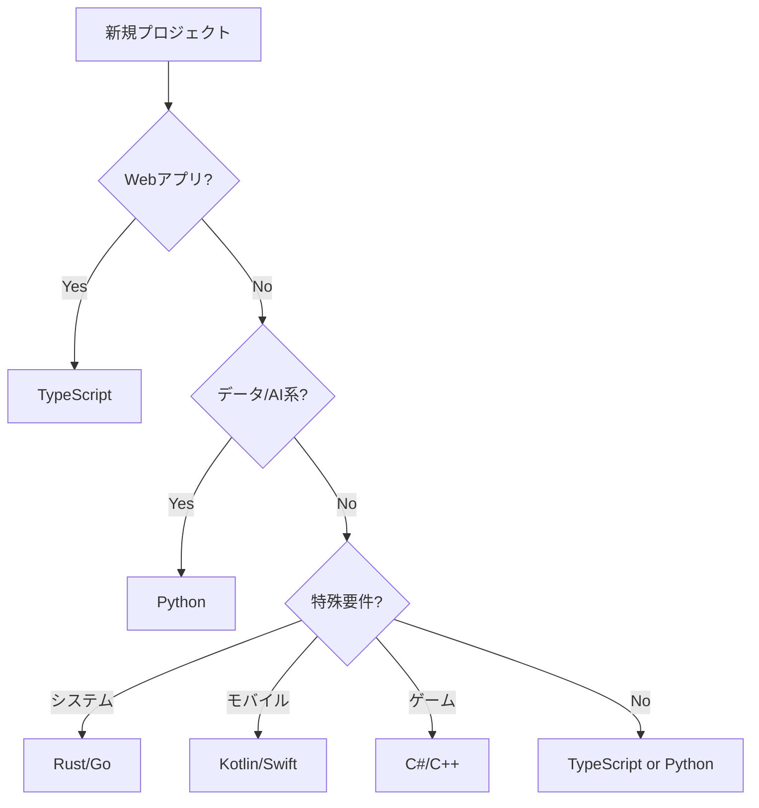

# サーバーサイド開発言語の選択

日付: 2025-06-11

---

## 👤 ユーザー
*2025/6/11 13:07:05*

サーバーサイド開発としておススメの言語

---

## 🤖 アシスタント
*2025/6/11 13:07:20*

サーバーサイド開発のおすすめ言語をいくつか紹介します：

## Node.js (JavaScript/TypeScript)
- **メリット**: フロントエンドと同じ言語で開発可能、非同期処理に優れ、エコシステムが充実
- **適用例**: リアルタイムアプリ、API開発、マイクロサービス
- **フレームワーク**: Express.js、NestJS、Fastify

## Python
- **メリット**: 学習しやすく、豊富なライブラリ、AI/ML統合が容易
- **適用例**: データ処理、機械学習API、Web開発
- **フレームワーク**: Django、FastAPI、Flask

## Go
- **メリット**: 高速実行、並行処理に強い、シンプルな言語仕様
- **適用例**: 高パフォーマンスAPI、マイクロサービス、クラウドネイティブアプリ
- **フレームワーク**: Gin、Echo、Fiber

## Java/Kotlin
- **メリット**: 大規模開発に適し、成熟したエコシステム、高い信頼性
- **適用例**: エンタープライズアプリ、金融システム
- **フレームワーク**: Spring Boot、Quarkus

## Rust
- **メリット**: メモリ安全性、C++並みの高速性、並行処理の安全性
- **適用例**: 高パフォーマンスが必要なシステム、WebAssembly
- **フレームワーク**: Actix Web、Rocket

選択基準としては、プロジェクトの要件（パフォーマンス、開発速度、チームのスキル）や既存システムとの連携を考慮することが重要です。個人的には、汎用性と開発効率のバランスが良いTypeScript（Node.js）やPython（FastAPI）から始めることをおすすめします。

---

## 👤 ユーザー
*2025/6/11 13:07:36*

何故 日本ではルビーなのか

---

## 🤖 アシスタント
*2025/6/11 13:07:52*

日本でRubyが特に人気な理由にはいくつかの要因があります：

## 日本発の言語
- **まつもとゆきひろ氏**（Matz）が1995年に開発
- 日本人が作った世界的に成功したプログラミング言語として誇り
- 日本語ドキュメントが最初から充実

## Ruby on Railsの影響
- 2004年にRailsが登場し、Web開発を革命的に効率化
- 「設定より規約」の思想が日本の開発文化と相性が良い
- スタートアップブームと時期が重なり、多くの日本企業が採用

## 日本固有の要因
- **コミュニティの強さ**: Ruby会議、地域Rubyコミュニティが活発
- **企業文化**: 楽天、クックパッドなど大手IT企業が積極採用
- **教育**: プログラミングスクールの多くがRubyを教材に使用
- **島根県の支援**: Ruby City MATSUEプロジェクトなど自治体も推進

## 言語の特徴と日本の開発文化
- 「楽しくプログラミング」という思想
- 可読性重視で、日本の丁寧な開発スタイルにマッチ
- 生産性重視の文化と相性が良い

ただし、最近では世界的なトレンドの影響で、日本でもPython、Go、TypeScriptなどの採用が増えており、Rubyの相対的なシェアは以前より下がっています。それでも日本のWeb開発業界では依然として重要な位置を占めています。

---

## 👤 ユーザー
*2025/6/11 13:08:06*

世界のシェア順では？

---

## 🤖 アシスタント
*2025/6/11 13:08:35*

世界のサーバーサイド開発言語のシェアについて、最新の状況を調べてみます。
```
This block is not supported on your current device yet.
```


```
This block is not supported on your current device yet.
```

世界のサーバーサイド開発言語のシェアについて、2025年の最新データを基にまとめます：

## 世界のサーバーサイド言語シェア（2025年）

### Webサイトでの使用率
1. **PHP** - 約79.2%（圧倒的首位）
2. **ASP.NET** - 約6-8%
3. **Ruby** - 約5-6%
4. **Java** - 約4-5%
5. **Node.js (JavaScript)** - 約4%
6. **Python** - 約1-2%

### 開発者人気・市場シェア（別の観点）
1. **Python** - 29.85%（AI/ML分野で急成長）
2. **Java** - 第2位（企業向けで安定）
3. **JavaScript** - 第3位（フルスタック開発）
4. **C/C++** - システム開発で根強い
5. **Go** - クラウドネイティブで急上昇
6. **Rust** - セキュリティ重視で成長中

## 重要な注意点

PHPは実際に稼働しているWebサイトの79.2%で使用されており、これはWordPressなどのCMSの普及が大きな要因です。一方、開発者の間での人気や新規プロジェクトでの採用率は別の傾向を示しています。

**Rubyの位置づけ**：
- Webサイト使用率では3-4位
- 新規開発での採用は減少傾向
- 日本では依然として高いシェアを維持

この二つの指標（実際の使用率 vs 開発者人気）の違いを理解することが重要です。既存システムの多くはPHPで動いていますが、新規開発ではPython、Go、Rustなどのモダンな言語が選ばれる傾向にあります。

---

## 👤 ユーザー
*2025/6/11 13:09:28*

何故Pythonなのか？ 型制約はTypeScriptと比べてどうか？

---

## 🤖 アシスタント
*2025/6/11 13:10:26*

PythonとTypeScriptの型システムを比較しながら、Pythonが人気な理由を解説します。

## Pythonが人気な理由

### 1. AI/機械学習のエコシステム
- **圧倒的なライブラリ群**: TensorFlow、PyTorch、scikit-learn、pandas
- **データサイエンスの標準言語**: Jupyter Notebookとの統合
- **研究者コミュニティ**: 学術界での採用が産業界に波及

### 2. 学習曲線の優しさ
```python
# Pythonの直感的な構文
def calculate_average(numbers):
    return sum(numbers) / len(numbers)

# 読みやすいリスト内包表記
squares = [x**2 for x in range(10)]
```

### 3. 多目的性
- Web開発（Django、FastAPI）
- 自動化・スクリプティング
- 科学計算
- システム管理

## 型システムの比較

### Python（型ヒント）
```python
from typing import List, Optional, Union

def process_data(
    items: List[str], 
    max_count: Optional[int] = None
) -> Union[int, str]:
    if max_count:
        return len(items[:max_count])
    return f"Total: {len(items)}"

# 実行時には型チェックされない
result = process_data(["a", "b"], "wrong")  # 実行可能
```

### TypeScript（静的型付け）
```typescript
function processData(
    items: string[], 
    maxCount?: number
): number | string {
    if (maxCount) {
        return items.slice(0, maxCount).length;
    }
    return `Total: ${items.length}`;
}

// コンパイル時にエラー
const result = processData(["a", "b"], "wrong"); // エラー
```

## 型制約の主な違い

### 実行タイミング
- **Python**: 実行時型チェック（オプション）
- **TypeScript**: コンパイル時型チェック（必須）

### 型の厳密さ
```python
# Python - 段階的型付け
def add(a, b):  # 型なしでもOK
    return a + b

def add_typed(a: int, b: int) -> int:  # 型ありも可能
    return a + b
```

```typescript
// TypeScript - デフォルトで型推論
function add(a: number, b: number) {  // 戻り値は自動推論
    return a + b;
}
```

### 型システムの表現力
両言語とも高度な型が使用可能：

**Python**:
```python
from typing import TypeVar, Generic, Protocol

T = TypeVar('T')
class Container(Generic[T]):
    def __init__(self, value: T) -> None:
        self.value = value
```

**TypeScript**:
```typescript
class Container<T> {
    constructor(public value: T) {}
}

// より高度な型操作
type Readonly<T> = {
    readonly [P in keyof T]: T[P];
}
```

## どちらを選ぶべきか？

### Pythonが適している場合
- データ分析、AI/ML開発
- プロトタイピング、研究開発
- 科学計算、数値処理
- 型の柔軟性を重視

### TypeScriptが適している場合
- 大規模なWebアプリケーション
- チーム開発での型安全性重視
- フロントエンド/バックエンド統一
- リファクタリング頻度が高い

Pythonの人気は、その**柔軟性**と**強力なエコシステム**、特にAI分野での圧倒的な優位性によるものです。型システムは後から追加された機能ですが、必要に応じて使える「段階的型付け」のアプローチが、多様な開発者のニーズに応えています。

---

## 👤 ユーザー
*2025/6/11 13:11:15*

型安全重視でAPiサーバーを建てるならどの選択肢が有効か

---

## 🤖 アシスタント
*2025/6/11 13:11:49*

型安全性を重視したAPIサーバー開発の選択肢を、実践的な観点から比較します。

## 1. TypeScript (Node.js)

### フレームワーク例
```typescript
// NestJS - 最も型安全なNode.jsフレームワーク
@Controller('users')
export class UserController {
  @Post()
  async createUser(@Body() dto: CreateUserDto): Promise<User> {
    return this.userService.create(dto);
  }
}

// tRPC - End-to-End型安全
const appRouter = router({
  user: {
    create: publicProcedure
      .input(z.object({ name: z.string(), email: z.string().email() }))
      .mutation(async ({ input }) => {
        return await createUser(input);
      }),
  },
});
```

**メリット**:
- フロントエンドとの型共有が容易
- 豊富なエコシステム
- tRPCによる完全な型安全性

**デメリット**:
- ランタイムエラーの可能性
- 型定義の管理が複雑になりがち

## 2. Rust

### フレームワーク例
```rust
// Actix-web
#[derive(Deserialize, Serialize)]
struct CreateUser {
    name: String,
    email: String,
}

#[post("/users")]
async fn create_user(user: web::Json<CreateUser>) -> Result<impl Responder> {
    // コンパイル時に型が保証される
    Ok(HttpResponse::Ok().json(&user))
}
```

**メリット**:
- 最高レベルの型安全性とメモリ安全性
- ゼロコスト抽象化
- 実行時エラーが極めて少ない

**デメリット**:
- 学習曲線が急
- 開発速度が遅い

## 3. Go

### 標準的な実装
```go
type CreateUserRequest struct {
    Name  string `json:"name" validate:"required"`
    Email string `json:"email" validate:"required,email"`
}

func CreateUser(w http.ResponseWriter, r *http.Request) {
    var req CreateUserRequest
    if err := json.NewDecoder(r.Body).Decode(&req); err != nil {
        http.Error(w, err.Error(), http.StatusBadRequest)
        return
    }
    // 処理
}
```

**メリット**:
- シンプルで理解しやすい
- 高速なコンパイル
- 優れた並行処理

**デメリット**:
- ジェネリクスの制限
- エラーハンドリングが冗長

## 4. C# (.NET)

### ASP.NET Core例
```csharp
[ApiController]
[Route("[controller]")]
public class UsersController : ControllerBase
{
    [HttpPost]
    public async Task<ActionResult<User>> CreateUser(
        [FromBody] CreateUserDto dto)
    {
        if (!ModelState.IsValid)
            return BadRequest(ModelState);
        
        return Ok(await _userService.CreateAsync(dto));
    }
}
```

**メリット**:
- 成熟した型システム
- 優れたツーリング（Visual Studio）
- OpenAPI統合が充実

**デメリット**:
- Windows中心のエコシステム
- 比較的重い

## 5. Kotlin (JVM)

### Ktor例
```kotlin
@Serializable
data class CreateUserRequest(
    val name: String,
    val email: String
)

fun Route.userRoutes() {
    route("/users") {
        post {
            val user = call.receive<CreateUserRequest>()
            call.respond(HttpStatusCode.Created, createUser(user))
        }
    }
}
```

**メリット**:
- null安全性
- JVMの成熟したエコシステム
- コルーチンによる非同期処理

## 推奨選択基準

### 最高の型安全性を求める場合
**Rust** - コンパイル時にほぼ全てのエラーを検出

### バランスの良い選択
**TypeScript (NestJS/tRPC)** - 開発効率と型安全性の良いバランス

### エンタープライズ環境
**C# (.NET)** または **Java/Kotlin** - 実績と安定性

### シンプルさと性能
**Go** - 型安全性は中程度だが、実用的で高速

### 実践的な推奨
```typescript
// TypeScript + Zodによる実行時検証
import { z } from 'zod';

const UserSchema = z.object({
  name: z.string().min(1),
  email: z.string().email(),
});

type User = z.infer<typeof UserSchema>;

// コンパイル時 + 実行時の両方で型安全
const validateUser = (data: unknown): User => {
  return UserSchema.parse(data);
};
```

多くのプロジェクトでは、**TypeScript + Zod/io-ts** の組み合わせが、開発効率と型安全性の最適なバランスを提供します。より厳密な要求がある場合は、Rustを検討すべきでしょう。

---

## 👤 ユーザー
*2025/6/11 13:12:39*

Goはどうなのか？それぞれの言語で向いていること向いていないことを探そう

---

## 🤖 アシスタント
*2025/6/11 13:13:16*

Goの特徴と各言語の向き不向きを詳しく分析します。

## Go言語の詳細分析

### Goの強み
```go
// シンプルで読みやすい並行処理
func processItems(items []string) {
    ch := make(chan string, len(items))
    
    // 並行処理が言語レベルでサポート
    for _, item := range items {
        go func(i string) {
            result := process(i)
            ch <- result
        }(item)
    }
    
    // 結果の収集
    for range items {
        fmt.Println(<-ch)
    }
}
```

### Goの型システムの特徴
```go
// インターフェースによる柔軟な設計
type Storage interface {
    Save(data []byte) error
    Load(id string) ([]byte, error)
}

// エラーハンドリングは明示的
func CreateUser(name, email string) (*User, error) {
    if name == "" {
        return nil, errors.New("name is required")
    }
    // 処理
    return &User{Name: name, Email: email}, nil
}
```

## 各言語の向き不向き

### Go
**向いている**
- マイクロサービス、API開発
- ネットワークサービス、プロキシ
- CLI ツール
- コンテナ関連ツール（Docker、Kubernetes）
- 高並行性が必要なシステム

**向いていない**
- 複雑なビジネスロジック（ジェネリクスの制限）
- GUI アプリケーション
- 機械学習、データ分析
- ゲーム開発

### TypeScript
**向いている**
- フルスタックWeb開発
- 大規模なフロントエンド
- GraphQL API
- リアルタイムアプリ（Socket.io）
- Electronデスクトップアプリ

**向いていない**
- システムプログラミング
- 高性能計算
- モバイルネイティブアプリ
- 組み込みシステム

### Rust
**向いている**
- システムプログラミング
- WebAssembly
- ゲームエンジン
- 暗号化、セキュリティ重視のアプリ
- 組み込みシステム

**向いていない**
- 高速なプロトタイピング
- スクリプト的な用途
- 学習コストを抑えたい小規模プロジェクト
- Webフロントエンド（直接）

### Python
**向いている**
- データ分析、機械学習
- 科学計算
- 自動化スクリプト
- Web開発（Django、FastAPI）
- 教育、学習用途

**向いていない**
- 高性能が必要なシステム
- モバイルアプリ開発
- 型安全性が重要なシステム
- リアルタイムシステム

### C# (.NET)
**向いている**
- エンタープライズアプリケーション
- Windows デスクトップアプリ
- ゲーム開発（Unity）
- クロスプラットフォームアプリ（MAUI）
- Azure統合システム

**向いていない**
- システムプログラミング
- 軽量なマイクロサービス
- 組み込みシステム
- 小規模なスクリプト

### Java/Kotlin
**向いている**
- Androidアプリ開発
- 大規模エンタープライズシステム
- Spring Bootマイクロサービス
- ビッグデータ処理（Spark、Kafka）

**向いていない**
- システムプログラミング
- 軽量なCLIツール
- リアルタイムゲーム
- 機械学習の研究開発

## 具体的な選択シナリオ

### APIサーバー構築の判断基準

```go
// Go - シンプルで高性能なAPI
type Handler struct {
    db Database
}

func (h *Handler) CreateUser(w http.ResponseWriter, r *http.Request) {
    // 明示的なエラーハンドリング
    // 高速な実行
    // デプロイが簡単（単一バイナリ）
}
```

```typescript
// TypeScript - 型安全で柔軟なAPI
class UserController {
    @Post()
    @UseGuards(AuthGuard)
    async createUser(@Body() dto: CreateUserDto): Promise<User> {
        // デコレータによる宣言的な実装
        // 豊富なミドルウェア
        // フロントエンドとの型共有
    }
}
```

### 選択の決定木

1. **パフォーマンスが最重要？**
   - Yes → Rust or Go
   - No → 次へ

2. **型安全性が最重要？**
   - Yes → Rust > TypeScript > C# > Go > Python
   - No → 次へ

3. **開発速度が最重要？**
   - Yes → Python > TypeScript > Go > C# > Rust
   - No → 次へ

4. **既存チームのスキル？**
   - フロントエンド経験 → TypeScript
   - システム開発経験 → Go or Rust
   - エンタープライズ経験 → Java/C#

Goは「シンプルさ」と「性能」の絶妙なバランスを提供し、特にクラウドネイティブな環境では最適な選択肢の一つです。ただし、複雑な型表現が必要な場合は他の言語を検討すべきでしょう。

---

## 👤 ユーザー
*2025/6/11 13:14:22*

AWSやGCPが真っ先に対応してくれる言語はどれか

---

## 🤖 アシスタント
*2025/6/11 13:15:10*

クラウドプロバイダーのサポート優先度を調べてみます。
```
This block is not supported on your current device yet.
```


```
This block is not supported on your current device yet.
```

AWSやGCPが真っ先に対応してくれる言語について、データに基づいてまとめます。

## クラウドプロバイダーの言語サポート優先順位

### 第1優先グループ（Day 1サポート）
これらの言語は新機能・新サービスが最も早くサポートされます：

1. **Python**
   - 両プラットフォームで最優先
   - Lambda で「シンプルな関数では、PythonとNode.jsのような解釈型言語が最速のパフォーマンスを提供」
   - AI/ML サービスとの統合が最も充実
   - SDK更新が最も迅速

2. **Node.js/JavaScript**
   - サーバーレス環境で最適化
   - Google Cloud Functionsは「特にNode.jsやPythonで書かれた関数でコールドスタート時間が速い」
   - フロントエンド統合が容易

3. **Java**
   - エンタープライズ向けの最優先言語
   - 「Java、Python、NodeはLambdaで現在サポートされている唯一の言語で、デフォルトでSDKがバンドルされている」
   - 最も包括的なSDKサポート

### 第2優先グループ
4. **Go**
   - クラウドネイティブツールの標準
   - 両プラットフォームでネイティブサポート
   - コンテナ環境で優遇

5. **C#/.NET**
   - AWSでより優先（Azureとの競合）
   - エンタープライズ向け機能が充実

### 第3優先グループ
6. **Ruby** - GCPでネイティブサポート、AWSは限定的
7. **PHP** - GCPでネイティブサポート、AWSは限定的
8. **Rust** - カスタムランタイムとして利用可能

## プラットフォーム別の特徴

### AWS Lambda
「Node.js、Python、Java、Go、Ruby、.NET Coreを含む複数のプログラミング言語をサポート」

**優先順位の証拠**：
- SDK同時リリース: Python, Node.js, Java
- ランタイム更新頻度: 最も頻繁
- ドキュメント充実度: 最高

### Google Cloud Functions
「Node.js、Python、Go、Javaなどの言語をサポート」

**優先順位の証拠**：
- コールドスタート最適化: Node.js, Python
- 新機能の優先実装: これらの言語から

## 実践的な選択指針

### 最速のサポートを求める場合
```python
# Python - 両プラットフォームで最優先
# 新サービスのSDKが最速でリリース
# AI/MLサービスとの統合が最も充実
```

```javascript
// Node.js/TypeScript - サーバーレスに最適
// Lambda@Edge、Cloud Functions即座に対応
// フルスタック開発で一貫性
```

### エンタープライズ向け
```java
// Java - 最も包括的なサポート
// すべてのサービスで完全なSDK
// 長期サポート保証
```

### クラウドネイティブ開発
```go
// Go - コンテナ環境で優遇
// GKE、ECSツールの標準言語
// 軽量で高速なデプロイ
```

## 選択の決定要因

1. **新サービスへの対応速度**
   - Python = Node.js > Java > Go > その他

2. **SDK の完成度**
   - Java > Python > Node.js > Go > その他

3. **サーバーレス最適化**
   - Node.js > Python > Go > Java > その他

4. **長期サポート保証**
   - Java > Python > Node.js > その他

結論として、**Python、Node.js、Java** の3言語が両クラウドプロバイダーから最も優先的にサポートされており、新機能や新サービスへの対応も最速です。特にPythonは、AI/ML分野での需要により、今後さらに優先度が上がると予想されます。

---

## 👤 ユーザー
*2025/6/11 13:15:44*

Kotlinはどうなのか？Javaの上位互換だと思っていたけど

---

## 🤖 アシスタント
*2025/6/11 13:16:28*

Kotlinについて詳しく分析してみます。確かにKotlinはJavaの「より良い版」として設計されていますが、クラウドプロバイダーのサポート状況は複雑です。

## KotlinとJavaの関係

### Kotlinの技術的優位性
```kotlin
// Null安全性 - コンパイル時にNullPointerExceptionを防ぐ
val name: String? = null
val length = name?.length ?: 0  // Javaより簡潔で安全

// データクラス - ボイラープレートコードを削減
data class User(val id: Int, val name: String)

// コルーチン - 非同期処理が直感的
suspend fun fetchUser(): User = coroutineScope {
    val user = async { apiCall() }
    user.await()
}

// 拡張関数 - 既存クラスに機能追加
fun String.isEmail(): Boolean = 
    this.contains("@") && this.contains(".")
```

### Javaとの相互運用性
```kotlin
// JavaコードをKotlinから呼び出し
val list = ArrayList<String>()  // Java標準ライブラリ
list.add("Kotlin")

// KotlinコードをJavaから呼び出し
@JvmStatic
fun main(args: Array<String>) {
    // Javaから呼び出し可能
}
```

## クラウドプロバイダーでのKotlinサポート状況

### AWS Lambda
- **公式サポート**: JVMランタイムとして動作
- **制限事項**: 
  - Kotlin専用ランタイムは存在しない
  - Java 21ランタイムで実行
  - コールドスタートがJavaと同様に遅い

```kotlin
// AWS Lambda Handler in Kotlin
class Handler : RequestHandler<APIGatewayProxyRequestEvent, APIGatewayProxyResponseEvent> {
    override fun handleRequest(
        input: APIGatewayProxyRequestEvent,
        context: Context
    ): APIGatewayProxyResponseEvent {
        return APIGatewayProxyResponseEvent().apply {
            statusCode = 200
            body = """{"message": "Hello from Kotlin!"}"""
        }
    }
}
```

### Google Cloud Functions
「Google Cloud FunctionsはJavaに加えて、Kotlin、Groovy、ScalaなどのJVM言語もサポート」している点で、AWSより積極的です。

### SDK サポートの現実
```kotlin
// AWS SDK for Kotlin - 2021年に登場
import aws.sdk.kotlin.services.s3.S3Client

suspend fun uploadFile() {
    S3Client { region = "us-east-1" }.use { s3 ->
        s3.putObject {
            bucket = "my-bucket"
            key = "file.txt"
            body = ByteStream.fromString("content")
        }
    }
}
```

## なぜKotlinが第一級サポートを受けないのか

### 1. エコシステムの成熟度
- **Java**: 25年以上の歴史、膨大なライブラリ
- **Kotlin**: 2011年登場、主にAndroid開発で普及
- エンタープライズでの採用はまだ限定的

### 2. 互換性の複雑さ
```kotlin
// Kotlin特有の機能はJavaに変換される
inline fun <reified T> genericFunction(): T {
    // この機能はJVMバイトコードに変換時に複雑
    return T::class.java.newInstance()
}
```

### 3. パフォーマンスの考慮事項
- Kotlinの便利機能の多くは追加のオーバーヘッド
- ラムダ式やコレクション操作で余分なオブジェクト生成
- サーバーレス環境では起動時間が重要

## Kotlinが優れている使用例

### 1. Spring Boot開発
```kotlin
@RestController
@RequestMapping("/api")
class UserController(private val userService: UserService) {
    
    @GetMapping("/users/{id}")
    suspend fun getUser(@PathVariable id: Long): User? =
        userService.findById(id)
}
```

### 2. Android + バックエンド統合
```kotlin
// 共通のデータモデルを共有
@Serializable
data class ApiResponse<T>(
    val data: T?,
    val error: String?
)
```

### 3. DSL構築
```kotlin
// 型安全なクエリビルダー
val query = query {
    select("users") {
        where { "age" greaterThan 18 }
        orderBy("name", ascending = true)
    }
}
```

## 実践的な判断基準

### Kotlinを選ぶべき場合
- **Androidアプリと統合**: コード共有が可能
- **Spring Boot使用**: 公式サポートが充実
- **型安全性重視**: Nullセーフティが必須
- **開発効率優先**: ボイラープレートを削減

### Javaを選ぶべき場合
- **クラウドサービス優先度**: 新機能の即座サポート
- **パフォーマンス重視**: 起動時間が重要
- **チームの経験**: Java経験者が多い
- **長期保守**: 10年以上のサポート必要

## 将来の展望

KotlinはJavaの技術的な上位互換ですが、クラウドプロバイダーのサポートでは「第2級市民」的な扱いです。しかし：

1. **AWS SDK for Kotlin**が正式リリース（2021年）
2. **GraalVM Native Image**でコールドスタート改善
3. **Kotlin Multiplatform**でサーバー/クライアント統合

これらの進展により、今後数年でサポート状況は改善される可能性があります。

現時点では、**クラウドファーストの開発ならJava**、**開発効率とコード品質ならKotlin**という使い分けが現実的です。

---

## 👤 ユーザー
*2025/6/11 13:17:13*

こうなるとtypescriptとPythonをまず採用するかを考えてそれらでどうしても扱えない場合は別言語ということになるのではないか？

---

## 🤖 アシスタント
*2025/6/11 13:17:53*

まさにその通りです！現代のサーバーサイド開発では、TypeScriptとPythonの2言語でほとんどのケースをカバーできる時代になっています。

## TypeScript + Python戦略の合理性

### カバー範囲の広さ
```typescript
// TypeScript - Webアプリケーション全般
- フロントエンド/バックエンド統一
- リアルタイムアプリ（WebSocket）
- GraphQL API
- マイクロサービス
- サーバーレス関数
```

```python
# Python - データ処理とAI/ML
- 機械学習API
- データ分析・ETL処理
- 科学計算
- 自動化スクリプト
- バッチ処理
```

## この2言語で「できない」ケース

### 1. システムプログラミング
```rust
// OS、ドライバ、組み込みシステム
// → Rust or C++
fn low_level_memory_operation() {
    unsafe {
        let raw_ptr = 0x1234 as *mut u8;
        *raw_ptr = 42;
    }
}
```

### 2. 超高性能要求
```go
// 数百万req/secのプロキシサーバー
// → Go or Rust
func handleMillionsOfRequests() {
    for i := 0; i < runtime.NumCPU(); i++ {
        go worker()
    }
}
```

### 3. モバイルネイティブ
```kotlin
// Androidアプリ → Kotlin
// iOSアプリ → Swift
class MainActivity : AppCompatActivity() {
    // プラットフォーム特有のAPI
}
```

### 4. ゲームエンジン
```csharp
// Unity → C#
// Unreal → C++
public class PlayerController : MonoBehaviour {
    void Update() {
        // 60FPSでの物理演算
    }
}
```

## 実践的な技術選定フローチャート



## TypeScript + Python の実装例

### 典型的なアーキテクチャ
```typescript
// TypeScript - APIゲートウェイ
export class APIGateway {
  async handleRequest(req: Request): Promise<Response> {
    if (req.path.startsWith('/ml/')) {
      // Python MLサービスに転送
      return await fetch('http://ml-service:5000' + req.path);
    }
    // 通常のビジネスロジック
    return await this.processRequest(req);
  }
}
```

```python
# Python - MLサービス
from fastapi import FastAPI
from transformers import pipeline

app = FastAPI()
classifier = pipeline("sentiment-analysis")

@app.post("/ml/sentiment")
async def analyze_sentiment(text: str):
    result = classifier(text)
    return {"sentiment": result}
```

## 言語選定の判断基準

### TypeScriptを選ぶ
- リアルタイムWeb機能
- フロントエンドとの統合
- GraphQL/REST API
- 型安全性が必要なビジネスロジック

### Pythonを選ぶ
- データ分析・可視化
- 機械学習/AI機能
- 科学計算
- 自動化・スクリプト処理

### 両方使う
```yaml
# docker-compose.yml
services:
  api:
    build: ./typescript-api
    ports:
      - "3000:3000"
  
  ml-service:
    build: ./python-ml
    ports:
      - "5000:5000"
  
  data-processor:
    build: ./python-etl
    depends_on:
      - api
```

## 他言語が必要になる明確な指標

1. **パフォーマンス測定で不足**
   - レイテンシ < 1ms要求 → Go/Rust
   - メモリ使用量制限 → Go/Rust

2. **プラットフォーム制約**
   - iOS開発 → Swift必須
   - Windows Desktop → C#有利

3. **既存資産の活用**
   - Javaの巨大なコードベース
   - C++の数値計算ライブラリ

4. **特殊なハードウェア**
   - GPU演算 → CUDA (C++)
   - 組み込み → C/Rust

## まとめ

現代のサーバーサイド開発では：

1. **第一選択**: TypeScript（Web系）or Python（データ/AI系）
2. **両方で対応できない場合のみ**他言語を検討
3. **マイクロサービスで適材適所**の組み合わせ

この戦略により：
- 学習コストの削減
- チーム編成の簡素化
- クラウドサポートの最大活用
- 開発効率の最適化

が実現できます。「とりあえずTypeScriptかPythonで始めて、本当に必要になったら他言語」というアプローチは、多くのプロジェクトで最も実践的な選択と言えるでしょう。

---

## 👤 ユーザー
*2025/6/11 13:18:11*

何故サーバーレス環境がtypescriptは強いのか？Pythonではできないのか？

---

## 🤖 アシスタント
*2025/6/11 13:19:02*

実はPythonでもサーバーレスは十分可能です！ただ、TypeScriptが特に強いとされる理由を詳しく解説します。

## サーバーレス環境でのTypeScriptの優位性

### 1. コールドスタートの速度
```typescript
// TypeScript (Node.js) - 起動時間: 100-200ms
export const handler = async (event: APIGatewayEvent) => {
  return {
    statusCode: 200,
    body: JSON.stringify({ message: "Hello" })
  };
};
```

```python
# Python - 起動時間: 150-400ms（ライブラリ次第）
import json
import pandas as pd  # これだけで+200ms
import numpy as np   # さらに+150ms

def handler(event, context):
    return {
        'statusCode': 200,
        'body': json.dumps({'message': 'Hello'})
    }
```

### 2. パッケージサイズの違い

**TypeScript/Node.js:**
```json
{
  "dependencies": {
    "aws-sdk": "excluded", // Lambdaに含まれている
    "axios": "1MB"
  }
}
// 最終的なzipサイズ: 2-5MB
```

**Python:**
```txt
# requirements.txt
pandas==2.0.0  # 40MB
numpy==1.24.0  # 20MB
scikit-learn==1.3.0  # 25MB
# 最終的なzipサイズ: 50-100MB
```

### 3. 非同期処理の自然さ
```typescript
// TypeScript - 非同期が言語の中核
export const handler = async (event: any) => {
  const [user, posts, comments] = await Promise.all([
    fetchUser(event.userId),
    fetchPosts(event.userId),
    fetchComments(event.userId)
  ]);
  
  return { user, posts, comments };
};
```

```python
# Python - 非同期は後付け
import asyncio

async def handler(event, context):
    # asyncioの追加設定が必要
    user, posts, comments = await asyncio.gather(
        fetch_user(event['userId']),
        fetch_posts(event['userId']),
        fetch_comments(event['userId'])
    )
    return {'user': user, 'posts': posts, 'comments': comments}
```

## Pythonでサーバーレスが「できない」わけではない

### Python + Mangum (FastAPI on Lambda)
```python
from fastapi import FastAPI
from mangum import Mangum

app = FastAPI()

@app.get("/users/{user_id}")
async def get_user(user_id: int):
    return {"user_id": user_id}

# Lambda handler
handler = Mangum(app)
```

### 軽量Pythonランタイムの構築
```dockerfile
# カスタムランタイムで軽量化
FROM public.ecr.aws/lambda/python:3.11

# 必要最小限のパッケージ
COPY requirements-minimal.txt .
RUN pip install --no-cache-dir -r requirements-minimal.txt

COPY app.py .
CMD ["app.handler"]
```

## 実際の使い分け基準

### TypeScriptが有利なケース
```typescript
// 1. API Gateway + 高頻度アクセス
export const apiHandler = async (event: APIGatewayEvent) => {
  // コールドスタートが頻繁 → 起動速度重要
  const result = await processRequest(event);
  return formatResponse(result);
};

// 2. リアルタイム処理
export const websocketHandler = async (event: any) => {
  // WebSocket接続は低レイテンシが必須
  await broadcastMessage(event.message);
};

// 3. 軽量な変換処理
export const transformHandler = async (event: S3Event) => {
  // JSONの変換など軽い処理
  const transformed = transform(event.Records);
  await saveToS3(transformed);
};
```

### Pythonが有利なケース
```python
# 1. データ分析・集計（実行時間 > 起動時間）
import pandas as pd

def analytics_handler(event, context):
    # 5分かかる処理なら、300ms の起動時間は誤差
    df = pd.read_csv(event['s3_path'])
    results = df.groupby('category').agg({
        'sales': 'sum',
        'profit': 'mean'
    })
    return results.to_dict()

# 2. 機械学習推論
from transformers import pipeline

classifier = pipeline("sentiment-analysis")

def ml_handler(event, context):
    # モデルロードは初回のみ（Provisioned Concurrency使用）
    text = event['text']
    result = classifier(text)
    return result

# 3. バッチ処理
def batch_handler(event, context):
    # 15分のタイムアウト内で大量データ処理
    process_large_dataset(event['bucket'], event['key'])
```

## パフォーマンス最適化テクニック

### TypeScript最適化
```typescript
// 1. Tree shaking で不要コード削除
import { S3 } from '@aws-sdk/client-s3'; // v3 SDK

// 2. バンドルサイズ最小化
// webpack.config.js
module.exports = {
  mode: 'production',
  target: 'node',
  externals: {
    'aws-sdk': 'aws-sdk' // Lambda環境のSDK使用
  }
};
```

### Python最適化
```python
# 1. Lambda Layers でライブラリ共有
# serverless.yml
layers:
  pythonLibs:
    path: layer
    requirements:
      - pandas
      - numpy

# 2. 起動時初期化を最小化
import os

# グローバルスコープで重い処理を避ける
def handler(event, context):
    # 必要になってから import
    if event.get('use_pandas'):
        import pandas as pd
        # pandas を使った処理
```

## 実践的な選択指針

### サーバーレスでTypeScriptを選ぶ
- **レスポンス速度重視**: API Gateway, GraphQL
- **高頻度・短時間実行**: 1秒以内の処理
- **WebSocketやリアルタイム**: 低レイテンシ必須
- **フロントエンドとの統合**: 型共有

### サーバーレスでPythonを選ぶ
- **データ処理重視**: ETL、分析、レポート生成
- **機械学習**: 推論API、画像処理
- **長時間実行**: 数分〜15分のバッチ
- **科学計算ライブラリ**: NumPy、SciPy必須

## ハイブリッドアプローチ
```yaml
# serverless.yml
functions:
  # 高速レスポンスが必要なAPI
  api:
    handler: dist/api.handler
    runtime: nodejs18.x
    memorySize: 512
    
  # データ処理ジョブ
  processor:
    handler: python/processor.handler
    runtime: python3.11
    memorySize: 3008
    timeout: 900
    layers:
      - arn:aws:lambda:layer:pandas-numpy
```

結論：Pythonでもサーバーレスは十分可能ですが、**低レイテンシが重要な場合はTypeScript**、**計算処理が重要な場合はPython**という使い分けが最適です。

---

## 👤 ユーザー
*2025/6/11 13:19:22*

じゃあ用途に合わせてハイブリッドの方が良くないか？

---

## 🤖 アシスタント
*2025/6/11 13:20:17*

まさにその通りです！ハイブリッドアプローチこそが現代のサーバーサイド開発の最適解だと思います。

## ハイブリッドアーキテクチャの実例

### 典型的な構成
```yaml
# docker-compose.yml
version: '3.8'
services:
  # TypeScript: APIゲートウェイ・BFF
  api-gateway:
    build: ./services/api-gateway
    environment:
      - SERVICE_URLS={"ml":"http://ml-service:5000","data":"http://data-service:8000"}
    ports:
      - "3000:3000"

  # Python: 機械学習サービス
  ml-service:
    build: ./services/ml
    environment:
      - MODEL_PATH=/models/sentiment.pkl
    volumes:
      - ./models:/models

  # Python: データ処理サービス
  data-service:
    build: ./services/data-processor
    environment:
      - DATABASE_URL=postgresql://...

  # TypeScript: リアルタイムサービス
  realtime-service:
    build: ./services/realtime
    ports:
      - "3001:3001"

  # Go: 高性能プロキシ（必要に応じて）
  rate-limiter:
    build: ./services/rate-limiter
    ports:
      - "8080:8080"
```

## サービス別の実装例

### 1. API Gateway (TypeScript)
```typescript
// 高速ルーティングと型安全な統合
import { FastifyInstance } from 'fastify';
import { z } from 'zod';

export function setupRoutes(app: FastifyInstance) {
  // リアルタイムデータ
  app.get('/api/live/:id', async (request) => {
    return await realtimeService.getData(request.params.id);
  });

  // ML処理へのプロキシ
  app.post('/api/analyze', async (request) => {
    const schema = z.object({
      text: z.string(),
      model: z.enum(['sentiment', 'classification'])
    });
    
    const data = schema.parse(request.body);
    return await fetch('http://ml-service:5000/predict', {
      method: 'POST',
      body: JSON.stringify(data)
    });
  });

  // データ集計のトリガー
  app.post('/api/reports/generate', async (request) => {
    // 非同期ジョブとしてPythonサービスに委譲
    await jobQueue.push({
      service: 'data-processor',
      task: 'generate_report',
      params: request.body
    });
    
    return { jobId: generateJobId(), status: 'queued' };
  });
}
```

### 2. ML Service (Python)
```python
from fastapi import FastAPI
from transformers import pipeline
import torch

app = FastAPI()

# 起動時にモデルロード
sentiment_analyzer = pipeline("sentiment-analysis")
classifier = pipeline("zero-shot-classification")

@app.post("/predict")
async def predict(request: dict):
    model_type = request.get("model")
    text = request.get("text")
    
    if model_type == "sentiment":
        result = sentiment_analyzer(text)
    elif model_type == "classification":
        result = classifier(text, candidate_labels=request.get("labels"))
    
    return {"result": result, "model": model_type}

@app.post("/batch-process")
async def batch_process(texts: list[str]):
    # GPUを使った並列処理
    with torch.cuda.amp.autocast():
        results = sentiment_analyzer(texts, batch_size=32)
    return results
```

### 3. Data Processor (Python)
```python
import pandas as pd
from sqlalchemy import create_engine
import asyncio

class DataProcessor:
    def __init__(self):
        self.engine = create_engine(os.getenv("DATABASE_URL"))
    
    async def generate_report(self, params: dict):
        # 重いデータ処理
        query = f"""
        SELECT * FROM transactions 
        WHERE date >= '{params['start_date']}' 
        AND date <= '{params['end_date']}'
        """
        
        df = pd.read_sql(query, self.engine)
        
        # 複雑な集計処理
        report = df.groupby(['category', 'region']).agg({
            'amount': ['sum', 'mean', 'std'],
            'quantity': ['sum', 'count']
        })
        
        # 結果をS3に保存
        report.to_parquet(f"s3://reports/{params['report_id']}.parquet")
        
        return {"report_id": params['report_id'], "status": "completed"}
```

### 4. Realtime Service (TypeScript)
```typescript
// WebSocket handling
import { Server } from 'socket.io';
import { Redis } from 'ioredis';

export class RealtimeService {
  private io: Server;
  private redis: Redis;
  private subscribers = new Map<string, Set<string>>();

  async handleConnection(socket: Socket) {
    socket.on('subscribe', async (channel: string) => {
      // 低レイテンシが重要
      this.subscribers.get(channel)?.add(socket.id) || 
        this.subscribers.set(channel, new Set([socket.id]));
      
      // 最新データを即座に送信
      const latestData = await this.redis.get(`latest:${channel}`);
      socket.emit('data', JSON.parse(latestData || '{}'));
    });

    socket.on('publish', async (data: any) => {
      // リアルタイムブロードキャスト
      const subscribers = this.subscribers.get(data.channel) || new Set();
      for (const subscriberId of subscribers) {
        this.io.to(subscriberId).emit('data', data);
      }
    });
  }
}
```

## マイクロサービス間の通信パターン

### 1. 同期通信（REST/gRPC）
```typescript
// TypeScript側
const mlResult = await fetch('http://ml-service:5000/predict', {
  method: 'POST',
  body: JSON.stringify({ text: userInput })
});
```

### 2. 非同期通信（メッセージキュー）
```python
# Python側 - 重い処理
@celery.task
def process_large_dataset(dataset_id: str):
    # 1時間かかる処理
    result = heavy_computation(dataset_id)
    
    # 完了通知をTypeScriptサービスへ
    redis.publish('job:completed', json.dumps({
        'dataset_id': dataset_id,
        'result_path': result.path
    }))
```

## サーバーレスでのハイブリッド構成

```yaml
# serverless.yml
service: hybrid-app

functions:
  # TypeScript: 高速API
  api:
    handler: dist/handlers/api.handler
    runtime: nodejs20.x
    memorySize: 512
    events:
      - httpApi:
          path: /api/{proxy+}
          method: ANY

  # Python: ML推論
  mlInference:
    handler: python/ml.handler
    runtime: python3.11
    memorySize: 3008
    timeout: 30
    layers:
      - arn:aws:lambda:layer:pytorch
    events:
      - httpApi:
          path: /ml/predict
          method: POST

  # Python: バッチ処理
  dataProcessor:
    handler: python/batch.handler
    runtime: python3.11
    memorySize: 10240
    timeout: 900
    events:
      - schedule:
          rate: cron(0 2 * * ? *)  # 毎日午前2時

  # TypeScript: WebSocket
  websocket:
    handler: dist/handlers/ws.handler
    runtime: nodejs20.x
    events:
      - websocket:
          route: $connect
      - websocket:
          route: $default
```

## ハイブリッドアプローチのメリット

1. **最適な言語を最適な場所で**
   - API層: TypeScript（高速レスポンス）
   - ML/データ: Python（豊富なライブラリ）
   - 必要に応じて: Go（超高性能）、Rust（システム）

2. **チームの専門性を活かせる**
   - フロントエンドチーム → TypeScript API
   - データサイエンティスト → Python ML
   - インフラチーム → Go/Rust ツール

3. **段階的な最適化が可能**
   ```typescript
   // 最初はTypeScriptで実装
   async function processData(data: any) {
     // シンプルな処理
   }

   // ボトルネックになったらPythonサービスに移行
   async function processData(data: any) {
     return await pythonService.process(data);
   }
   ```

4. **障害の分離**
   - MLサービスが落ちても基本APIは動作
   - データ処理の遅延がリアルタイムに影響しない

## まとめ

ハイブリッドアプローチは：
- **複雑さ**は増すが、**適材適所**のメリットが上回る
- **マイクロサービス**の考え方と相性が良い
- **段階的な移行**が可能（モノリスから始めて分割）
- **クラウドネイティブ**な設計と親和性が高い

「すべてをTypeScriptで」や「すべてをPythonで」という制約に縛られるより、**各言語の強みを活かしたハイブリッド構成**の方が、現代の多様な要求に応えやすい最適解だと言えるでしょう。

---

## 👤 ユーザー
*2025/6/11 13:20:42*

何故インフラはGoなのか？インフラ側がコードを書くことがあるのか？

---

## 🤖 アシスタント
*2025/6/11 13:21:33*

良い質問です！「インフラ」という言葉が曖昧でしたね。正確に言うと、インフラチームが作る**インフラ関連のツールやミドルウェア**でGoが選ばれることが多いという意味です。

## インフラチームが実際に書くコード

### 1. カスタムプロキシ・ロードバランサー
```go
// 例: 認証プロキシ
package main

import (
    "net/http"
    "net/http/httputil"
    "net/url"
)

func main() {
    // 複数のバックエンドサービスへの振り分け
    proxy := &CustomProxy{
        services: map[string]*url.URL{
            "/api/": parseURL("http://api-service:3000"),
            "/ml/":  parseURL("http://ml-service:5000"),
        },
    }
    
    http.HandleFunc("/", proxy.ServeHTTP)
    http.ListenAndServe(":8080", nil)
}

func (p *CustomProxy) ServeHTTP(w http.ResponseWriter, r *http.Request) {
    // 認証チェック
    if !p.authenticate(r) {
        http.Error(w, "Unauthorized", 401)
        return
    }
    
    // ルーティング
    for path, backend := range p.services {
        if strings.HasPrefix(r.URL.Path, path) {
            proxy := httputil.NewSingleHostReverseProxy(backend)
            proxy.ServeHTTP(w, r)
            return
        }
    }
}
```

### 2. 監視・メトリクス収集ツール
```go
// Prometheusエクスポーター
type K8sMetricsCollector struct {
    client kubernetes.Interface
}

func (c *K8sMetricsCollector) CollectMetrics() {
    pods, _ := c.client.CoreV1().Pods("").List(context.TODO(), metav1.ListOptions{})
    
    for _, pod := range pods.Items {
        podMemoryUsage.WithLabelValues(
            pod.Namespace,
            pod.Name,
        ).Set(float64(pod.Status.ContainerStatuses[0].Resources.Memory))
    }
}
```

### 3. CI/CDパイプラインツール
```go
// デプロイメント自動化ツール
func DeployService(service string, version string) error {
    // Kubernetesにデプロイ
    deployment := &appsv1.Deployment{
        ObjectMeta: metav1.ObjectMeta{
            Name: service,
        },
        Spec: appsv1.DeploymentSpec{
            Template: corev1.PodTemplateSpec{
                Spec: corev1.PodSpec{
                    Containers: []corev1.Container{{
                        Name:  service,
                        Image: fmt.Sprintf("%s:%s", service, version),
                    }},
                },
            },
        },
    }
    
    _, err := k8sClient.AppsV1().Deployments("production").Update(deployment)
    return err
}
```

## なぜGoが選ばれるのか

### 1. 単一バイナリでのデプロイ
```bash
# Goアプリのデプロイ
GOOS=linux GOARCH=amd64 go build -o myapp
scp myapp server:/usr/local/bin/
# 完了！依存関係の心配なし

# Pythonアプリのデプロイ
pip install -r requirements.txt  # 環境構築が必要
python app.py  # インタープリタも必要
```

### 2. 軽量コンテナイメージ
```dockerfile
# Go - 最終イメージ: 10-20MB
FROM golang:1.21 AS builder
WORKDIR /app
COPY . .
RUN go build -o main .

FROM scratch
COPY --from=builder /app/main /
CMD ["/main"]
```

```dockerfile
# Python - 最終イメージ: 100-500MB
FROM python:3.11
WORKDIR /app
COPY requirements.txt .
RUN pip install -r requirements.txt
COPY . .
CMD ["python", "app.py"]
```

### 3. クラウドツールのエコシステム
```go
// 主要なインフラツールがGo製
- Docker
- Kubernetes
- Terraform (HashiCorp)
- Prometheus
- Grafana Loki
- etcd
- Consul
- Vault
```

## 実際のインフラコーディング例

### サービスメッシュのサイドカー
```go
// Envoyの設定を動的に更新
type ConfigManager struct {
    envoyAdmin string
}

func (cm *ConfigManager) UpdateRoute(service string, weight int) {
    config := map[string]interface{}{
        "routes": []map[string]interface{}{{
            "match": map[string]string{"prefix": "/"},
            "route": map[string]interface{}{
                "weighted_clusters": map[string]interface{}{
                    "clusters": []map[string]interface{}{{
                        "name": service,
                        "weight": weight,
                    }},
                },
            },
        }},
    }
    
    // Envoyに設定を適用
    http.Post(cm.envoyAdmin + "/clusters", "application/json", config)
}
```

### ログ集約パイプライン
```go
// 高速なログ処理
func ProcessLogs(input <-chan string, output chan<- ParsedLog) {
    for line := range input {
        // 正規表現より高速なパース
        if idx := strings.Index(line, "ERROR"); idx != -1 {
            parsed := ParsedLog{
                Level: "ERROR",
                Message: line[idx+6:],
                Timestamp: time.Now(),
            }
            output <- parsed
        }
    }
}
```

## TypeScript/Pythonでインフラツールを書かない理由

### パフォーマンス要件
```go
// Go - 1秒間に100万リクエスト処理可能
func handleMetrics(w http.ResponseWriter, r *http.Request) {
    // メモリ効率的な処理
    atomic.AddInt64(&requestCount, 1)
}
```

```typescript
// TypeScript - オーバーヘッドが大きい
app.get('/metrics', (req, res) => {
    // V8エンジンのオーバーヘッド
    requestCount++;
});
```

### リソース消費
```yaml
# Goのサイドカー
resources:
  requests:
    memory: "10Mi"
    cpu: "10m"

# Node.jsのサイドカー
resources:
  requests:
    memory: "128Mi"  # 10倍以上
    cpu: "100m"      # 10倍
```

## 現代のインフラチームの役割

1. **プラットフォームエンジニアリング**
   - 開発者向けの内部ツール作成
   - セルフサービスポータル
   - 自動化スクリプト

2. **観測可能性（Observability）**
   - カスタムメトリクス収集
   - 分散トレーシング
   - ログ集約・分析

3. **セキュリティツール**
   - 脆弱性スキャナー
   - シークレット管理
   - ネットワークポリシー実装

## まとめ

インフラチームは「インフラを設定する」だけでなく、**インフラを効率化するツール**を積極的に開発しています。その際にGoが選ばれる理由は：

1. **クラウドネイティブツールとの親和性**
2. **極めて軽量なランタイム**
3. **高い並行処理性能**
4. **運用の簡単さ**（単一バイナリ）

ただし、すべてのインフラツールがGoである必要はなく：
- **設定管理**: Python (Ansible)
- **スクリプト**: Bash/Python
- **Web UI**: TypeScript/React

という使い分けも一般的です。

---
