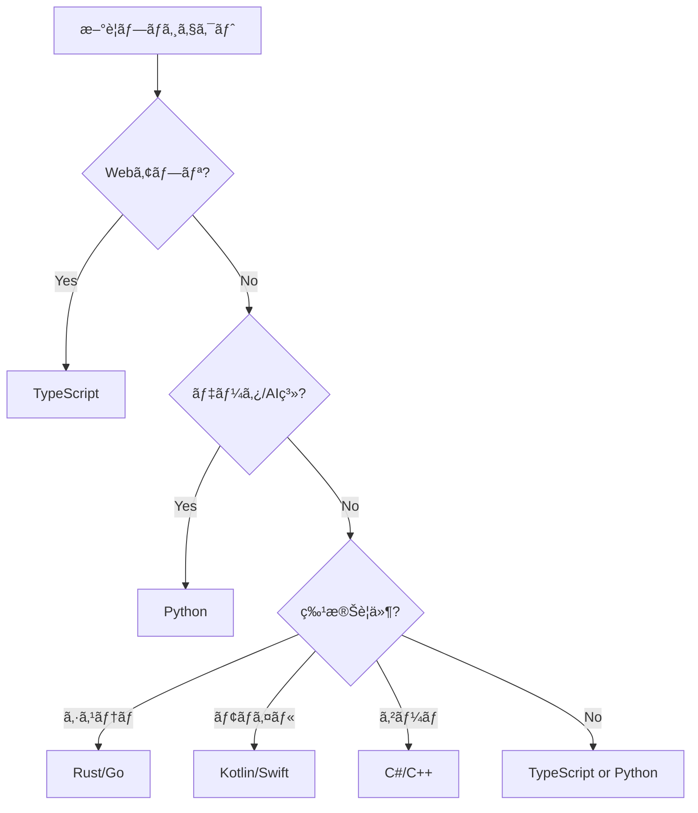

# サーãƒãƒ¼ã‚µã‚¤ãƒ‰é–‹ç™ºè¨€èªã®é¸æŠ

日付: 2025-06-11

---

## 👤 ユーザー
*2025/6/11 13:07:05*

サーãƒãƒ¼ã‚µã‚¤ãƒ‰é–‹ç™ºã¨ã—ã¦ãŠã‚¹ã‚¹ãƒ¡ã®è¨€èª

---

## 🤖 アシスタント
*2025/6/11 13:07:20*

サーãƒãƒ¼ã‚µã‚¤ãƒ‰é–‹ç™ºã®ãŠã™ã™ã‚言èªã‚’ã„ãã¤ã‹ç´¹ä»‹ã—ã¾ã™ï¼š

## Node.js (JavaScript/TypeScript)
- **メリット**: フロントエンドã¨åŒã˜è¨€èªã§é–‹ç™ºå¯èƒ½ã€éåŒæœŸå‡¦ç†ã«å„ªã‚Œã€ã‚¨ã‚³ã‚·ã‚¹ãƒ†ãƒ ãŒå……実
- **é©ç”¨ä¾‹**: リアルタイムアプリã€API開発ã€ãƒã‚¤ã‚¯ãƒ­ã‚µãƒ¼ãƒ“ス
- **フレームワーク**: Express.jsã€NestJSã€Fastify

## Python
- **メリット**: 学習ã—ã‚„ã™ãã€è±Šå¯Œãªãƒ©ã‚¤ãƒ–ラリã€AI/MLçµ±åˆãŒå®¹æ˜“
- **é©ç”¨ä¾‹**: データ処ç†ã€æ©Ÿæ¢°å­¦ç¿’APIã€Web開発
- **フレームワーク**: Djangoã€FastAPIã€Flask

## Go
- **メリット**: 高速実行ã€ä¸¦è¡Œå‡¦ç†ã«å¼·ã„ã€ã‚·ãƒ³ãƒ—ルãªè¨€èªä»•æ§˜
- **é©ç”¨ä¾‹**: 高パフォーãƒãƒ³ã‚¹APIã€ãƒã‚¤ã‚¯ãƒ­ã‚µãƒ¼ãƒ“スã€ã‚¯ãƒ©ã‚¦ãƒ‰ãƒã‚¤ãƒ†ã‚£ãƒ–アプリ
- **フレームワーク**: Ginã€Echoã€Fiber

## Java/Kotlin
- **メリット**: 大è¦æ¨¡é–‹ç™ºã«é©ã—ã€æˆç†Ÿã—ãŸã‚¨ã‚³ã‚·ã‚¹ãƒ†ãƒ ã€é«˜ã„信頼性
- **é©ç”¨ä¾‹**: エンタープライズアプリã€é‡‘èシステム
- **フレームワーク**: Spring Bootã€Quarkus

## Rust
- **メリット**: メモリ安全性ã€C++並ã¿ã®é«˜é€Ÿæ€§ã€ä¸¦è¡Œå‡¦ç†ã®å®‰å…¨æ€§
- **é©ç”¨ä¾‹**: 高パフォーãƒãƒ³ã‚¹ãŒå¿…è¦ãªã‚·ã‚¹ãƒ†ãƒ ã€WebAssembly
- **フレームワーク**: Actix Webã€Rocket

é¸æŠåŸºæº–ã¨ã—ã¦ã¯ã€ãƒ—ロジェクトã®è¦ä»¶ï¼ˆãƒ‘フォーãƒãƒ³ã‚¹ã€é–‹ç™ºé€Ÿåº¦ã€ãƒãƒ¼ãƒ ã®ã‚¹ã‚­ãƒ«ï¼‰ã‚„既存システムã¨ã®é€£æºã‚’考慮ã™ã‚‹ã“ã¨ãŒé‡è¦ã§ã™ã€‚個人的ã«ã¯ã€æ±ç”¨æ€§ã¨é–‹ç™ºåŠ¹ç‡ã®ãƒãƒ©ãƒ³ã‚¹ãŒè‰¯ã„TypeScript（Node.js）やPython（FastAPI）ã‹ã‚‰å§‹ã‚ã‚‹ã“ã¨ã‚’ãŠã™ã™ã‚ã—ã¾ã™ã€‚

---

## 👤 ユーザー
*2025/6/11 13:07:36*

何故 日本ã§ã¯ãƒ«ãƒ“ーãªã®ã‹

---

## 🤖 アシスタント
*2025/6/11 13:07:52*

日本ã§RubyãŒç‰¹ã«äººæ°—ãªç†ç”±ã«ã¯ã„ãã¤ã‹ã®è¦å› ãŒã‚ã‚Šã¾ã™ï¼š

## 日本発ã®è¨€èª
- **ã¾ã¤ã‚‚ã¨ã‚†ãã²ã‚æ°**（Matz）ãŒ1995å¹´ã«é–‹ç™º
- 日本人ãŒä½œã£ãŸä¸–界的ã«æˆåŠŸã—ãŸãƒ—ログラミング言èªã¨ã—ã¦èª‡ã‚Š
- 日本èªãƒ‰ã‚­ãƒ¥ãƒ¡ãƒ³ãƒˆãŒæœ€åˆã‹ã‚‰å……実

## Ruby on Railsã®å½±éŸ¿
- 2004å¹´ã«RailsãŒç™»å ´ã—ã€Web開発をé©å‘½çš„ã«åŠ¹ç‡åŒ–
- 「設定よりè¦ç´„ã€ã®æ€æƒ³ãŒæ—¥æœ¬ã®é–‹ç™ºæ–‡åŒ–ã¨ç›¸æ€§ãŒè‰¯ã„
- スタートアップブームã¨æ™‚期ãŒé‡ãªã‚Šã€å¤šãã®æ—¥æœ¬ä¼æ¥­ãŒæ¡ç”¨

## 日本固有ã®è¦å› 
- **コミュニティã®å¼·ã•**: Ruby会議ã€åœ°åŸŸRubyコミュニティãŒæ´»ç™º
- **ä¼æ¥­æ–‡åŒ–**: 楽天ã€ã‚¯ãƒƒã‚¯ãƒ‘ッドãªã©å¤§æ‰‹ITä¼æ¥­ãŒç©æ¥µæ¡ç”¨
- **教育**: プログラミングスクールã®å¤šããŒRubyã‚’æ•™æã«ä½¿ç”¨
- **島根県ã®æ”¯æ´**: Ruby City MATSUEプロジェクトãªã©è‡ªæ²»ä½“ã‚‚æ¨é€²

## 言èªã®ç‰¹å¾´ã¨æ—¥æœ¬ã®é–‹ç™ºæ–‡åŒ–
- 「楽ã—ãプログラミングã€ã¨ã„ã†æ€æƒ³
- å¯èª­æ€§é‡è¦–ã§ã€æ—¥æœ¬ã®ä¸å¯§ãªé–‹ç™ºã‚¹ã‚¿ã‚¤ãƒ«ã«ãƒãƒƒãƒ
- 生産性é‡è¦–ã®æ–‡åŒ–ã¨ç›¸æ€§ãŒè‰¯ã„

ãŸã ã—ã€æœ€è¿‘ã§ã¯ä¸–界的ãªãƒˆãƒ¬ãƒ³ãƒ‰ã®å½±éŸ¿ã§ã€æ—¥æœ¬ã§ã‚‚Pythonã€Goã€TypeScriptãªã©ã®æ¡ç”¨ãŒå¢—ãˆã¦ãŠã‚Šã€Rubyã®ç›¸å¯¾çš„ãªã‚·ã‚§ã‚¢ã¯ä»¥å‰ã‚ˆã‚Šä¸‹ãŒã£ã¦ã„ã¾ã™ã€‚ãã‚Œã§ã‚‚日本ã®Web開発業界ã§ã¯ä¾ç„¶ã¨ã—ã¦é‡è¦ãªä½ç½®ã‚’å ã‚ã¦ã„ã¾ã™ã€‚

---

## 👤 ユーザー
*2025/6/11 13:08:06*

世界ã®ã‚·ã‚§ã‚¢é †ã§ã¯ï¼Ÿ

---

## 🤖 アシスタント
*2025/6/11 13:08:35*

世界ã®ã‚µãƒ¼ãƒãƒ¼ã‚µã‚¤ãƒ‰é–‹ç™ºè¨€èªã®ã‚·ã‚§ã‚¢ã«ã¤ã„ã¦ã€æœ€æ–°ã®çŠ¶æ³ã‚’調ã¹ã¦ã¿ã¾ã™ã€‚
```
This block is not supported on your current device yet.
```


```
This block is not supported on your current device yet.
```

世界ã®ã‚µãƒ¼ãƒãƒ¼ã‚µã‚¤ãƒ‰é–‹ç™ºè¨€èªã®ã‚·ã‚§ã‚¢ã«ã¤ã„ã¦ã€2025å¹´ã®æœ€æ–°ãƒ‡ãƒ¼ã‚¿ã‚’基ã«ã¾ã¨ã‚ã¾ã™ï¼š

## 世界ã®ã‚µãƒ¼ãƒãƒ¼ã‚µã‚¤ãƒ‰è¨€èªã‚·ã‚§ã‚¢ï¼ˆ2025年）

### Webサイトã§ã®ä½¿ç”¨ç‡
1. **PHP** - ç´„79.2%（圧倒的首ä½ï¼‰
2. **ASP.NET** - ç´„6-8%
3. **Ruby** - ç´„5-6%
4. **Java** - ç´„4-5%
5. **Node.js (JavaScript)** - ç´„4%
6. **Python** - ç´„1-2%

### 開発者人気・市場シェア（別ã®è¦³ç‚¹ï¼‰
1. **Python** - 29.85%（AI/ML分é‡ã§æ€¥æˆé•·ï¼‰
2. **Java** - 第2ä½ï¼ˆä¼æ¥­å‘ã‘ã§å®‰å®šï¼‰
3. **JavaScript** - 第3ä½ï¼ˆãƒ•ãƒ«ã‚¹ã‚¿ãƒƒã‚¯é–‹ç™ºï¼‰
4. **C/C++** - システム開発ã§æ ¹å¼·ã„
5. **Go** - クラウドãƒã‚¤ãƒ†ã‚£ãƒ–ã§æ€¥ä¸Šæ˜‡
6. **Rust** - セキュリティé‡è¦–ã§æˆé•·ä¸­

## é‡è¦ãªæ³¨æ„点

PHPã¯å®Ÿéš›ã«ç¨¼åƒã—ã¦ã„ã‚‹Webサイトã®79.2%ã§ä½¿ç”¨ã•ã‚Œã¦ãŠã‚Šã€ã“ã‚Œã¯WordPressãªã©ã®CMSã®æ™®åŠãŒå¤§ããªè¦å› ã§ã™ã€‚一方ã€é–‹ç™ºè€…ã®é–“ã§ã®äººæ°—ã‚„æ–°è¦ãƒ—ロジェクトã§ã®æ¡ç”¨ç‡ã¯åˆ¥ã®å‚¾å‘を示ã—ã¦ã„ã¾ã™ã€‚

**Rubyã®ä½ç½®ã¥ã‘**：
- Webサイト使用ç‡ã§ã¯3-4ä½
- æ–°è¦é–‹ç™ºã§ã®æ¡ç”¨ã¯æ¸›å°‘傾å‘
- 日本ã§ã¯ä¾ç„¶ã¨ã—ã¦é«˜ã„シェアを維æŒ

ã“ã®äºŒã¤ã®æŒ‡æ¨™ï¼ˆå®Ÿéš›ã®ä½¿ç”¨ç‡ vs 開発者人気）ã®é•ã„ã‚’ç†è§£ã™ã‚‹ã“ã¨ãŒé‡è¦ã§ã™ã€‚既存システムã®å¤šãã¯PHPã§å‹•ã„ã¦ã„ã¾ã™ãŒã€æ–°è¦é–‹ç™ºã§ã¯Pythonã€Goã€Rustãªã©ã®ãƒ¢ãƒ€ãƒ³ãªè¨€èªãŒé¸ã°ã‚Œã‚‹å‚¾å‘ã«ã‚ã‚Šã¾ã™ã€‚

---

## 👤 ユーザー
*2025/6/11 13:09:28*

何故Pythonãªã®ã‹ï¼Ÿ å‹åˆ¶ç´„ã¯TypeScriptã¨æ¯”ã¹ã¦ã©ã†ã‹ï¼Ÿ

---

## 🤖 アシスタント
*2025/6/11 13:10:26*

Pythonã¨TypeScriptã®å‹ã‚·ã‚¹ãƒ†ãƒ ã‚’比較ã—ãªãŒã‚‰ã€PythonãŒäººæ°—ãªç†ç”±ã‚’解説ã—ã¾ã™ã€‚

## PythonãŒäººæ°—ãªç†ç”±

### 1. AI/機械学習ã®ã‚¨ã‚³ã‚·ã‚¹ãƒ†ãƒ 
- **圧倒的ãªãƒ©ã‚¤ãƒ–ラリ群**: TensorFlowã€PyTorchã€scikit-learnã€pandas
- **データサイエンスã®æ¨™æº–言èª**: Jupyter Notebookã¨ã®çµ±åˆ
- **研究者コミュニティ**: 学術界ã§ã®æ¡ç”¨ãŒç”£æ¥­ç•Œã«æ³¢åŠ

### 2. 学習曲線ã®å„ªã—ã•
```python
# Pythonã®ç›´æ„Ÿçš„ãªæ§‹æ–‡
def calculate_average(numbers):
    return sum(numbers) / len(numbers)

# 読ã¿ã‚„ã™ã„リスト内包表記
squares = [x**2 for x in range(10)]
```

### 3. 多目的性
- Web開発（Djangoã€FastAPI）
- 自動化・スクリプティング
- 科学計算
- システム管ç†

## å‹ã‚·ã‚¹ãƒ†ãƒ ã®æ¯”較

### Python（å‹ãƒ’ント）
```python
from typing import List, Optional, Union

def process_data(
    items: List[str], 
    max_count: Optional[int] = None
) -> Union[int, str]:
    if max_count:
        return len(items[:max_count])
    return f"Total: {len(items)}"

# 実行時ã«ã¯å‹ãƒã‚§ãƒƒã‚¯ã•ã‚Œãªã„
result = process_data(["a", "b"], "wrong")  # 実行å¯èƒ½
```

### TypeScript（é™çš„å‹ä»˜ã‘）
```typescript
function processData(
    items: string[], 
    maxCount?: number
): number | string {
    if (maxCount) {
        return items.slice(0, maxCount).length;
    }
    return `Total: ${items.length}`;
}

// コンパイル時ã«ã‚¨ãƒ©ãƒ¼
const result = processData(["a", "b"], "wrong"); // エラー
```

## å‹åˆ¶ç´„ã®ä¸»ãªé•ã„

### 実行タイミング
- **Python**: 実行時å‹ãƒã‚§ãƒƒã‚¯ï¼ˆã‚ªãƒ—ション）
- **TypeScript**: コンパイル時å‹ãƒã‚§ãƒƒã‚¯ï¼ˆå¿…須）

### å‹ã®å³å¯†ã•
```python
# Python - 段éšçš„å‹ä»˜ã‘
def add(a, b):  # å‹ãªã—ã§ã‚‚OK
    return a + b

def add_typed(a: int, b: int) -> int:  # å‹ã‚ã‚Šã‚‚å¯èƒ½
    return a + b
```

```typescript
// TypeScript - デフォルトã§å‹æ¨è«–
function add(a: number, b: number) {  // 戻り値ã¯è‡ªå‹•æ¨è«–
    return a + b;
}
```

### å‹ã‚·ã‚¹ãƒ†ãƒ ã®è¡¨ç¾åŠ›
両言èªã¨ã‚‚高度ãªå‹ãŒä½¿ç”¨å¯èƒ½ï¼š

**Python**:
```python
from typing import TypeVar, Generic, Protocol

T = TypeVar('T')
class Container(Generic[T]):
    def __init__(self, value: T) -> None:
        self.value = value
```

**TypeScript**:
```typescript
class Container<T> {
    constructor(public value: T) {}
}

// より高度ãªå‹æ“作
type Readonly<T> = {
    readonly [P in keyof T]: T[P];
}
```

## ã©ã¡ã‚‰ã‚’é¸ã¶ã¹ãã‹ï¼Ÿ

### PythonãŒé©ã—ã¦ã„ã‚‹å ´åˆ
- データ分æã€AI/ML開発
- プロトタイピングã€ç ”究開発
- 科学計算ã€æ•°å€¤å‡¦ç†
- å‹ã®æŸ”軟性をé‡è¦–

### TypeScriptãŒé©ã—ã¦ã„ã‚‹å ´åˆ
- 大è¦æ¨¡ãªWebアプリケーション
- ãƒãƒ¼ãƒ é–‹ç™ºã§ã®å‹å®‰å…¨æ€§é‡è¦–
- フロントエンド/ãƒãƒƒã‚¯ã‚¨ãƒ³ãƒ‰çµ±ä¸€
- リファクタリング頻度ãŒé«˜ã„

Pythonã®äººæ°—ã¯ã€ãã®**柔軟性**ã¨**強力ãªã‚¨ã‚³ã‚·ã‚¹ãƒ†ãƒ **ã€ç‰¹ã«AI分é‡ã§ã®åœ§å€’çš„ãªå„ªä½æ€§ã«ã‚ˆã‚‹ã‚‚ã®ã§ã™ã€‚å‹ã‚·ã‚¹ãƒ†ãƒ ã¯å¾Œã‹ã‚‰è¿½åŠ ã•ã‚ŒãŸæ©Ÿèƒ½ã§ã™ãŒã€å¿…è¦ã«å¿œã˜ã¦ä½¿ãˆã‚‹ã€Œæ®µéšçš„å‹ä»˜ã‘ã€ã®ã‚¢ãƒ—ローãƒãŒã€å¤šæ§˜ãªé–‹ç™ºè€…ã®ãƒ‹ãƒ¼ã‚ºã«å¿œãˆã¦ã„ã¾ã™ã€‚

---

## 👤 ユーザー
*2025/6/11 13:11:15*

å‹å®‰å…¨é‡è¦–ã§APiサーãƒãƒ¼ã‚’建ã¦ã‚‹ãªã‚‰ã©ã®é¸æŠè‚¢ãŒæœ‰åŠ¹ã‹

---

## 🤖 アシスタント
*2025/6/11 13:11:49*

å‹å®‰å…¨æ€§ã‚’é‡è¦–ã—ãŸAPIサーãƒãƒ¼é–‹ç™ºã®é¸æŠè‚¢ã‚’ã€å®Ÿè·µçš„ãªè¦³ç‚¹ã‹ã‚‰æ¯”較ã—ã¾ã™ã€‚

## 1. TypeScript (Node.js)

### フレームワーク例
```typescript
// NestJS - 最もå‹å®‰å…¨ãªNode.jsフレームワーク
@Controller('users')
export class UserController {
  @Post()
  async createUser(@Body() dto: CreateUserDto): Promise<User> {
    return this.userService.create(dto);
  }
}

// tRPC - End-to-Endå‹å®‰å…¨
const appRouter = router({
  user: {
    create: publicProcedure
      .input(z.object({ name: z.string(), email: z.string().email() }))
      .mutation(async ({ input }) => {
        return await createUser(input);
      }),
  },
});
```

**メリット**:
- フロントエンドã¨ã®å‹å…±æœ‰ãŒå®¹æ˜“
- 豊富ãªã‚¨ã‚³ã‚·ã‚¹ãƒ†ãƒ 
- tRPCã«ã‚ˆã‚‹å®Œå…¨ãªå‹å®‰å…¨æ€§

**デメリット**:
- ランタイムエラーã®å¯èƒ½æ€§
- å‹å®šç¾©ã®ç®¡ç†ãŒè¤‡é›‘ã«ãªã‚ŠãŒã¡

## 2. Rust

### フレームワーク例
```rust
// Actix-web
#[derive(Deserialize, Serialize)]
struct CreateUser {
    name: String,
    email: String,
}

#[post("/users")]
async fn create_user(user: web::Json<CreateUser>) -> Result<impl Responder> {
    // コンパイル時ã«å‹ãŒä¿è¨¼ã•ã‚Œã‚‹
    Ok(HttpResponse::Ok().json(&user))
}
```

**メリット**:
- 最高レベルã®å‹å®‰å…¨æ€§ã¨ãƒ¡ãƒ¢ãƒªå®‰å…¨æ€§
- ゼロコスト抽象化
- 実行時エラーãŒæ¥µã‚ã¦å°‘ãªã„

**デメリット**:
- 学習曲線ãŒæ€¥
- 開発速度ãŒé…ã„

## 3. Go

### 標準的ãªå®Ÿè£…
```go
type CreateUserRequest struct {
    Name  string `json:"name" validate:"required"`
    Email string `json:"email" validate:"required,email"`
}

func CreateUser(w http.ResponseWriter, r *http.Request) {
    var req CreateUserRequest
    if err := json.NewDecoder(r.Body).Decode(&req); err != nil {
        http.Error(w, err.Error(), http.StatusBadRequest)
        return
    }
    // 処ç†
}
```

**メリット**:
- シンプルã§ç†è§£ã—ã‚„ã™ã„
- 高速ãªã‚³ãƒ³ãƒ‘イル
- 優れãŸä¸¦è¡Œå‡¦ç†

**デメリット**:
- ジェãƒãƒªã‚¯ã‚¹ã®åˆ¶é™
- エラーãƒãƒ³ãƒ‰ãƒªãƒ³ã‚°ãŒå†—é•·

## 4. C# (.NET)

### ASP.NET Core例
```csharp
[ApiController]
[Route("[controller]")]
public class UsersController : ControllerBase
{
    [HttpPost]
    public async Task<ActionResult<User>> CreateUser(
        [FromBody] CreateUserDto dto)
    {
        if (!ModelState.IsValid)
            return BadRequest(ModelState);
        
        return Ok(await _userService.CreateAsync(dto));
    }
}
```

**メリット**:
- æˆç†Ÿã—ãŸå‹ã‚·ã‚¹ãƒ†ãƒ 
- 優れãŸãƒ„ーリング（Visual Studio）
- OpenAPIçµ±åˆãŒå……実

**デメリット**:
- Windows中心ã®ã‚¨ã‚³ã‚·ã‚¹ãƒ†ãƒ 
- 比較的é‡ã„

## 5. Kotlin (JVM)

### Ktor例
```kotlin
@Serializable
data class CreateUserRequest(
    val name: String,
    val email: String
)

fun Route.userRoutes() {
    route("/users") {
        post {
            val user = call.receive<CreateUserRequest>()
            call.respond(HttpStatusCode.Created, createUser(user))
        }
    }
}
```

**メリット**:
- null安全性
- JVMã®æˆç†Ÿã—ãŸã‚¨ã‚³ã‚·ã‚¹ãƒ†ãƒ 
- コルーãƒãƒ³ã«ã‚ˆã‚‹éåŒæœŸå‡¦ç†

## æ¨å¥¨é¸æŠåŸºæº–

### 最高ã®å‹å®‰å…¨æ€§ã‚’求ã‚ã‚‹å ´åˆ
**Rust** - コンパイル時ã«ã»ã¼å…¨ã¦ã®ã‚¨ãƒ©ãƒ¼ã‚’検出

### ãƒãƒ©ãƒ³ã‚¹ã®è‰¯ã„é¸æŠ
**TypeScript (NestJS/tRPC)** - 開発効ç‡ã¨å‹å®‰å…¨æ€§ã®è‰¯ã„ãƒãƒ©ãƒ³ã‚¹

### エンタープライズ環境
**C# (.NET)** ã¾ãŸã¯ **Java/Kotlin** - 実績ã¨å®‰å®šæ€§

### シンプルã•ã¨æ€§èƒ½
**Go** - å‹å®‰å…¨æ€§ã¯ä¸­ç¨‹åº¦ã ãŒã€å®Ÿç”¨çš„ã§é«˜é€Ÿ

### 実践的ãªæ¨å¥¨
```typescript
// TypeScript + Zodã«ã‚ˆã‚‹å®Ÿè¡Œæ™‚検証
import { z } from 'zod';

const UserSchema = z.object({
  name: z.string().min(1),
  email: z.string().email(),
});

type User = z.infer<typeof UserSchema>;

// コンパイル時 + 実行時ã®ä¸¡æ–¹ã§å‹å®‰å…¨
const validateUser = (data: unknown): User => {
  return UserSchema.parse(data);
};
```

多ãã®ãƒ—ロジェクトã§ã¯ã€**TypeScript + Zod/io-ts** ã®çµ„ã¿åˆã‚ã›ãŒã€é–‹ç™ºåŠ¹ç‡ã¨å‹å®‰å…¨æ€§ã®æœ€é©ãªãƒãƒ©ãƒ³ã‚¹ã‚’æä¾›ã—ã¾ã™ã€‚よりå³å¯†ãªè¦æ±‚ãŒã‚ã‚‹å ´åˆã¯ã€Rustを検è¨ã™ã¹ãã§ã—ょã†ã€‚

---

## 👤 ユーザー
*2025/6/11 13:12:39*

Goã¯ã©ã†ãªã®ã‹ï¼Ÿãã‚Œãã‚Œã®è¨€èªã§å‘ã„ã¦ã„ã‚‹ã“ã¨å‘ã„ã¦ã„ãªã„ã“ã¨ã‚’æ¢ãã†

---

## 🤖 アシスタント
*2025/6/11 13:13:16*

Goã®ç‰¹å¾´ã¨å„言èªã®å‘ãä¸å‘ãを詳ã—ã分æã—ã¾ã™ã€‚

## Go言èªã®è©³ç´°åˆ†æ

### Goã®å¼·ã¿
```go
// シンプルã§èª­ã¿ã‚„ã™ã„並行処ç†
func processItems(items []string) {
    ch := make(chan string, len(items))
    
    // 並行処ç†ãŒè¨€èªãƒ¬ãƒ™ãƒ«ã§ã‚µãƒãƒ¼ãƒˆ
    for _, item := range items {
        go func(i string) {
            result := process(i)
            ch <- result
        }(item)
    }
    
    // çµæœã®å集
    for range items {
        fmt.Println(<-ch)
    }
}
```

### Goã®å‹ã‚·ã‚¹ãƒ†ãƒ ã®ç‰¹å¾´
```go
// インターフェースã«ã‚ˆã‚‹æŸ”軟ãªè¨­è¨ˆ
type Storage interface {
    Save(data []byte) error
    Load(id string) ([]byte, error)
}

// エラーãƒãƒ³ãƒ‰ãƒªãƒ³ã‚°ã¯æ˜ç¤ºçš„
func CreateUser(name, email string) (*User, error) {
    if name == "" {
        return nil, errors.New("name is required")
    }
    // 処ç†
    return &User{Name: name, Email: email}, nil
}
```

## å„言èªã®å‘ãä¸å‘ã

### Go
**å‘ã„ã¦ã„ã‚‹**
- ãƒã‚¤ã‚¯ãƒ­ã‚µãƒ¼ãƒ“スã€API開発
- ãƒãƒƒãƒˆãƒ¯ãƒ¼ã‚¯ã‚µãƒ¼ãƒ“スã€ãƒ—ロキシ
- CLI ツール
- コンテナ関連ツール（Dockerã€Kubernetes）
- 高並行性ãŒå¿…è¦ãªã‚·ã‚¹ãƒ†ãƒ 

**å‘ã„ã¦ã„ãªã„**
- 複雑ãªãƒ“ジãƒã‚¹ãƒ­ã‚¸ãƒƒã‚¯ï¼ˆã‚¸ã‚§ãƒãƒªã‚¯ã‚¹ã®åˆ¶é™ï¼‰
- GUI アプリケーション
- 機械学習ã€ãƒ‡ãƒ¼ã‚¿åˆ†æ
- ゲーム開発

### TypeScript
**å‘ã„ã¦ã„ã‚‹**
- フルスタックWeb開発
- 大è¦æ¨¡ãªãƒ•ãƒ­ãƒ³ãƒˆã‚¨ãƒ³ãƒ‰
- GraphQL API
- リアルタイムアプリ（Socket.io）
- Electronデスクトップアプリ

**å‘ã„ã¦ã„ãªã„**
- システムプログラミング
- 高性能計算
- モãƒã‚¤ãƒ«ãƒã‚¤ãƒ†ã‚£ãƒ–アプリ
- 組ã¿è¾¼ã¿ã‚·ã‚¹ãƒ†ãƒ 

### Rust
**å‘ã„ã¦ã„ã‚‹**
- システムプログラミング
- WebAssembly
- ゲームエンジン
- æš—å·åŒ–ã€ã‚»ã‚­ãƒ¥ãƒªãƒ†ã‚£é‡è¦–ã®ã‚¢ãƒ—リ
- 組ã¿è¾¼ã¿ã‚·ã‚¹ãƒ†ãƒ 

**å‘ã„ã¦ã„ãªã„**
- 高速ãªãƒ—ロトタイピング
- スクリプト的ãªç”¨é€”
- 学習コストを抑ãˆãŸã„å°è¦æ¨¡ãƒ—ロジェクト
- Webフロントエンド（直æ¥ï¼‰

### Python
**å‘ã„ã¦ã„ã‚‹**
- データ分æã€æ©Ÿæ¢°å­¦ç¿’
- 科学計算
- 自動化スクリプト
- Web開発（Djangoã€FastAPI）
- 教育ã€å­¦ç¿’用途

**å‘ã„ã¦ã„ãªã„**
- 高性能ãŒå¿…è¦ãªã‚·ã‚¹ãƒ†ãƒ 
- モãƒã‚¤ãƒ«ã‚¢ãƒ—リ開発
- å‹å®‰å…¨æ€§ãŒé‡è¦ãªã‚·ã‚¹ãƒ†ãƒ 
- リアルタイムシステム

### C# (.NET)
**å‘ã„ã¦ã„ã‚‹**
- エンタープライズアプリケーション
- Windows デスクトップアプリ
- ゲーム開発（Unity）
- クロスプラットフォームアプリ（MAUI）
- Azureçµ±åˆã‚·ã‚¹ãƒ†ãƒ 

**å‘ã„ã¦ã„ãªã„**
- システムプログラミング
- 軽é‡ãªãƒã‚¤ã‚¯ãƒ­ã‚µãƒ¼ãƒ“ス
- 組ã¿è¾¼ã¿ã‚·ã‚¹ãƒ†ãƒ 
- å°è¦æ¨¡ãªã‚¹ã‚¯ãƒªãƒ—ト

### Java/Kotlin
**å‘ã„ã¦ã„ã‚‹**
- Androidアプリ開発
- 大è¦æ¨¡ã‚¨ãƒ³ã‚¿ãƒ¼ãƒ—ライズシステム
- Spring Bootãƒã‚¤ã‚¯ãƒ­ã‚µãƒ¼ãƒ“ス
- ビッグデータ処ç†ï¼ˆSparkã€Kafka）

**å‘ã„ã¦ã„ãªã„**
- システムプログラミング
- 軽é‡ãªCLIツール
- リアルタイムゲーム
- 機械学習ã®ç ”究開発

## 具体的ãªé¸æŠã‚·ãƒŠãƒªã‚ª

### APIサーãƒãƒ¼æ§‹ç¯‰ã®åˆ¤æ–­åŸºæº–

```go
// Go - シンプルã§é«˜æ€§èƒ½ãªAPI
type Handler struct {
    db Database
}

func (h *Handler) CreateUser(w http.ResponseWriter, r *http.Request) {
    // æ˜ç¤ºçš„ãªã‚¨ãƒ©ãƒ¼ãƒãƒ³ãƒ‰ãƒªãƒ³ã‚°
    // 高速ãªå®Ÿè¡Œ
    // デプロイãŒç°¡å˜ï¼ˆå˜ä¸€ãƒã‚¤ãƒŠãƒªï¼‰
}
```

```typescript
// TypeScript - å‹å®‰å…¨ã§æŸ”軟ãªAPI
class UserController {
    @Post()
    @UseGuards(AuthGuard)
    async createUser(@Body() dto: CreateUserDto): Promise<User> {
        // デコレータã«ã‚ˆã‚‹å®£è¨€çš„ãªå®Ÿè£…
        // 豊富ãªãƒŸãƒ‰ãƒ«ã‚¦ã‚§ã‚¢
        // フロントエンドã¨ã®å‹å…±æœ‰
    }
}
```

### é¸æŠã®æ±ºå®šæœ¨

1. **パフォーãƒãƒ³ã‚¹ãŒæœ€é‡è¦ï¼Ÿ**
   - Yes → Rust or Go
   - No → 次ã¸

2. **å‹å®‰å…¨æ€§ãŒæœ€é‡è¦ï¼Ÿ**
   - Yes → Rust > TypeScript > C# > Go > Python
   - No → 次ã¸

3. **開発速度ãŒæœ€é‡è¦ï¼Ÿ**
   - Yes → Python > TypeScript > Go > C# > Rust
   - No → 次ã¸

4. **既存ãƒãƒ¼ãƒ ã®ã‚¹ã‚­ãƒ«ï¼Ÿ**
   - フロントエンド経験 → TypeScript
   - システム開発経験 → Go or Rust
   - エンタープライズ経験 → Java/C#

Goã¯ã€Œã‚·ãƒ³ãƒ—ルã•ã€ã¨ã€Œæ€§èƒ½ã€ã®çµ¶å¦™ãªãƒãƒ©ãƒ³ã‚¹ã‚’æä¾›ã—ã€ç‰¹ã«ã‚¯ãƒ©ã‚¦ãƒ‰ãƒã‚¤ãƒ†ã‚£ãƒ–ãªç’°å¢ƒã§ã¯æœ€é©ãªé¸æŠè‚¢ã®ä¸€ã¤ã§ã™ã€‚ãŸã ã—ã€è¤‡é›‘ãªå‹è¡¨ç¾ãŒå¿…è¦ãªå ´åˆã¯ä»–ã®è¨€èªã‚’検è¨ã™ã¹ãã§ã—ょã†ã€‚

---

## 👤 ユーザー
*2025/6/11 13:14:22*

AWSã‚„GCPãŒçœŸã£å…ˆã«å¯¾å¿œã—ã¦ãれる言èªã¯ã©ã‚Œã‹

---

## 🤖 アシスタント
*2025/6/11 13:15:10*

クラウドプロãƒã‚¤ãƒ€ãƒ¼ã®ã‚µãƒãƒ¼ãƒˆå„ªå…ˆåº¦ã‚’調ã¹ã¦ã¿ã¾ã™ã€‚
```
This block is not supported on your current device yet.
```


```
This block is not supported on your current device yet.
```

AWSã‚„GCPãŒçœŸã£å…ˆã«å¯¾å¿œã—ã¦ãれる言èªã«ã¤ã„ã¦ã€ãƒ‡ãƒ¼ã‚¿ã«åŸºã¥ã„ã¦ã¾ã¨ã‚ã¾ã™ã€‚

## クラウドプロãƒã‚¤ãƒ€ãƒ¼ã®è¨€èªã‚µãƒãƒ¼ãƒˆå„ªå…ˆé †ä½

### 第1優先グループ（Day 1サãƒãƒ¼ãƒˆï¼‰
ã“れらã®è¨€èªã¯æ–°æ©Ÿèƒ½ãƒ»æ–°ã‚µãƒ¼ãƒ“スãŒæœ€ã‚‚æ—©ãサãƒãƒ¼ãƒˆã•ã‚Œã¾ã™ï¼š

1. **Python**
   - 両プラットフォームã§æœ€å„ªå…ˆ
   - Lambda ã§ã€Œã‚·ãƒ³ãƒ—ルãªé–¢æ•°ã§ã¯ã€Pythonã¨Node.jsã®ã‚ˆã†ãªè§£é‡ˆå‹è¨€èªãŒæœ€é€Ÿã®ãƒ‘フォーãƒãƒ³ã‚¹ã‚’æä¾›ã€
   - AI/ML サービスã¨ã®çµ±åˆãŒæœ€ã‚‚充実
   - SDKæ›´æ–°ãŒæœ€ã‚‚迅速

2. **Node.js/JavaScript**
   - サーãƒãƒ¼ãƒ¬ã‚¹ç’°å¢ƒã§æœ€é©åŒ–
   - Google Cloud Functionsã¯ã€Œç‰¹ã«Node.jsã‚„Pythonã§æ›¸ã‹ã‚ŒãŸé–¢æ•°ã§ã‚³ãƒ¼ãƒ«ãƒ‰ã‚¹ã‚¿ãƒ¼ãƒˆæ™‚é–“ãŒé€Ÿã„ã€
   - フロントエンド統åˆãŒå®¹æ˜“

3. **Java**
   - エンタープライズå‘ã‘ã®æœ€å„ªå…ˆè¨€èª
   - 「Javaã€Pythonã€Nodeã¯Lambdaã§ç¾åœ¨ã‚µãƒãƒ¼ãƒˆã•ã‚Œã¦ã„る唯一ã®è¨€èªã§ã€ãƒ‡ãƒ•ã‚©ãƒ«ãƒˆã§SDKãŒãƒãƒ³ãƒ‰ãƒ«ã•ã‚Œã¦ã„ã‚‹ã€
   - 最も包括的ãªSDKサãƒãƒ¼ãƒˆ

### 第2優先グループ
4. **Go**
   - クラウドãƒã‚¤ãƒ†ã‚£ãƒ–ツールã®æ¨™æº–
   - 両プラットフォームã§ãƒã‚¤ãƒ†ã‚£ãƒ–サãƒãƒ¼ãƒˆ
   - コンテナ環境ã§å„ªé‡

5. **C#/.NET**
   - AWSã§ã‚ˆã‚Šå„ªå…ˆï¼ˆAzureã¨ã®ç«¶åˆï¼‰
   - エンタープライズå‘ã‘機能ãŒå……実

### 第3優先グループ
6. **Ruby** - GCPã§ãƒã‚¤ãƒ†ã‚£ãƒ–サãƒãƒ¼ãƒˆã€AWSã¯é™å®šçš„
7. **PHP** - GCPã§ãƒã‚¤ãƒ†ã‚£ãƒ–サãƒãƒ¼ãƒˆã€AWSã¯é™å®šçš„
8. **Rust** - カスタムランタイムã¨ã—ã¦åˆ©ç”¨å¯èƒ½

## プラットフォーム別ã®ç‰¹å¾´

### AWS Lambda
「Node.jsã€Pythonã€Javaã€Goã€Rubyã€.NET Coreã‚’å«ã‚€è¤‡æ•°ã®ãƒ—ログラミング言èªã‚’サãƒãƒ¼ãƒˆã€

**優先順ä½ã®è¨¼æ‹ **：
- SDKåŒæ™‚リリース: Python, Node.js, Java
- ランタイム更新頻度: 最も頻ç¹
- ドキュメント充実度: 最高

### Google Cloud Functions
「Node.jsã€Pythonã€Goã€Javaãªã©ã®è¨€èªã‚’サãƒãƒ¼ãƒˆã€

**優先順ä½ã®è¨¼æ‹ **：
- コールドスタート最é©åŒ–: Node.js, Python
- 新機能ã®å„ªå…ˆå®Ÿè£…: ã“れらã®è¨€èªã‹ã‚‰

## 実践的ãªé¸æŠæŒ‡é‡

### 最速ã®ã‚µãƒãƒ¼ãƒˆã‚’求ã‚ã‚‹å ´åˆ
```python
# Python - 両プラットフォームã§æœ€å„ªå…ˆ
# 新サービスã®SDKãŒæœ€é€Ÿã§ãƒªãƒªãƒ¼ã‚¹
# AI/MLサービスã¨ã®çµ±åˆãŒæœ€ã‚‚充実
```

```javascript
// Node.js/TypeScript - サーãƒãƒ¼ãƒ¬ã‚¹ã«æœ€é©
// Lambda@Edgeã€Cloud Functionså³åº§ã«å¯¾å¿œ
// フルスタック開発ã§ä¸€è²«æ€§
```

### エンタープライズå‘ã‘
```java
// Java - 最も包括的ãªã‚µãƒãƒ¼ãƒˆ
// ã™ã¹ã¦ã®ã‚µãƒ¼ãƒ“スã§å®Œå…¨ãªSDK
// 長期サãƒãƒ¼ãƒˆä¿è¨¼
```

### クラウドãƒã‚¤ãƒ†ã‚£ãƒ–開発
```go
// Go - コンテナ環境ã§å„ªé‡
// GKEã€ECSツールã®æ¨™æº–言èª
// 軽é‡ã§é«˜é€Ÿãªãƒ‡ãƒ—ロイ
```

## é¸æŠã®æ±ºå®šè¦å› 

1. **新サービスã¸ã®å¯¾å¿œé€Ÿåº¦**
   - Python = Node.js > Java > Go > ãã®ä»–

2. **SDK ã®å®Œæˆåº¦**
   - Java > Python > Node.js > Go > ãã®ä»–

3. **サーãƒãƒ¼ãƒ¬ã‚¹æœ€é©åŒ–**
   - Node.js > Python > Go > Java > ãã®ä»–

4. **長期サãƒãƒ¼ãƒˆä¿è¨¼**
   - Java > Python > Node.js > ãã®ä»–

çµè«–ã¨ã—ã¦ã€**Pythonã€Node.jsã€Java** ã®3言èªãŒä¸¡ã‚¯ãƒ©ã‚¦ãƒ‰ãƒ—ロãƒã‚¤ãƒ€ãƒ¼ã‹ã‚‰æœ€ã‚‚優先的ã«ã‚µãƒãƒ¼ãƒˆã•ã‚Œã¦ãŠã‚Šã€æ–°æ©Ÿèƒ½ã‚„新サービスã¸ã®å¯¾å¿œã‚‚最速ã§ã™ã€‚特ã«Pythonã¯ã€AI/ML分é‡ã§ã®éœ€è¦ã«ã‚ˆã‚Šã€ä»Šå¾Œã•ã‚‰ã«å„ªå…ˆåº¦ãŒä¸ŠãŒã‚‹ã¨äºˆæƒ³ã•ã‚Œã¾ã™ã€‚

---

## 👤 ユーザー
*2025/6/11 13:15:44*

Kotlinã¯ã©ã†ãªã®ã‹ï¼ŸJavaã®ä¸Šä½äº’æ›ã ã¨æ€ã£ã¦ã„ãŸã‘ã©

---

## 🤖 アシスタント
*2025/6/11 13:16:28*

Kotlinã«ã¤ã„ã¦è©³ã—ã分æã—ã¦ã¿ã¾ã™ã€‚確ã‹ã«Kotlinã¯Javaã®ã€Œã‚ˆã‚Šè‰¯ã„版ã€ã¨ã—ã¦è¨­è¨ˆã•ã‚Œã¦ã„ã¾ã™ãŒã€ã‚¯ãƒ©ã‚¦ãƒ‰ãƒ—ロãƒã‚¤ãƒ€ãƒ¼ã®ã‚µãƒãƒ¼ãƒˆçŠ¶æ³ã¯è¤‡é›‘ã§ã™ã€‚

## Kotlinã¨Javaã®é–¢ä¿‚

### Kotlinã®æŠ€è¡“的優ä½æ€§
```kotlin
// Null安全性 - コンパイル時ã«NullPointerExceptionを防ã
val name: String? = null
val length = name?.length ?: 0  // Javaより簡潔ã§å®‰å…¨

// データクラス - ボイラープレートコードを削減
data class User(val id: Int, val name: String)

// コルーãƒãƒ³ - éåŒæœŸå‡¦ç†ãŒç›´æ„Ÿçš„
suspend fun fetchUser(): User = coroutineScope {
    val user = async { apiCall() }
    user.await()
}

// 拡張関数 - 既存クラスã«æ©Ÿèƒ½è¿½åŠ 
fun String.isEmail(): Boolean = 
    this.contains("@") && this.contains(".")
```

### Javaã¨ã®ç›¸äº’é‹ç”¨æ€§
```kotlin
// JavaコードをKotlinã‹ã‚‰å‘¼ã³å‡ºã—
val list = ArrayList<String>()  // Java標準ライブラリ
list.add("Kotlin")

// KotlinコードをJavaã‹ã‚‰å‘¼ã³å‡ºã—
@JvmStatic
fun main(args: Array<String>) {
    // Javaã‹ã‚‰å‘¼ã³å‡ºã—å¯èƒ½
}
```

## クラウドプロãƒã‚¤ãƒ€ãƒ¼ã§ã®Kotlinサãƒãƒ¼ãƒˆçŠ¶æ³

### AWS Lambda
- **å…¬å¼ã‚µãƒãƒ¼ãƒˆ**: JVMランタイムã¨ã—ã¦å‹•ä½œ
- **制é™äº‹é …**: 
  - Kotlin専用ランタイムã¯å­˜åœ¨ã—ãªã„
  - Java 21ランタイムã§å®Ÿè¡Œ
  - コールドスタートãŒJavaã¨åŒæ§˜ã«é…ã„

```kotlin
// AWS Lambda Handler in Kotlin
class Handler : RequestHandler<APIGatewayProxyRequestEvent, APIGatewayProxyResponseEvent> {
    override fun handleRequest(
        input: APIGatewayProxyRequestEvent,
        context: Context
    ): APIGatewayProxyResponseEvent {
        return APIGatewayProxyResponseEvent().apply {
            statusCode = 200
            body = """{"message": "Hello from Kotlin!"}"""
        }
    }
}
```

### Google Cloud Functions
「Google Cloud Functionsã¯Javaã«åŠ ãˆã¦ã€Kotlinã€Groovyã€Scalaãªã©ã®JVM言èªã‚‚サãƒãƒ¼ãƒˆã€ã—ã¦ã„る点ã§ã€AWSよりç©æ¥µçš„ã§ã™ã€‚

### SDK サãƒãƒ¼ãƒˆã®ç¾å®Ÿ
```kotlin
// AWS SDK for Kotlin - 2021å¹´ã«ç™»å ´
import aws.sdk.kotlin.services.s3.S3Client

suspend fun uploadFile() {
    S3Client { region = "us-east-1" }.use { s3 ->
        s3.putObject {
            bucket = "my-bucket"
            key = "file.txt"
            body = ByteStream.fromString("content")
        }
    }
}
```

## ãªãœKotlinãŒç¬¬ä¸€ç´šã‚µãƒãƒ¼ãƒˆã‚’å—ã‘ãªã„ã®ã‹

### 1. エコシステムã®æˆç†Ÿåº¦
- **Java**: 25年以上ã®æ­´å²ã€è†¨å¤§ãªãƒ©ã‚¤ãƒ–ラリ
- **Kotlin**: 2011年登場ã€ä¸»ã«Android開発ã§æ™®åŠ
- エンタープライズã§ã®æ¡ç”¨ã¯ã¾ã é™å®šçš„

### 2. 互æ›æ€§ã®è¤‡é›‘ã•
```kotlin
// Kotlin特有ã®æ©Ÿèƒ½ã¯Javaã«å¤‰æ›ã•ã‚Œã‚‹
inline fun <reified T> genericFunction(): T {
    // ã“ã®æ©Ÿèƒ½ã¯JVMãƒã‚¤ãƒˆã‚³ãƒ¼ãƒ‰ã«å¤‰æ›æ™‚ã«è¤‡é›‘
    return T::class.java.newInstance()
}
```

### 3. パフォーãƒãƒ³ã‚¹ã®è€ƒæ…®äº‹é …
- Kotlinã®ä¾¿åˆ©æ©Ÿèƒ½ã®å¤šãã¯è¿½åŠ ã®ã‚ªãƒ¼ãƒãƒ¼ãƒ˜ãƒƒãƒ‰
- ラムダå¼ã‚„コレクションæ“作ã§ä½™åˆ†ãªã‚ªãƒ–ジェクト生æˆ
- サーãƒãƒ¼ãƒ¬ã‚¹ç’°å¢ƒã§ã¯èµ·å‹•æ™‚é–“ãŒé‡è¦

## KotlinãŒå„ªã‚Œã¦ã„る使用例

### 1. Spring Boot開発
```kotlin
@RestController
@RequestMapping("/api")
class UserController(private val userService: UserService) {
    
    @GetMapping("/users/{id}")
    suspend fun getUser(@PathVariable id: Long): User? =
        userService.findById(id)
}
```

### 2. Android + ãƒãƒƒã‚¯ã‚¨ãƒ³ãƒ‰çµ±åˆ
```kotlin
// 共通ã®ãƒ‡ãƒ¼ã‚¿ãƒ¢ãƒ‡ãƒ«ã‚’共有
@Serializable
data class ApiResponse<T>(
    val data: T?,
    val error: String?
)
```

### 3. DSL構築
```kotlin
// å‹å®‰å…¨ãªã‚¯ã‚¨ãƒªãƒ“ルダー
val query = query {
    select("users") {
        where { "age" greaterThan 18 }
        orderBy("name", ascending = true)
    }
}
```

## 実践的ãªåˆ¤æ–­åŸºæº–

### Kotlinã‚’é¸ã¶ã¹ãå ´åˆ
- **Androidアプリã¨çµ±åˆ**: コード共有ãŒå¯èƒ½
- **Spring Boot使用**: å…¬å¼ã‚µãƒãƒ¼ãƒˆãŒå……実
- **å‹å®‰å…¨æ€§é‡è¦–**: NullセーフティãŒå¿…é ˆ
- **開発効ç‡å„ªå…ˆ**: ボイラープレートを削減

### Javaã‚’é¸ã¶ã¹ãå ´åˆ
- **クラウドサービス優先度**: 新機能ã®å³åº§ã‚µãƒãƒ¼ãƒˆ
- **パフォーãƒãƒ³ã‚¹é‡è¦–**: 起動時間ãŒé‡è¦
- **ãƒãƒ¼ãƒ ã®çµŒé¨“**: Java経験者ãŒå¤šã„
- **長期ä¿å®ˆ**: 10年以上ã®ã‚µãƒãƒ¼ãƒˆå¿…è¦

## å°†æ¥ã®å±•æœ›

Kotlinã¯Javaã®æŠ€è¡“çš„ãªä¸Šä½äº’æ›ã§ã™ãŒã€ã‚¯ãƒ©ã‚¦ãƒ‰ãƒ—ロãƒã‚¤ãƒ€ãƒ¼ã®ã‚µãƒãƒ¼ãƒˆã§ã¯ã€Œç¬¬2級市民ã€çš„ãªæ‰±ã„ã§ã™ã€‚ã—ã‹ã—：

1. **AWS SDK for Kotlin**ãŒæ­£å¼ãƒªãƒªãƒ¼ã‚¹ï¼ˆ2021年）
2. **GraalVM Native Image**ã§ã‚³ãƒ¼ãƒ«ãƒ‰ã‚¹ã‚¿ãƒ¼ãƒˆæ”¹å–„
3. **Kotlin Multiplatform**ã§ã‚µãƒ¼ãƒãƒ¼/クライアント統åˆ

ã“れらã®é€²å±•ã«ã‚ˆã‚Šã€ä»Šå¾Œæ•°å¹´ã§ã‚µãƒãƒ¼ãƒˆçŠ¶æ³ã¯æ”¹å–„ã•ã‚Œã‚‹å¯èƒ½æ€§ãŒã‚ã‚Šã¾ã™ã€‚

ç¾æ™‚点ã§ã¯ã€**クラウドファーストã®é–‹ç™ºãªã‚‰Java**ã€**開発効ç‡ã¨ã‚³ãƒ¼ãƒ‰å“質ãªã‚‰Kotlin**ã¨ã„ã†ä½¿ã„分ã‘ãŒç¾å®Ÿçš„ã§ã™ã€‚

---

## 👤 ユーザー
*2025/6/11 13:17:13*

ã“ã†ãªã‚‹ã¨typescriptã¨Pythonã‚’ã¾ãšæ¡ç”¨ã™ã‚‹ã‹ã‚’考ãˆã¦ãれらã§ã©ã†ã—ã¦ã‚‚扱ãˆãªã„å ´åˆã¯åˆ¥è¨€èªã¨ã„ã†ã“ã¨ã«ãªã‚‹ã®ã§ã¯ãªã„ã‹ï¼Ÿ

---

## 🤖 アシスタント
*2025/6/11 13:17:53*

ã¾ã•ã«ãã®é€šã‚Šã§ã™ï¼ç¾ä»£ã®ã‚µãƒ¼ãƒãƒ¼ã‚µã‚¤ãƒ‰é–‹ç™ºã§ã¯ã€TypeScriptã¨Pythonã®2言èªã§ã»ã¨ã‚“ã©ã®ã‚±ãƒ¼ã‚¹ã‚’ã‚«ãƒãƒ¼ã§ãる時代ã«ãªã£ã¦ã„ã¾ã™ã€‚

## TypeScript + Python戦略ã®åˆç†æ€§

### ã‚«ãƒãƒ¼ç¯„囲ã®åºƒã•
```typescript
// TypeScript - Webアプリケーション全般
- フロントエンド/ãƒãƒƒã‚¯ã‚¨ãƒ³ãƒ‰çµ±ä¸€
- リアルタイムアプリ（WebSocket）
- GraphQL API
- ãƒã‚¤ã‚¯ãƒ­ã‚µãƒ¼ãƒ“ス
- サーãƒãƒ¼ãƒ¬ã‚¹é–¢æ•°
```

```python
# Python - データ処ç†ã¨AI/ML
- 機械学習API
- データ分æ・ETL処ç†
- 科学計算
- 自動化スクリプト
- ãƒãƒƒãƒå‡¦ç†
```

## ã“ã®2言èªã§ã€Œã§ããªã„ã€ã‚±ãƒ¼ã‚¹

### 1. システムプログラミング
```rust
// OSã€ãƒ‰ãƒ©ã‚¤ãƒã€çµ„ã¿è¾¼ã¿ã‚·ã‚¹ãƒ†ãƒ 
// → Rust or C++
fn low_level_memory_operation() {
    unsafe {
        let raw_ptr = 0x1234 as *mut u8;
        *raw_ptr = 42;
    }
}
```

### 2. 超高性能è¦æ±‚
```go
// 数百万req/secã®ãƒ—ロキシサーãƒãƒ¼
// → Go or Rust
func handleMillionsOfRequests() {
    for i := 0; i < runtime.NumCPU(); i++ {
        go worker()
    }
}
```

### 3. モãƒã‚¤ãƒ«ãƒã‚¤ãƒ†ã‚£ãƒ–
```kotlin
// Androidアプリ → Kotlin
// iOSアプリ → Swift
class MainActivity : AppCompatActivity() {
    // プラットフォーム特有ã®API
}
```

### 4. ゲームエンジン
```csharp
// Unity → C#
// Unreal → C++
public class PlayerController : MonoBehaviour {
    void Update() {
        // 60FPSã§ã®ç‰©ç†æ¼”ç®—
    }
}
```

## 実践的ãªæŠ€è¡“é¸å®šãƒ•ãƒ­ãƒ¼ãƒãƒ£ãƒ¼ãƒˆ



## TypeScript + Python ã®å®Ÿè£…例

### å…¸å‹çš„ãªã‚¢ãƒ¼ã‚­ãƒ†ã‚¯ãƒãƒ£
```typescript
// TypeScript - APIゲートウェイ
export class APIGateway {
  async handleRequest(req: Request): Promise<Response> {
    if (req.path.startsWith('/ml/')) {
      // Python MLサービスã«è»¢é€
      return await fetch('http://ml-service:5000' + req.path);
    }
    // 通常ã®ãƒ“ジãƒã‚¹ãƒ­ã‚¸ãƒƒã‚¯
    return await this.processRequest(req);
  }
}
```

```python
# Python - MLサービス
from fastapi import FastAPI
from transformers import pipeline

app = FastAPI()
classifier = pipeline("sentiment-analysis")

@app.post("/ml/sentiment")
async def analyze_sentiment(text: str):
    result = classifier(text)
    return {"sentiment": result}
```

## 言èªé¸å®šã®åˆ¤æ–­åŸºæº–

### TypeScriptã‚’é¸ã¶
- リアルタイムWeb機能
- フロントエンドã¨ã®çµ±åˆ
- GraphQL/REST API
- å‹å®‰å…¨æ€§ãŒå¿…è¦ãªãƒ“ジãƒã‚¹ãƒ­ã‚¸ãƒƒã‚¯

### Pythonã‚’é¸ã¶
- データ分æ・å¯è¦–化
- 機械学習/AI機能
- 科学計算
- 自動化・スクリプト処ç†

### 両方使ã†
```yaml
# docker-compose.yml
services:
  api:
    build: ./typescript-api
    ports:
      - "3000:3000"
  
  ml-service:
    build: ./python-ml
    ports:
      - "5000:5000"
  
  data-processor:
    build: ./python-etl
    depends_on:
      - api
```

## 他言èªãŒå¿…è¦ã«ãªã‚‹æ˜ç¢ºãªæŒ‡æ¨™

1. **パフォーãƒãƒ³ã‚¹æ¸¬å®šã§ä¸è¶³**
   - レイテンシ < 1msè¦æ±‚ → Go/Rust
   - メモリ使用é‡åˆ¶é™ → Go/Rust

2. **プラットフォーム制約**
   - iOS開発 → Swift必須
   - Windows Desktop → C#有利

3. **既存資産ã®æ´»ç”¨**
   - Javaã®å·¨å¤§ãªã‚³ãƒ¼ãƒ‰ãƒ™ãƒ¼ã‚¹
   - C++ã®æ•°å€¤è¨ˆç®—ライブラリ

4. **特殊ãªãƒãƒ¼ãƒ‰ã‚¦ã‚§ã‚¢**
   - GPU演算 → CUDA (C++)
   - 組ã¿è¾¼ã¿ → C/Rust

## ã¾ã¨ã‚

ç¾ä»£ã®ã‚µãƒ¼ãƒãƒ¼ã‚µã‚¤ãƒ‰é–‹ç™ºã§ã¯ï¼š

1. **第一é¸æŠ**: TypeScript（Web系）or Python（データ/AI系）
2. **両方ã§å¯¾å¿œã§ããªã„å ´åˆã®ã¿**他言èªã‚’検è¨
3. **ãƒã‚¤ã‚¯ãƒ­ã‚µãƒ¼ãƒ“スã§é©æé©æ‰€**ã®çµ„ã¿åˆã‚ã›

ã“ã®æˆ¦ç•¥ã«ã‚ˆã‚Šï¼š
- 学習コストã®å‰Šæ¸›
- ãƒãƒ¼ãƒ ç·¨æˆã®ç°¡ç´ åŒ–
- クラウドサãƒãƒ¼ãƒˆã®æœ€å¤§æ´»ç”¨
- 開発効ç‡ã®æœ€é©åŒ–

ãŒå®Ÿç¾ã§ãã¾ã™ã€‚「ã¨ã‚Šã‚ãˆãšTypeScriptã‹Pythonã§å§‹ã‚ã¦ã€æœ¬å½“ã«å¿…è¦ã«ãªã£ãŸã‚‰ä»–言èªã€ã¨ã„ã†ã‚¢ãƒ—ローãƒã¯ã€å¤šãã®ãƒ—ロジェクトã§æœ€ã‚‚実践的ãªé¸æŠã¨è¨€ãˆã‚‹ã§ã—ょã†ã€‚

---

## 👤 ユーザー
*2025/6/11 13:18:11*

何故サーãƒãƒ¼ãƒ¬ã‚¹ç’°å¢ƒãŒtypescriptã¯å¼·ã„ã®ã‹ï¼ŸPythonã§ã¯ã§ããªã„ã®ã‹ï¼Ÿ

---

## 🤖 アシスタント
*2025/6/11 13:19:02*

実ã¯Pythonã§ã‚‚サーãƒãƒ¼ãƒ¬ã‚¹ã¯å分å¯èƒ½ã§ã™ï¼ãŸã ã€TypeScriptãŒç‰¹ã«å¼·ã„ã¨ã•ã‚Œã‚‹ç†ç”±ã‚’詳ã—ã解説ã—ã¾ã™ã€‚

## サーãƒãƒ¼ãƒ¬ã‚¹ç’°å¢ƒã§ã®TypeScriptã®å„ªä½æ€§

### 1. コールドスタートã®é€Ÿåº¦
```typescript
// TypeScript (Node.js) - 起動時間: 100-200ms
export const handler = async (event: APIGatewayEvent) => {
  return {
    statusCode: 200,
    body: JSON.stringify({ message: "Hello" })
  };
};
```

```python
# Python - 起動時間: 150-400ms（ライブラリ次第）
import json
import pandas as pd  # ã“ã‚Œã ã‘ã§+200ms
import numpy as np   # ã•ã‚‰ã«+150ms

def handler(event, context):
    return {
        'statusCode': 200,
        'body': json.dumps({'message': 'Hello'})
    }
```

### 2. パッケージサイズã®é•ã„

**TypeScript/Node.js:**
```json
{
  "dependencies": {
    "aws-sdk": "excluded", // Lambdaã«å«ã¾ã‚Œã¦ã„ã‚‹
    "axios": "1MB"
  }
}
// 最終的ãªzipサイズ: 2-5MB
```

**Python:**
```txt
# requirements.txt
pandas==2.0.0  # 40MB
numpy==1.24.0  # 20MB
scikit-learn==1.3.0  # 25MB
# 最終的ãªzipサイズ: 50-100MB
```

### 3. éåŒæœŸå‡¦ç†ã®è‡ªç„¶ã•
```typescript
// TypeScript - éåŒæœŸãŒè¨€èªã®ä¸­æ ¸
export const handler = async (event: any) => {
  const [user, posts, comments] = await Promise.all([
    fetchUser(event.userId),
    fetchPosts(event.userId),
    fetchComments(event.userId)
  ]);
  
  return { user, posts, comments };
};
```

```python
# Python - éåŒæœŸã¯å¾Œä»˜ã‘
import asyncio

async def handler(event, context):
    # asyncioã®è¿½åŠ è¨­å®šãŒå¿…è¦
    user, posts, comments = await asyncio.gather(
        fetch_user(event['userId']),
        fetch_posts(event['userId']),
        fetch_comments(event['userId'])
    )
    return {'user': user, 'posts': posts, 'comments': comments}
```

## Pythonã§ã‚µãƒ¼ãƒãƒ¼ãƒ¬ã‚¹ãŒã€Œã§ããªã„ã€ã‚ã‘ã§ã¯ãªã„

### Python + Mangum (FastAPI on Lambda)
```python
from fastapi import FastAPI
from mangum import Mangum

app = FastAPI()

@app.get("/users/{user_id}")
async def get_user(user_id: int):
    return {"user_id": user_id}

# Lambda handler
handler = Mangum(app)
```

### 軽é‡Pythonランタイムã®æ§‹ç¯‰
```dockerfile
# カスタムランタイムã§è»½é‡åŒ–
FROM public.ecr.aws/lambda/python:3.11

# å¿…è¦æœ€å°é™ã®ãƒ‘ッケージ
COPY requirements-minimal.txt .
RUN pip install --no-cache-dir -r requirements-minimal.txt

COPY app.py .
CMD ["app.handler"]
```

## 実際ã®ä½¿ã„分ã‘基準

### TypeScriptãŒæœ‰åˆ©ãªã‚±ãƒ¼ã‚¹
```typescript
// 1. API Gateway + 高頻度アクセス
export const apiHandler = async (event: APIGatewayEvent) => {
  // コールドスタートãŒé »ç¹ → 起動速度é‡è¦
  const result = await processRequest(event);
  return formatResponse(result);
};

// 2. リアルタイム処ç†
export const websocketHandler = async (event: any) => {
  // WebSocketæ¥ç¶šã¯ä½ãƒ¬ã‚¤ãƒ†ãƒ³ã‚·ãŒå¿…é ˆ
  await broadcastMessage(event.message);
};

// 3. 軽é‡ãªå¤‰æ›å‡¦ç†
export const transformHandler = async (event: S3Event) => {
  // JSONã®å¤‰æ›ãªã©è»½ã„処ç†
  const transformed = transform(event.Records);
  await saveToS3(transformed);
};
```

### PythonãŒæœ‰åˆ©ãªã‚±ãƒ¼ã‚¹
```python
# 1. データ分æ・集計（実行時間 > 起動時間）
import pandas as pd

def analytics_handler(event, context):
    # 5分ã‹ã‹ã‚‹å‡¦ç†ãªã‚‰ã€300ms ã®èµ·å‹•æ™‚é–“ã¯èª¤å·®
    df = pd.read_csv(event['s3_path'])
    results = df.groupby('category').agg({
        'sales': 'sum',
        'profit': 'mean'
    })
    return results.to_dict()

# 2. 機械学習æ¨è«–
from transformers import pipeline

classifier = pipeline("sentiment-analysis")

def ml_handler(event, context):
    # モデルロードã¯åˆå›ã®ã¿ï¼ˆProvisioned Concurrency使用）
    text = event['text']
    result = classifier(text)
    return result

# 3. ãƒãƒƒãƒå‡¦ç†
def batch_handler(event, context):
    # 15分ã®ã‚¿ã‚¤ãƒ ã‚¢ã‚¦ãƒˆå†…ã§å¤§é‡ãƒ‡ãƒ¼ã‚¿å‡¦ç†
    process_large_dataset(event['bucket'], event['key'])
```

## パフォーãƒãƒ³ã‚¹æœ€é©åŒ–テクニック

### TypeScript最é©åŒ–
```typescript
// 1. Tree shaking ã§ä¸è¦ã‚³ãƒ¼ãƒ‰å‰Šé™¤
import { S3 } from '@aws-sdk/client-s3'; // v3 SDK

// 2. ãƒãƒ³ãƒ‰ãƒ«ã‚µã‚¤ã‚ºæœ€å°åŒ–
// webpack.config.js
module.exports = {
  mode: 'production',
  target: 'node',
  externals: {
    'aws-sdk': 'aws-sdk' // Lambda環境ã®SDK使用
  }
};
```

### Python最é©åŒ–
```python
# 1. Lambda Layers ã§ãƒ©ã‚¤ãƒ–ラリ共有
# serverless.yml
layers:
  pythonLibs:
    path: layer
    requirements:
      - pandas
      - numpy

# 2. 起動時åˆæœŸåŒ–を最å°åŒ–
import os

# グローãƒãƒ«ã‚¹ã‚³ãƒ¼ãƒ—ã§é‡ã„処ç†ã‚’é¿ã‘ã‚‹
def handler(event, context):
    # å¿…è¦ã«ãªã£ã¦ã‹ã‚‰ import
    if event.get('use_pandas'):
        import pandas as pd
        # pandas を使ã£ãŸå‡¦ç†
```

## 実践的ãªé¸æŠæŒ‡é‡

### サーãƒãƒ¼ãƒ¬ã‚¹ã§TypeScriptã‚’é¸ã¶
- **レスãƒãƒ³ã‚¹é€Ÿåº¦é‡è¦–**: API Gateway, GraphQL
- **高頻度・短時間実行**: 1秒以内ã®å‡¦ç†
- **WebSocketやリアルタイム**: ä½ãƒ¬ã‚¤ãƒ†ãƒ³ã‚·å¿…é ˆ
- **フロントエンドã¨ã®çµ±åˆ**: å‹å…±æœ‰

### サーãƒãƒ¼ãƒ¬ã‚¹ã§Pythonã‚’é¸ã¶
- **データ処ç†é‡è¦–**: ETLã€åˆ†æã€ãƒ¬ãƒãƒ¼ãƒˆç”Ÿæˆ
- **機械学習**: æ¨è«–APIã€ç”»åƒå‡¦ç†
- **長時間実行**: 数分〜15分ã®ãƒãƒƒãƒ
- **科学計算ライブラリ**: NumPyã€SciPyå¿…é ˆ

## ãƒã‚¤ãƒ–リッドアプローãƒ
```yaml
# serverless.yml
functions:
  # 高速レスãƒãƒ³ã‚¹ãŒå¿…è¦ãªAPI
  api:
    handler: dist/api.handler
    runtime: nodejs18.x
    memorySize: 512
    
  # データ処ç†ã‚¸ãƒ§ãƒ–
  processor:
    handler: python/processor.handler
    runtime: python3.11
    memorySize: 3008
    timeout: 900
    layers:
      - arn:aws:lambda:layer:pandas-numpy
```

çµè«–：Pythonã§ã‚‚サーãƒãƒ¼ãƒ¬ã‚¹ã¯å分å¯èƒ½ã§ã™ãŒã€**ä½ãƒ¬ã‚¤ãƒ†ãƒ³ã‚·ãŒé‡è¦ãªå ´åˆã¯TypeScript**ã€**計算処ç†ãŒé‡è¦ãªå ´åˆã¯Python**ã¨ã„ã†ä½¿ã„分ã‘ãŒæœ€é©ã§ã™ã€‚

---

## 👤 ユーザー
*2025/6/11 13:19:22*

ã˜ã‚ƒã‚用途ã«åˆã‚ã›ã¦ãƒã‚¤ãƒ–リッドã®æ–¹ãŒè‰¯ããªã„ã‹ï¼Ÿ

---

## 🤖 アシスタント
*2025/6/11 13:20:17*

ã¾ã•ã«ãã®é€šã‚Šã§ã™ï¼ãƒã‚¤ãƒ–リッドアプローãƒã“ããŒç¾ä»£ã®ã‚µãƒ¼ãƒãƒ¼ã‚µã‚¤ãƒ‰é–‹ç™ºã®æœ€é©è§£ã ã¨æ€ã„ã¾ã™ã€‚

## ãƒã‚¤ãƒ–リッドアーキテクãƒãƒ£ã®å®Ÿä¾‹

### å…¸å‹çš„ãªæ§‹æˆ
```yaml
# docker-compose.yml
version: '3.8'
services:
  # TypeScript: APIゲートウェイ・BFF
  api-gateway:
    build: ./services/api-gateway
    environment:
      - SERVICE_URLS={"ml":"http://ml-service:5000","data":"http://data-service:8000"}
    ports:
      - "3000:3000"

  # Python: 機械学習サービス
  ml-service:
    build: ./services/ml
    environment:
      - MODEL_PATH=/models/sentiment.pkl
    volumes:
      - ./models:/models

  # Python: データ処ç†ã‚µãƒ¼ãƒ“ス
  data-service:
    build: ./services/data-processor
    environment:
      - DATABASE_URL=postgresql://...

  # TypeScript: リアルタイムサービス
  realtime-service:
    build: ./services/realtime
    ports:
      - "3001:3001"

  # Go: 高性能プロキシ（必è¦ã«å¿œã˜ã¦ï¼‰
  rate-limiter:
    build: ./services/rate-limiter
    ports:
      - "8080:8080"
```

## サービス別ã®å®Ÿè£…例

### 1. API Gateway (TypeScript)
```typescript
// 高速ルーティングã¨å‹å®‰å…¨ãªçµ±åˆ
import { FastifyInstance } from 'fastify';
import { z } from 'zod';

export function setupRoutes(app: FastifyInstance) {
  // リアルタイムデータ
  app.get('/api/live/:id', async (request) => {
    return await realtimeService.getData(request.params.id);
  });

  // ML処ç†ã¸ã®ãƒ—ロキシ
  app.post('/api/analyze', async (request) => {
    const schema = z.object({
      text: z.string(),
      model: z.enum(['sentiment', 'classification'])
    });
    
    const data = schema.parse(request.body);
    return await fetch('http://ml-service:5000/predict', {
      method: 'POST',
      body: JSON.stringify(data)
    });
  });

  // データ集計ã®ãƒˆãƒªã‚¬ãƒ¼
  app.post('/api/reports/generate', async (request) => {
    // éåŒæœŸã‚¸ãƒ§ãƒ–ã¨ã—ã¦Pythonサービスã«å§”è­²
    await jobQueue.push({
      service: 'data-processor',
      task: 'generate_report',
      params: request.body
    });
    
    return { jobId: generateJobId(), status: 'queued' };
  });
}
```

### 2. ML Service (Python)
```python
from fastapi import FastAPI
from transformers import pipeline
import torch

app = FastAPI()

# 起動時ã«ãƒ¢ãƒ‡ãƒ«ãƒ­ãƒ¼ãƒ‰
sentiment_analyzer = pipeline("sentiment-analysis")
classifier = pipeline("zero-shot-classification")

@app.post("/predict")
async def predict(request: dict):
    model_type = request.get("model")
    text = request.get("text")
    
    if model_type == "sentiment":
        result = sentiment_analyzer(text)
    elif model_type == "classification":
        result = classifier(text, candidate_labels=request.get("labels"))
    
    return {"result": result, "model": model_type}

@app.post("/batch-process")
async def batch_process(texts: list[str]):
    # GPUを使ã£ãŸä¸¦åˆ—処ç†
    with torch.cuda.amp.autocast():
        results = sentiment_analyzer(texts, batch_size=32)
    return results
```

### 3. Data Processor (Python)
```python
import pandas as pd
from sqlalchemy import create_engine
import asyncio

class DataProcessor:
    def __init__(self):
        self.engine = create_engine(os.getenv("DATABASE_URL"))
    
    async def generate_report(self, params: dict):
        # é‡ã„データ処ç†
        query = f"""
        SELECT * FROM transactions 
        WHERE date >= '{params['start_date']}' 
        AND date <= '{params['end_date']}'
        """
        
        df = pd.read_sql(query, self.engine)
        
        # 複雑ãªé›†è¨ˆå‡¦ç†
        report = df.groupby(['category', 'region']).agg({
            'amount': ['sum', 'mean', 'std'],
            'quantity': ['sum', 'count']
        })
        
        # çµæœã‚’S3ã«ä¿å­˜
        report.to_parquet(f"s3://reports/{params['report_id']}.parquet")
        
        return {"report_id": params['report_id'], "status": "completed"}
```

### 4. Realtime Service (TypeScript)
```typescript
// WebSocket handling
import { Server } from 'socket.io';
import { Redis } from 'ioredis';

export class RealtimeService {
  private io: Server;
  private redis: Redis;
  private subscribers = new Map<string, Set<string>>();

  async handleConnection(socket: Socket) {
    socket.on('subscribe', async (channel: string) => {
      // ä½ãƒ¬ã‚¤ãƒ†ãƒ³ã‚·ãŒé‡è¦
      this.subscribers.get(channel)?.add(socket.id) || 
        this.subscribers.set(channel, new Set([socket.id]));
      
      // 最新データをå³åº§ã«é€ä¿¡
      const latestData = await this.redis.get(`latest:${channel}`);
      socket.emit('data', JSON.parse(latestData || '{}'));
    });

    socket.on('publish', async (data: any) => {
      // リアルタイムブロードキャスト
      const subscribers = this.subscribers.get(data.channel) || new Set();
      for (const subscriberId of subscribers) {
        this.io.to(subscriberId).emit('data', data);
      }
    });
  }
}
```

## ãƒã‚¤ã‚¯ãƒ­ã‚µãƒ¼ãƒ“ス間ã®é€šä¿¡ãƒ‘ターン

### 1. åŒæœŸé€šä¿¡ï¼ˆREST/gRPC）
```typescript
// TypeScriptå´
const mlResult = await fetch('http://ml-service:5000/predict', {
  method: 'POST',
  body: JSON.stringify({ text: userInput })
});
```

### 2. éåŒæœŸé€šä¿¡ï¼ˆãƒ¡ãƒƒã‚»ãƒ¼ã‚¸ã‚­ãƒ¥ãƒ¼ï¼‰
```python
# Pythonå´ - é‡ã„処ç†
@celery.task
def process_large_dataset(dataset_id: str):
    # 1時間ã‹ã‹ã‚‹å‡¦ç†
    result = heavy_computation(dataset_id)
    
    # 完了通知をTypeScriptサービスã¸
    redis.publish('job:completed', json.dumps({
        'dataset_id': dataset_id,
        'result_path': result.path
    }))
```

## サーãƒãƒ¼ãƒ¬ã‚¹ã§ã®ãƒã‚¤ãƒ–リッド構æˆ

```yaml
# serverless.yml
service: hybrid-app

functions:
  # TypeScript: 高速API
  api:
    handler: dist/handlers/api.handler
    runtime: nodejs20.x
    memorySize: 512
    events:
      - httpApi:
          path: /api/{proxy+}
          method: ANY

  # Python: MLæ¨è«–
  mlInference:
    handler: python/ml.handler
    runtime: python3.11
    memorySize: 3008
    timeout: 30
    layers:
      - arn:aws:lambda:layer:pytorch
    events:
      - httpApi:
          path: /ml/predict
          method: POST

  # Python: ãƒãƒƒãƒå‡¦ç†
  dataProcessor:
    handler: python/batch.handler
    runtime: python3.11
    memorySize: 10240
    timeout: 900
    events:
      - schedule:
          rate: cron(0 2 * * ? *)  # æ¯æ—¥åˆå‰2時

  # TypeScript: WebSocket
  websocket:
    handler: dist/handlers/ws.handler
    runtime: nodejs20.x
    events:
      - websocket:
          route: $connect
      - websocket:
          route: $default
```

## ãƒã‚¤ãƒ–リッドアプローãƒã®ãƒ¡ãƒªãƒƒãƒˆ

1. **最é©ãªè¨€èªã‚’最é©ãªå ´æ‰€ã§**
   - API層: TypeScript（高速レスãƒãƒ³ã‚¹ï¼‰
   - ML/データ: Python（豊富ãªãƒ©ã‚¤ãƒ–ラリ）
   - å¿…è¦ã«å¿œã˜ã¦: Go（超高性能）ã€Rust（システム）

2. **ãƒãƒ¼ãƒ ã®å°‚門性を活ã‹ã›ã‚‹**
   - フロントエンドãƒãƒ¼ãƒ  → TypeScript API
   - データサイエンティスト → Python ML
   - インフラãƒãƒ¼ãƒ  → Go/Rust ツール

3. **段éšçš„ãªæœ€é©åŒ–ãŒå¯èƒ½**
   ```typescript
   // 最åˆã¯TypeScriptã§å®Ÿè£…
   async function processData(data: any) {
     // シンプルãªå‡¦ç†
   }

   // ボトルãƒãƒƒã‚¯ã«ãªã£ãŸã‚‰Pythonサービスã«ç§»è¡Œ
   async function processData(data: any) {
     return await pythonService.process(data);
   }
   ```

4. **障害ã®åˆ†é›¢**
   - MLサービスãŒè½ã¡ã¦ã‚‚基本APIã¯å‹•ä½œ
   - データ処ç†ã®é…延ãŒãƒªã‚¢ãƒ«ã‚¿ã‚¤ãƒ ã«å½±éŸ¿ã—ãªã„

## ã¾ã¨ã‚

ãƒã‚¤ãƒ–リッドアプローãƒã¯ï¼š
- **複雑ã•**ã¯å¢—ã™ãŒã€**é©æé©æ‰€**ã®ãƒ¡ãƒªãƒƒãƒˆãŒä¸Šå›ã‚‹
- **ãƒã‚¤ã‚¯ãƒ­ã‚µãƒ¼ãƒ“ス**ã®è€ƒãˆæ–¹ã¨ç›¸æ€§ãŒè‰¯ã„
- **段éšçš„ãªç§»è¡Œ**ãŒå¯èƒ½ï¼ˆãƒ¢ãƒãƒªã‚¹ã‹ã‚‰å§‹ã‚ã¦åˆ†å‰²ï¼‰
- **クラウドãƒã‚¤ãƒ†ã‚£ãƒ–**ãªè¨­è¨ˆã¨è¦ªå’Œæ€§ãŒé«˜ã„

「ã™ã¹ã¦ã‚’TypeScriptã§ã€ã‚„「ã™ã¹ã¦ã‚’Pythonã§ã€ã¨ã„ã†åˆ¶ç´„ã«ç¸›ã‚‰ã‚Œã‚‹ã‚ˆã‚Šã€**å„言èªã®å¼·ã¿ã‚’æ´»ã‹ã—ãŸãƒã‚¤ãƒ–リッド構æˆ**ã®æ–¹ãŒã€ç¾ä»£ã®å¤šæ§˜ãªè¦æ±‚ã«å¿œãˆã‚„ã™ã„最é©è§£ã ã¨è¨€ãˆã‚‹ã§ã—ょã†ã€‚

---

## 👤 ユーザー
*2025/6/11 13:20:42*

何故インフラã¯Goãªã®ã‹ï¼Ÿã‚¤ãƒ³ãƒ•ãƒ©å´ãŒã‚³ãƒ¼ãƒ‰ã‚’書ãã“ã¨ãŒã‚ã‚‹ã®ã‹ï¼Ÿ

---

## 🤖 アシスタント
*2025/6/11 13:21:33*

良ã„質å•ã§ã™ï¼ã€Œã‚¤ãƒ³ãƒ•ãƒ©ã€ã¨ã„ã†è¨€è‘‰ãŒæ›–昧ã§ã—ãŸã­ã€‚正確ã«è¨€ã†ã¨ã€ã‚¤ãƒ³ãƒ•ãƒ©ãƒãƒ¼ãƒ ãŒä½œã‚‹**インフラ関連ã®ãƒ„ールやミドルウェア**ã§GoãŒé¸ã°ã‚Œã‚‹ã“ã¨ãŒå¤šã„ã¨ã„ã†æ„味ã§ã™ã€‚

## インフラãƒãƒ¼ãƒ ãŒå®Ÿéš›ã«æ›¸ãコード

### 1. カスタムプロキシ・ロードãƒãƒ©ãƒ³ã‚µãƒ¼
```go
// 例: èªè¨¼ãƒ—ロキシ
package main

import (
    "net/http"
    "net/http/httputil"
    "net/url"
)

func main() {
    // 複数ã®ãƒãƒƒã‚¯ã‚¨ãƒ³ãƒ‰ã‚µãƒ¼ãƒ“スã¸ã®æŒ¯ã‚Šåˆ†ã‘
    proxy := &CustomProxy{
        services: map[string]*url.URL{
            "/api/": parseURL("http://api-service:3000"),
            "/ml/":  parseURL("http://ml-service:5000"),
        },
    }
    
    http.HandleFunc("/", proxy.ServeHTTP)
    http.ListenAndServe(":8080", nil)
}

func (p *CustomProxy) ServeHTTP(w http.ResponseWriter, r *http.Request) {
    // èªè¨¼ãƒã‚§ãƒƒã‚¯
    if !p.authenticate(r) {
        http.Error(w, "Unauthorized", 401)
        return
    }
    
    // ルーティング
    for path, backend := range p.services {
        if strings.HasPrefix(r.URL.Path, path) {
            proxy := httputil.NewSingleHostReverseProxy(backend)
            proxy.ServeHTTP(w, r)
            return
        }
    }
}
```

### 2. 監視・メトリクスå集ツール
```go
// Prometheusエクスãƒãƒ¼ã‚¿ãƒ¼
type K8sMetricsCollector struct {
    client kubernetes.Interface
}

func (c *K8sMetricsCollector) CollectMetrics() {
    pods, _ := c.client.CoreV1().Pods("").List(context.TODO(), metav1.ListOptions{})
    
    for _, pod := range pods.Items {
        podMemoryUsage.WithLabelValues(
            pod.Namespace,
            pod.Name,
        ).Set(float64(pod.Status.ContainerStatuses[0].Resources.Memory))
    }
}
```

### 3. CI/CDパイプラインツール
```go
// デプロイメント自動化ツール
func DeployService(service string, version string) error {
    // Kubernetesã«ãƒ‡ãƒ—ロイ
    deployment := &appsv1.Deployment{
        ObjectMeta: metav1.ObjectMeta{
            Name: service,
        },
        Spec: appsv1.DeploymentSpec{
            Template: corev1.PodTemplateSpec{
                Spec: corev1.PodSpec{
                    Containers: []corev1.Container{{
                        Name:  service,
                        Image: fmt.Sprintf("%s:%s", service, version),
                    }},
                },
            },
        },
    }
    
    _, err := k8sClient.AppsV1().Deployments("production").Update(deployment)
    return err
}
```

## ãªãœGoãŒé¸ã°ã‚Œã‚‹ã®ã‹

### 1. å˜ä¸€ãƒã‚¤ãƒŠãƒªã§ã®ãƒ‡ãƒ—ロイ
```bash
# Goアプリã®ãƒ‡ãƒ—ロイ
GOOS=linux GOARCH=amd64 go build -o myapp
scp myapp server:/usr/local/bin/
# 完了ï¼ä¾å­˜é–¢ä¿‚ã®å¿ƒé…ãªã—

# Pythonアプリã®ãƒ‡ãƒ—ロイ
pip install -r requirements.txt  # 環境構築ãŒå¿…è¦
python app.py  # インタープリタも必è¦
```

### 2. 軽é‡ã‚³ãƒ³ãƒ†ãƒŠã‚¤ãƒ¡ãƒ¼ã‚¸
```dockerfile
# Go - 最終イメージ: 10-20MB
FROM golang:1.21 AS builder
WORKDIR /app
COPY . .
RUN go build -o main .

FROM scratch
COPY --from=builder /app/main /
CMD ["/main"]
```

```dockerfile
# Python - 最終イメージ: 100-500MB
FROM python:3.11
WORKDIR /app
COPY requirements.txt .
RUN pip install -r requirements.txt
COPY . .
CMD ["python", "app.py"]
```

### 3. クラウドツールã®ã‚¨ã‚³ã‚·ã‚¹ãƒ†ãƒ 
```go
// 主è¦ãªã‚¤ãƒ³ãƒ•ãƒ©ãƒ„ールãŒGo製
- Docker
- Kubernetes
- Terraform (HashiCorp)
- Prometheus
- Grafana Loki
- etcd
- Consul
- Vault
```

## 実際ã®ã‚¤ãƒ³ãƒ•ãƒ©ã‚³ãƒ¼ãƒ‡ã‚£ãƒ³ã‚°ä¾‹

### サービスメッシュã®ã‚µã‚¤ãƒ‰ã‚«ãƒ¼
```go
// Envoyã®è¨­å®šã‚’å‹•çš„ã«æ›´æ–°
type ConfigManager struct {
    envoyAdmin string
}

func (cm *ConfigManager) UpdateRoute(service string, weight int) {
    config := map[string]interface{}{
        "routes": []map[string]interface{}{{
            "match": map[string]string{"prefix": "/"},
            "route": map[string]interface{}{
                "weighted_clusters": map[string]interface{}{
                    "clusters": []map[string]interface{}{{
                        "name": service,
                        "weight": weight,
                    }},
                },
            },
        }},
    }
    
    // Envoyã«è¨­å®šã‚’é©ç”¨
    http.Post(cm.envoyAdmin + "/clusters", "application/json", config)
}
```

### ログ集約パイプライン
```go
// 高速ãªãƒ­ã‚°å‡¦ç†
func ProcessLogs(input <-chan string, output chan<- ParsedLog) {
    for line := range input {
        // æ­£è¦è¡¨ç¾ã‚ˆã‚Šé«˜é€Ÿãªãƒ‘ース
        if idx := strings.Index(line, "ERROR"); idx != -1 {
            parsed := ParsedLog{
                Level: "ERROR",
                Message: line[idx+6:],
                Timestamp: time.Now(),
            }
            output <- parsed
        }
    }
}
```

## TypeScript/Pythonã§ã‚¤ãƒ³ãƒ•ãƒ©ãƒ„ールを書ã‹ãªã„ç†ç”±

### パフォーãƒãƒ³ã‚¹è¦ä»¶
```go
// Go - 1秒間ã«100万リクエスト処ç†å¯èƒ½
func handleMetrics(w http.ResponseWriter, r *http.Request) {
    // メモリ効ç‡çš„ãªå‡¦ç†
    atomic.AddInt64(&requestCount, 1)
}
```

```typescript
// TypeScript - オーãƒãƒ¼ãƒ˜ãƒƒãƒ‰ãŒå¤§ãã„
app.get('/metrics', (req, res) => {
    // V8エンジンã®ã‚ªãƒ¼ãƒãƒ¼ãƒ˜ãƒƒãƒ‰
    requestCount++;
});
```

### リソース消費
```yaml
# Goã®ã‚µã‚¤ãƒ‰ã‚«ãƒ¼
resources:
  requests:
    memory: "10Mi"
    cpu: "10m"

# Node.jsã®ã‚µã‚¤ãƒ‰ã‚«ãƒ¼
resources:
  requests:
    memory: "128Mi"  # 10å€ä»¥ä¸Š
    cpu: "100m"      # 10å€
```

## ç¾ä»£ã®ã‚¤ãƒ³ãƒ•ãƒ©ãƒãƒ¼ãƒ ã®å½¹å‰²

1. **プラットフォームエンジニアリング**
   - 開発者å‘ã‘ã®å†…部ツール作æˆ
   - セルフサービスãƒãƒ¼ã‚¿ãƒ«
   - 自動化スクリプト

2. **観測å¯èƒ½æ€§ï¼ˆObservability）**
   - カスタムメトリクスå集
   - 分散トレーシング
   - ログ集約・分æ

3. **セキュリティツール**
   - 脆弱性スキャナー
   - シークレット管ç†
   - ãƒãƒƒãƒˆãƒ¯ãƒ¼ã‚¯ãƒãƒªã‚·ãƒ¼å®Ÿè£…

## ã¾ã¨ã‚

インフラãƒãƒ¼ãƒ ã¯ã€Œã‚¤ãƒ³ãƒ•ãƒ©ã‚’設定ã™ã‚‹ã€ã ã‘ã§ãªãã€**インフラを効ç‡åŒ–ã™ã‚‹ãƒ„ール**ã‚’ç©æ¥µçš„ã«é–‹ç™ºã—ã¦ã„ã¾ã™ã€‚ãã®éš›ã«GoãŒé¸ã°ã‚Œã‚‹ç†ç”±ã¯ï¼š

1. **クラウドãƒã‚¤ãƒ†ã‚£ãƒ–ツールã¨ã®è¦ªå’Œæ€§**
2. **極ã‚ã¦è»½é‡ãªãƒ©ãƒ³ã‚¿ã‚¤ãƒ **
3. **高ã„並行処ç†æ€§èƒ½**
4. **é‹ç”¨ã®ç°¡å˜ã•**（å˜ä¸€ãƒã‚¤ãƒŠãƒªï¼‰

ãŸã ã—ã€ã™ã¹ã¦ã®ã‚¤ãƒ³ãƒ•ãƒ©ãƒ„ールãŒGoã§ã‚ã‚‹å¿…è¦ã¯ãªã：
- **設定管ç†**: Python (Ansible)
- **スクリプト**: Bash/Python
- **Web UI**: TypeScript/React

ã¨ã„ã†ä½¿ã„分ã‘も一般的ã§ã™ã€‚

---
