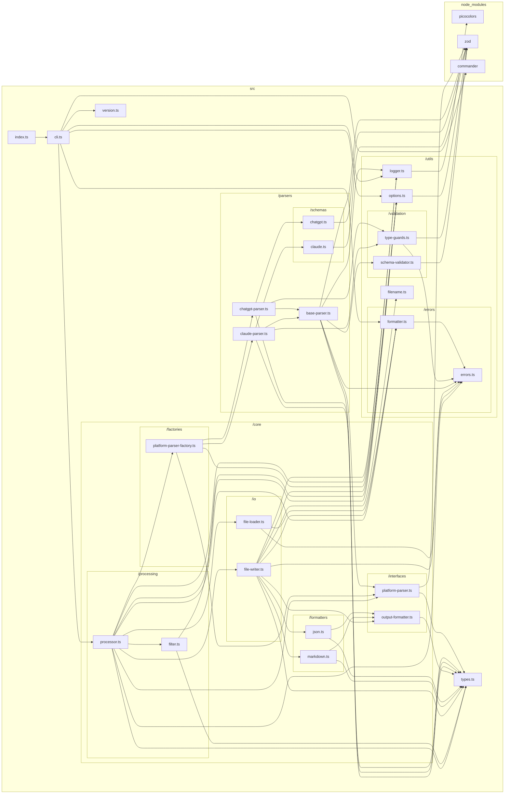

# TypeScript Graph

```bash
tsg --tsconfig ./tsconfig.json --LR --md docs/dependency-graphs/typescript-graph.md
```


```mermaid
flowchart LR
    subgraph src["src"]
        src/types.ts["types.ts"]
        src/version.ts["version.ts"]
        src/cli.ts["cli.ts"]
        src/index.ts["index.ts"]
        subgraph src/utils["/utils"]
            src/utils/logger.ts["logger.ts"]
            src/utils/options.ts["options.ts"]
            src/utils/filename.ts["filename.ts"]
            subgraph src/utils/errors["/errors"]
                src/utils/errors/errors.ts["errors.ts"]
                src/utils/errors/formatter.ts["formatter.ts"]
            end
            subgraph src/utils/validation["/validation"]
                src/utils/validation/type//guards.ts["type-guards.ts"]
                src/utils/validation/schema//validator.ts["schema-validator.ts"]
            end
        end
        subgraph src/core["/core"]
            subgraph src/core/interfaces["/interfaces"]
                src/core/interfaces/platform//parser.ts["platform-parser.ts"]
                src/core/interfaces/output//formatter.ts["output-formatter.ts"]
            end
            subgraph src/core/factories["/factories"]
                src/core/factories/platform//parser//factory.ts["platform-parser-factory.ts"]
            end
            subgraph src/core/io["/io"]
                src/core/io/file//loader.ts["file-loader.ts"]
                src/core/io/file//writer.ts["file-writer.ts"]
            end
            subgraph src/core/formatters["/formatters"]
                src/core/formatters/json.ts["json.ts"]
                src/core/formatters/markdown.ts["markdown.ts"]
            end
            subgraph src/core/processing["/processing"]
                src/core/processing/filter.ts["filter.ts"]
                src/core/processing/processor.ts["processor.ts"]
            end
        end
        subgraph src/parsers["/parsers"]
            src/parsers/base//parser.ts["base-parser.ts"]
            src/parsers/chatgpt//parser.ts["chatgpt-parser.ts"]
            src/parsers/claude//parser.ts["claude-parser.ts"]
            subgraph src/parsers/schemas["/schemas"]
                src/parsers/schemas/chatgpt.ts["chatgpt.ts"]
                src/parsers/schemas/claude.ts["claude.ts"]
            end
        end
    end
    subgraph node//modules["node_modules"]
        node//modules/picocolors/picocolors.d.ts["picocolors"]
        node//modules/zod/index.d.cts["zod"]
        node//modules/commander/typings/index.d.ts["commander"]
    end
    src/utils/errors/formatter.ts-->src/utils/errors/errors.ts
    src/utils/logger.ts-->node//modules/picocolors/picocolors.d.ts
    src/utils/options.ts-->node//modules/zod/index.d.cts
    src/utils/validation/type//guards.ts-->node//modules/zod/index.d.cts
    src/utils/validation/type//guards.ts-->src/utils/errors/errors.ts
    src/core/interfaces/platform//parser.ts-->node//modules/zod/index.d.cts
    src/core/interfaces/platform//parser.ts-->src/types.ts
    src/utils/validation/schema//validator.ts-->node//modules/zod/index.d.cts
    src/parsers/base//parser.ts-->node//modules/zod/index.d.cts
    src/parsers/base//parser.ts-->src/core/interfaces/platform//parser.ts
    src/parsers/base//parser.ts-->src/types.ts
    src/parsers/base//parser.ts-->src/utils/errors/errors.ts
    src/parsers/base//parser.ts-->src/utils/logger.ts
    src/parsers/base//parser.ts-->src/utils/validation/schema//validator.ts
    src/parsers/schemas/chatgpt.ts-->node//modules/zod/index.d.cts
    src/parsers/chatgpt//parser.ts-->src/types.ts
    src/parsers/chatgpt//parser.ts-->src/utils/validation/type//guards.ts
    src/parsers/chatgpt//parser.ts-->src/parsers/base//parser.ts
    src/parsers/chatgpt//parser.ts-->src/parsers/schemas/chatgpt.ts
    src/parsers/schemas/claude.ts-->node//modules/zod/index.d.cts
    src/parsers/claude//parser.ts-->src/types.ts
    src/parsers/claude//parser.ts-->src/utils/validation/type//guards.ts
    src/parsers/claude//parser.ts-->src/parsers/base//parser.ts
    src/parsers/claude//parser.ts-->src/parsers/schemas/claude.ts
    src/core/factories/platform//parser//factory.ts-->src/parsers/chatgpt//parser.ts
    src/core/factories/platform//parser//factory.ts-->src/parsers/claude//parser.ts
    src/core/factories/platform//parser//factory.ts-->src/utils/options.ts
    src/core/factories/platform//parser//factory.ts-->src/core/interfaces/platform//parser.ts
    src/core/io/file//loader.ts-->src/utils/errors/errors.ts
    src/core/io/file//loader.ts-->src/utils/errors/formatter.ts
    src/core/interfaces/output//formatter.ts-->src/types.ts
    src/core/formatters/json.ts-->src/types.ts
    src/core/formatters/json.ts-->src/core/interfaces/output//formatter.ts
    src/core/formatters/markdown.ts-->src/types.ts
    src/core/formatters/markdown.ts-->src/core/interfaces/output//formatter.ts
    src/core/io/file//writer.ts-->src/types.ts
    src/core/io/file//writer.ts-->src/utils/errors/errors.ts
    src/core/io/file//writer.ts-->src/utils/errors/formatter.ts
    src/core/io/file//writer.ts-->src/utils/filename.ts
    src/core/io/file//writer.ts-->src/utils/logger.ts
    src/core/io/file//writer.ts-->src/utils/options.ts
    src/core/io/file//writer.ts-->src/core/formatters/json.ts
    src/core/io/file//writer.ts-->src/core/formatters/markdown.ts
    src/core/io/file//writer.ts-->src/core/interfaces/output//formatter.ts
    src/core/processing/filter.ts-->src/types.ts
    src/core/processing/filter.ts-->src/utils/options.ts
    src/core/processing/processor.ts-->src/types.ts
    src/core/processing/processor.ts-->src/utils/errors/errors.ts
    src/core/processing/processor.ts-->src/utils/errors/formatter.ts
    src/core/processing/processor.ts-->src/utils/logger.ts
    src/core/processing/processor.ts-->src/utils/options.ts
    src/core/processing/processor.ts-->src/core/factories/platform//parser//factory.ts
    src/core/processing/processor.ts-->src/core/interfaces/platform//parser.ts
    src/core/processing/processor.ts-->src/core/io/file//loader.ts
    src/core/processing/processor.ts-->src/core/io/file//writer.ts
    src/core/processing/processor.ts-->src/core/processing/filter.ts
    src/cli.ts-->node//modules/commander/typings/index.d.ts
    src/cli.ts-->src/core/processing/processor.ts
    src/cli.ts-->src/utils/errors/formatter.ts
    src/cli.ts-->src/utils/logger.ts
    src/cli.ts-->src/utils/options.ts
    src/cli.ts-->src/version.ts
    src/index.ts-->src/cli.ts
```

