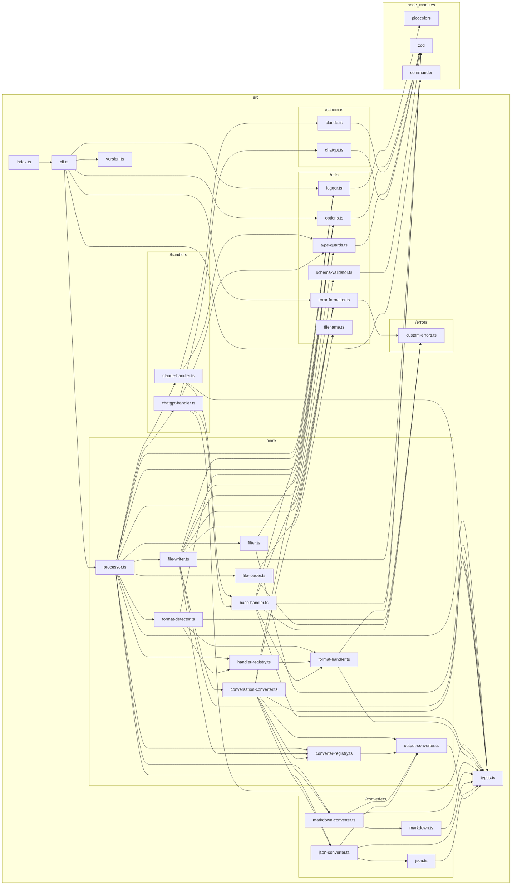

# TypeScript Graph

```bash
tsg --tsconfig ./tsconfig.dependency-graph.json --exclude tests --LR --md docs/dependency-graphs/typescript-graph.md
```


```mermaid
flowchart LR
    subgraph src["src"]
        src/types.ts["types.ts"]
        src/version.ts["version.ts"]
        src/cli.ts["cli.ts"]
        src/index.ts["index.ts"]
        subgraph src/core["/core"]
            src/core/output//converter.ts["output-converter.ts"]
            src/core/format//handler.ts["format-handler.ts"]
            src/core/base//handler.ts["base-handler.ts"]
            src/core/converter//registry.ts["converter-registry.ts"]
            src/core/file//loader.ts["file-loader.ts"]
            src/core/conversation//converter.ts["conversation-converter.ts"]
            src/core/file//writer.ts["file-writer.ts"]
            src/core/filter.ts["filter.ts"]
            src/core/handler//registry.ts["handler-registry.ts"]
            src/core/format//detector.ts["format-detector.ts"]
            src/core/processor.ts["processor.ts"]
        end
        subgraph src/converters["/converters"]
            src/converters/json.ts["json.ts"]
            src/converters/json//converter.ts["json-converter.ts"]
            src/converters/markdown.ts["markdown.ts"]
            src/converters/markdown//converter.ts["markdown-converter.ts"]
        end
        subgraph src/errors["/errors"]
            src/errors/custom//errors.ts["custom-errors.ts"]
        end
        subgraph src/utils["/utils"]
            src/utils/logger.ts["logger.ts"]
            src/utils/schema//validator.ts["schema-validator.ts"]
            src/utils/type//guards.ts["type-guards.ts"]
            src/utils/error//formatter.ts["error-formatter.ts"]
            src/utils/options.ts["options.ts"]
            src/utils/filename.ts["filename.ts"]
        end
        subgraph src/schemas["/schemas"]
            src/schemas/chatgpt.ts["chatgpt.ts"]
            src/schemas/claude.ts["claude.ts"]
        end
        subgraph src/handlers["/handlers"]
            src/handlers/chatgpt//handler.ts["chatgpt-handler.ts"]
            src/handlers/claude//handler.ts["claude-handler.ts"]
        end
    end
    subgraph node//modules["node_modules"]
        node//modules/picocolors/picocolors.d.ts["picocolors"]
        node//modules/zod/index.d.cts["zod"]
        node//modules/commander/typings/index.d.ts["commander"]
    end
    src/core/output//converter.ts-->src/types.ts
    src/converters/json.ts-->src/types.ts
    src/converters/json//converter.ts-->src/core/output//converter.ts
    src/converters/json//converter.ts-->src/types.ts
    src/converters/json//converter.ts-->src/converters/json.ts
    src/converters/markdown.ts-->src/types.ts
    src/converters/markdown//converter.ts-->src/core/output//converter.ts
    src/converters/markdown//converter.ts-->src/types.ts
    src/converters/markdown//converter.ts-->src/converters/markdown.ts
    src/utils/logger.ts-->node//modules/picocolors/picocolors.d.ts
    src/utils/schema//validator.ts-->node//modules/zod/index.d.cts
    src/core/format//handler.ts-->node//modules/zod/index.d.cts
    src/core/format//handler.ts-->src/types.ts
    src/core/base//handler.ts-->node//modules/zod/index.d.cts
    src/core/base//handler.ts-->src/errors/custom//errors.ts
    src/core/base//handler.ts-->src/types.ts
    src/core/base//handler.ts-->src/utils/logger.ts
    src/core/base//handler.ts-->src/utils/schema//validator.ts
    src/core/base//handler.ts-->src/core/format//handler.ts
    src/schemas/chatgpt.ts-->node//modules/zod/index.d.cts
    src/utils/type//guards.ts-->node//modules/zod/index.d.cts
    src/handlers/chatgpt//handler.ts-->src/core/base//handler.ts
    src/handlers/chatgpt//handler.ts-->src/schemas/chatgpt.ts
    src/handlers/chatgpt//handler.ts-->src/types.ts
    src/handlers/chatgpt//handler.ts-->src/utils/type//guards.ts
    src/schemas/claude.ts-->node//modules/zod/index.d.cts
    src/handlers/claude//handler.ts-->src/core/base//handler.ts
    src/handlers/claude//handler.ts-->src/schemas/claude.ts
    src/handlers/claude//handler.ts-->src/types.ts
    src/handlers/claude//handler.ts-->src/utils/type//guards.ts
    src/utils/error//formatter.ts-->src/errors/custom//errors.ts
    src/utils/options.ts-->node//modules/zod/index.d.cts
    src/core/converter//registry.ts-->src/core/output//converter.ts
    src/core/file//loader.ts-->src/errors/custom//errors.ts
    src/core/file//loader.ts-->src/utils/error//formatter.ts
    src/core/conversation//converter.ts-->src/converters/json//converter.ts
    src/core/conversation//converter.ts-->src/converters/markdown//converter.ts
    src/core/conversation//converter.ts-->src/types.ts
    src/core/conversation//converter.ts-->src/utils/error//formatter.ts
    src/core/conversation//converter.ts-->src/utils/options.ts
    src/core/conversation//converter.ts-->src/core/converter//registry.ts
    src/core/conversation//converter.ts-->src/core/output//converter.ts
    src/core/file//writer.ts-->node//modules/zod/index.d.cts
    src/core/file//writer.ts-->src/types.ts
    src/core/file//writer.ts-->src/utils/error//formatter.ts
    src/core/file//writer.ts-->src/utils/filename.ts
    src/core/file//writer.ts-->src/utils/logger.ts
    src/core/file//writer.ts-->src/utils/options.ts
    src/core/file//writer.ts-->src/utils/type//guards.ts
    src/core/file//writer.ts-->src/core/conversation//converter.ts
    src/core/file//writer.ts-->src/core/converter//registry.ts
    src/core/filter.ts-->src/types.ts
    src/core/filter.ts-->src/utils/options.ts
    src/core/handler//registry.ts-->src/core/format//handler.ts
    src/core/format//detector.ts-->src/errors/custom//errors.ts
    src/core/format//detector.ts-->src/utils/options.ts
    src/core/format//detector.ts-->src/core/format//handler.ts
    src/core/format//detector.ts-->src/core/handler//registry.ts
    src/core/processor.ts-->src/converters/json//converter.ts
    src/core/processor.ts-->src/converters/markdown//converter.ts
    src/core/processor.ts-->src/handlers/chatgpt//handler.ts
    src/core/processor.ts-->src/handlers/claude//handler.ts
    src/core/processor.ts-->src/types.ts
    src/core/processor.ts-->src/utils/error//formatter.ts
    src/core/processor.ts-->src/utils/logger.ts
    src/core/processor.ts-->src/utils/options.ts
    src/core/processor.ts-->src/core/converter//registry.ts
    src/core/processor.ts-->src/core/file//loader.ts
    src/core/processor.ts-->src/core/file//writer.ts
    src/core/processor.ts-->src/core/filter.ts
    src/core/processor.ts-->src/core/format//detector.ts
    src/core/processor.ts-->src/core/handler//registry.ts
    src/cli.ts-->node//modules/commander/typings/index.d.ts
    src/cli.ts-->src/core/processor.ts
    src/cli.ts-->src/utils/error//formatter.ts
    src/cli.ts-->src/utils/logger.ts
    src/cli.ts-->src/utils/options.ts
    src/cli.ts-->src/version.ts
    src/index.ts-->src/cli.ts
```

