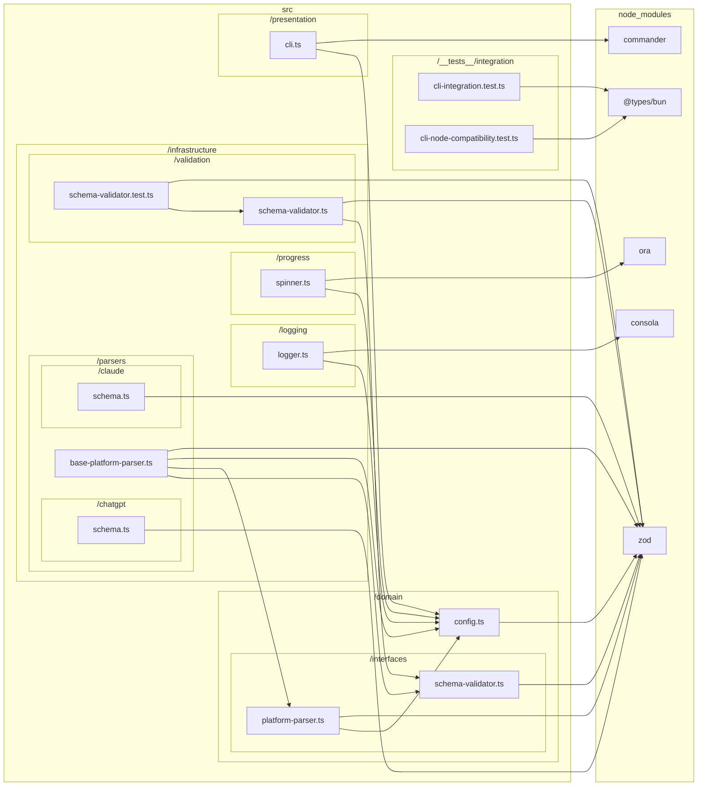

# TypeScript Graph

```bash
tsg --tsconfig tsconfig.json --LR --include node_modules --md docs/reports/dependencies/external.md
```


```mermaid
flowchart LR
    subgraph node//modules["node_modules"]
        node//modules///types/bun/index.d.ts["@types/bun"]
        node//modules/zod/index.d.cts["zod"]
        node//modules/consola/dist/index.d.cts["consola"]
        node//modules/ora/index.d.ts["ora"]
        node//modules/commander/typings/index.d.ts["commander"]
    end
    subgraph src["src"]
        subgraph src/////tests/////integration["/__tests__/integration"]
            src/////tests/////integration/cli//integration.test.ts["cli-integration.test.ts"]
            src/////tests/////integration/cli//node//compatibility.test.ts["cli-node-compatibility.test.ts"]
        end
        subgraph src/domain["/domain"]
            src/domain/config.ts["config.ts"]
            subgraph src/domain/interfaces["/interfaces"]
                src/domain/interfaces/platform//parser.ts["platform-parser.ts"]
                src/domain/interfaces/schema//validator.ts["schema-validator.ts"]
            end
        end
        subgraph src/infrastructure["/infrastructure"]
            subgraph src/infrastructure/logging["/logging"]
                src/infrastructure/logging/logger.ts["logger.ts"]
            end
            subgraph src/infrastructure/parsers["/parsers"]
                src/infrastructure/parsers/base//platform//parser.ts["base-platform-parser.ts"]
                subgraph src/infrastructure/parsers/chatgpt["/chatgpt"]
                    src/infrastructure/parsers/chatgpt/schema.ts["schema.ts"]
                end
                subgraph src/infrastructure/parsers/claude["/claude"]
                    src/infrastructure/parsers/claude/schema.ts["schema.ts"]
                end
            end
            subgraph src/infrastructure/progress["/progress"]
                src/infrastructure/progress/spinner.ts["spinner.ts"]
            end
            subgraph src/infrastructure/validation["/validation"]
                src/infrastructure/validation/schema//validator.ts["schema-validator.ts"]
                src/infrastructure/validation/schema//validator.test.ts["schema-validator.test.ts"]
            end
        end
        subgraph src/presentation["/presentation"]
            src/presentation/cli.ts["cli.ts"]
        end
    end
    src/////tests/////integration/cli//integration.test.ts-->node//modules///types/bun/index.d.ts
    src/////tests/////integration/cli//node//compatibility.test.ts-->node//modules///types/bun/index.d.ts
    src/domain/config.ts-->node//modules/zod/index.d.cts
    src/domain/interfaces/platform//parser.ts-->node//modules/zod/index.d.cts
    src/domain/interfaces/schema//validator.ts-->node//modules/zod/index.d.cts
    src/infrastructure/logging/logger.ts-->node//modules/consola/dist/index.d.cts
    src/infrastructure/parsers/base//platform//parser.ts-->node//modules/zod/index.d.cts
    src/infrastructure/progress/spinner.ts-->node//modules/ora/index.d.ts
    src/infrastructure/validation/schema//validator.ts-->node//modules/zod/index.d.cts
    src/infrastructure/parsers/chatgpt/schema.ts-->node//modules/zod/index.d.cts
    src/infrastructure/parsers/claude/schema.ts-->node//modules/zod/index.d.cts
    src/infrastructure/validation/schema//validator.test.ts-->node//modules/zod/index.d.cts
    src/presentation/cli.ts-->node//modules/commander/typings/index.d.ts
    src/domain/interfaces/platform//parser.ts-->src/domain/config.ts
    src/infrastructure/logging/logger.ts-->src/domain/config.ts
    src/infrastructure/parsers/base//platform//parser.ts-->src/domain/config.ts
    src/infrastructure/parsers/base//platform//parser.ts-->src/domain/interfaces/platform//parser.ts
    src/infrastructure/parsers/base//platform//parser.ts-->src/domain/interfaces/schema//validator.ts
    src/infrastructure/progress/spinner.ts-->src/domain/config.ts
    src/infrastructure/validation/schema//validator.ts-->src/domain/interfaces/schema//validator.ts
    src/infrastructure/validation/schema//validator.test.ts-->src/infrastructure/validation/schema//validator.ts
    src/presentation/cli.ts-->src/domain/config.ts
```

