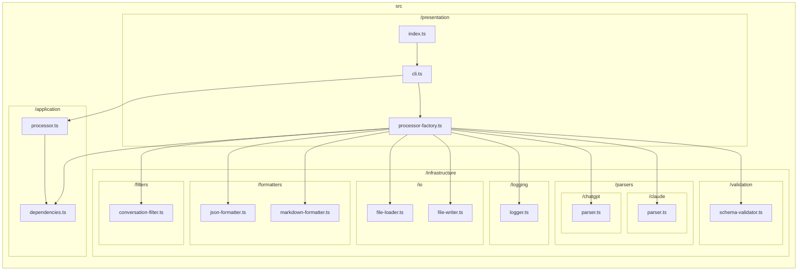

# TypeScript Graph

```bash
tsg --tsconfig tsconfig.build.json --LR --include src/presentation/cli.ts --include src/presentation/processor-factory.ts --include src/application/processor.ts --exclude src/domain --exclude node_modules --md docs/reports/dependencies/flow.md
```



