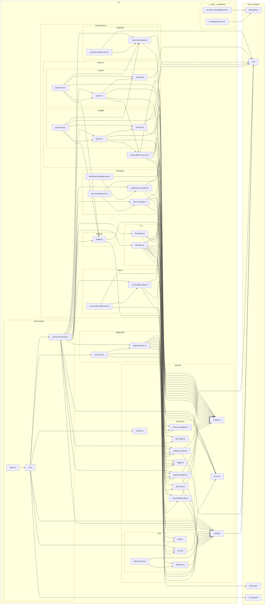

# TypeScript Graph

```bash
tsg --tsconfig tsconfig.json --LR --md docs/reports/dependencies-with-tests.md
```


```mermaid
flowchart LR
    subgraph src["src"]
        subgraph src/////tests/////integration["/__tests__/integration"]
            src/////tests/////integration/cli//integration.test.ts["cli-integration.test.ts"]
            src/////tests/////integration/cli//node//compatibility.test.ts["cli-node-compatibility.test.ts"]
        end
        subgraph src/domain["/domain"]
            src/domain/config.ts["config.ts"]
            src/domain/entities.ts["entities.ts"]
            src/domain/errors.ts["errors.ts"]
            src/domain/version.ts["version.ts"]
            subgraph src/domain/interfaces["/interfaces"]
                src/domain/interfaces/conversation//filter.ts["conversation-filter.ts"]
                src/domain/interfaces/file//loader.ts["file-loader.ts"]
                src/domain/interfaces/file//writer.ts["file-writer.ts"]
                src/domain/interfaces/logger.ts["logger.ts"]
                src/domain/interfaces/output//formatter.ts["output-formatter.ts"]
                src/domain/interfaces/platform//parser.ts["platform-parser.ts"]
                src/domain/interfaces/schema//validator.ts["schema-validator.ts"]
            end
            subgraph src/domain/utils["/utils"]
                src/domain/utils/path.ts["path.ts"]
                src/domain/utils/error.ts["error.ts"]
                src/domain/utils/filename.ts["filename.ts"]
                src/domain/utils/filename.test.ts["filename.test.ts"]
            end
        end
        subgraph src/application["/application"]
            src/application/depend_encies.ts["dependencies.ts"]
            src/application/processor.ts["processor.ts"]
        end
        subgraph src/infrastructure["/infrastructure"]
            subgraph src/infrastructure/filters["/filters"]
                src/infrastructure/filters/conversation//filter.ts["conversation-filter.ts"]
                src/infrastructure/filters/conversation//filter.test.ts["conversation-filter.test.ts"]
            end
            subgraph src/infrastructure/formatters["/formatters"]
                src/infrastructure/formatters/json//formatter.ts["json-formatter.ts"]
                src/infrastructure/formatters/json//formatter.test.ts["json-formatter.test.ts"]
                src/infrastructure/formatters/markdown//formatter.ts["markdown-formatter.ts"]
                src/infrastructure/formatters/markdown//formatter.test.ts["markdown-formatter.test.ts"]
            end
            subgraph src/infrastructure/io["/io"]
                src/infrastructure/io/file//loader.ts["file-loader.ts"]
                src/infrastructure/io/file//writer.ts["file-writer.ts"]
            end
            subgraph src/infrastructure/logging["/logging"]
                src/infrastructure/logging/logger.ts["logger.ts"]
            end
            subgraph src/infrastructure/parsers["/parsers"]
                src/infrastructure/parsers/base//platform//parser.ts["base-platform-parser.ts"]
                subgraph src/infrastructure/parsers/chatgpt["/chatgpt"]
                    src/infrastructure/parsers/chatgpt/schema.ts["schema.ts"]
                    src/infrastructure/parsers/chatgpt/parser.ts["parser.ts"]
                    src/infrastructure/parsers/chatgpt/parser.test.ts["parser.test.ts"]
                end
                subgraph src/infrastructure/parsers/claude["/claude"]
                    src/infrastructure/parsers/claude/schema.ts["schema.ts"]
                    src/infrastructure/parsers/claude/parser.ts["parser.ts"]
                    src/infrastructure/parsers/claude/parser.test.ts["parser.test.ts"]
                end
            end
            subgraph src/infrastructure/validation["/validation"]
                src/infrastructure/validation/schema//validator.ts["schema-validator.ts"]
                src/infrastructure/validation/schema//validator.test.ts["schema-validator.test.ts"]
            end
        end
        subgraph src/presentation["/presentation"]
            src/presentation/processor//factory.ts["processor-factory.ts"]
            src/presentation/cli.ts["cli.ts"]
            src/presentation/index.ts["index.ts"]
        end
    end
    subgraph node//modules["node_modules"]
        node//modules///types/bun/index.d.ts["@types/bun"]
        node//modules/zod/index.d.cts["zod"]
        node//modules/picocolors/picocolors.d.ts["picocolors"]
        node//modules/commander/typings/index.d.ts["commander"]
    end
    src/////tests/////integration/cli//integration.test.ts-->node//modules///types/bun/index.d.ts
    src/////tests/////integration/cli//node//compatibility.test.ts-->node//modules///types/bun/index.d.ts
    src/domain/config.ts-->node//modules/zod/index.d.cts
    src/domain/interfaces/conversation//filter.ts-->src/domain/config.ts
    src/domain/interfaces/conversation//filter.ts-->src/domain/entities.ts
    src/domain/interfaces/file//writer.ts-->src/domain/config.ts
    src/domain/interfaces/file//writer.ts-->src/domain/entities.ts
    src/domain/interfaces/output//formatter.ts-->src/domain/config.ts
    src/domain/interfaces/output//formatter.ts-->src/domain/entities.ts
    src/domain/interfaces/platform//parser.ts-->node//modules/zod/index.d.cts
    src/domain/interfaces/platform//parser.ts-->src/domain/entities.ts
    src/domain/interfaces/schema//validator.ts-->node//modules/zod/index.d.cts
    src/application/depend_encies.ts-->src/domain/interfaces/conversation//filter.ts
    src/application/depend_encies.ts-->src/domain/interfaces/file//loader.ts
    src/application/depend_encies.ts-->src/domain/interfaces/file//writer.ts
    src/application/depend_encies.ts-->src/domain/interfaces/logger.ts
    src/application/depend_encies.ts-->src/domain/interfaces/output//formatter.ts
    src/application/depend_encies.ts-->src/domain/interfaces/platform//parser.ts
    src/application/depend_encies.ts-->src/domain/interfaces/schema//validator.ts
    src/application/processor.ts-->src/domain/config.ts
    src/application/processor.ts-->src/domain/utils/path.ts
    src/application/processor.ts-->src/application/depend_encies.ts
    src/domain/utils/error.ts-->src/domain/errors.ts
    src/domain/utils/filename.ts-->src/domain/config.ts
    src/domain/utils/filename.test.ts-->src/domain/config.ts
    src/domain/utils/filename.test.ts-->src/domain/utils/filename.ts
    src/infrastructure/filters/conversation//filter.ts-->src/domain/config.ts
    src/infrastructure/filters/conversation//filter.ts-->src/domain/entities.ts
    src/infrastructure/filters/conversation//filter.ts-->src/domain/interfaces/conversation//filter.ts
    src/infrastructure/filters/conversation//filter.test.ts-->src/domain/config.ts
    src/infrastructure/filters/conversation//filter.test.ts-->src/domain/entities.ts
    src/infrastructure/filters/conversation//filter.test.ts-->src/infrastructure/filters/conversation//filter.ts
    src/infrastructure/formatters/json//formatter.ts-->src/domain/config.ts
    src/infrastructure/formatters/json//formatter.ts-->src/domain/entities.ts
    src/infrastructure/formatters/json//formatter.ts-->src/domain/interfaces/output//formatter.ts
    src/infrastructure/formatters/json//formatter.test.ts-->src/domain/entities.ts
    src/infrastructure/formatters/json//formatter.test.ts-->src/infrastructure/formatters/json//formatter.ts
    src/infrastructure/formatters/markdown//formatter.ts-->src/domain/config.ts
    src/infrastructure/formatters/markdown//formatter.ts-->src/domain/entities.ts
    src/infrastructure/formatters/markdown//formatter.ts-->src/domain/interfaces/output//formatter.ts
    src/infrastructure/formatters/markdown//formatter.test.ts-->src/domain/entities.ts
    src/infrastructure/formatters/markdown//formatter.test.ts-->src/infrastructure/formatters/markdown//formatter.ts
    src/infrastructure/io/file//loader.ts-->src/domain/errors.ts
    src/infrastructure/io/file//loader.ts-->src/domain/interfaces/file//loader.ts
    src/infrastructure/io/file//loader.ts-->src/domain/utils/error.ts
    src/infrastructure/io/file//writer.ts-->src/domain/config.ts
    src/infrastructure/io/file//writer.ts-->src/domain/entities.ts
    src/infrastructure/io/file//writer.ts-->src/domain/errors.ts
    src/infrastructure/io/file//writer.ts-->src/domain/interfaces/file//writer.ts
    src/infrastructure/io/file//writer.ts-->src/domain/interfaces/logger.ts
    src/infrastructure/io/file//writer.ts-->src/domain/interfaces/output//formatter.ts
    src/infrastructure/io/file//writer.ts-->src/domain/utils/error.ts
    src/infrastructure/io/file//writer.ts-->src/domain/utils/filename.ts
    src/infrastructure/io/file//writer.ts-->src/domain/utils/path.ts
    src/infrastructure/logging/logger.ts-->node//modules/picocolors/picocolors.d.ts
    src/infrastructure/logging/logger.ts-->src/domain/interfaces/logger.ts
    src/infrastructure/parsers/base//platform//parser.ts-->node//modules/zod/index.d.cts
    src/infrastructure/parsers/base//platform//parser.ts-->src/domain/entities.ts
    src/infrastructure/parsers/base//platform//parser.ts-->src/domain/errors.ts
    src/infrastructure/parsers/base//platform//parser.ts-->src/domain/interfaces/logger.ts
    src/infrastructure/parsers/base//platform//parser.ts-->src/domain/interfaces/platform//parser.ts
    src/infrastructure/parsers/base//platform//parser.ts-->src/domain/interfaces/schema//validator.ts
    src/infrastructure/validation/schema//validator.ts-->node//modules/zod/index.d.cts
    src/infrastructure/validation/schema//validator.ts-->src/domain/interfaces/schema//validator.ts
    src/infrastructure/parsers/chatgpt/schema.ts-->node//modules/zod/index.d.cts
    src/infrastructure/parsers/chatgpt/schema.ts-->src/domain/entities.ts
    src/infrastructure/parsers/chatgpt/parser.ts-->src/domain/entities.ts
    src/infrastructure/parsers/chatgpt/parser.ts-->src/domain/interfaces/platform//parser.ts
    src/infrastructure/parsers/chatgpt/parser.ts-->src/infrastructure/parsers/base//platform//parser.ts
    src/infrastructure/parsers/chatgpt/parser.ts-->src/infrastructure/parsers/chatgpt/schema.ts
    src/infrastructure/parsers/chatgpt/parser.test.ts-->src/domain/entities.ts
    src/infrastructure/parsers/chatgpt/parser.test.ts-->src/infrastructure/logging/logger.ts
    src/infrastructure/parsers/chatgpt/parser.test.ts-->src/infrastructure/validation/schema//validator.ts
    src/infrastructure/parsers/chatgpt/parser.test.ts-->src/infrastructure/parsers/chatgpt/parser.ts
    src/infrastructure/parsers/chatgpt/parser.test.ts-->src/infrastructure/parsers/chatgpt/schema.ts
    src/infrastructure/parsers/claude/schema.ts-->node//modules/zod/index.d.cts
    src/infrastructure/parsers/claude/parser.ts-->src/domain/entities.ts
    src/infrastructure/parsers/claude/parser.ts-->src/domain/interfaces/platform//parser.ts
    src/infrastructure/parsers/claude/parser.ts-->src/infrastructure/parsers/base//platform//parser.ts
    src/infrastructure/parsers/claude/parser.ts-->src/infrastructure/parsers/claude/schema.ts
    src/infrastructure/parsers/claude/parser.test.ts-->src/domain/entities.ts
    src/infrastructure/parsers/claude/parser.test.ts-->src/infrastructure/logging/logger.ts
    src/infrastructure/parsers/claude/parser.test.ts-->src/infrastructure/validation/schema//validator.ts
    src/infrastructure/parsers/claude/parser.test.ts-->src/infrastructure/parsers/claude/parser.ts
    src/infrastructure/parsers/claude/parser.test.ts-->src/infrastructure/parsers/claude/schema.ts
    src/infrastructure/validation/schema//validator.test.ts-->node//modules/zod/index.d.cts
    src/infrastructure/validation/schema//validator.test.ts-->src/infrastructure/validation/schema//validator.ts
    src/presentation/processor//factory.ts-->src/application/depend_encies.ts
    src/presentation/processor//factory.ts-->src/domain/config.ts
    src/presentation/processor//factory.ts-->src/domain/errors.ts
    src/presentation/processor//factory.ts-->src/domain/interfaces/output//formatter.ts
    src/presentation/processor//factory.ts-->src/domain/interfaces/platform//parser.ts
    src/presentation/processor//factory.ts-->src/infrastructure/filters/conversation//filter.ts
    src/presentation/processor//factory.ts-->src/infrastructure/formatters/json//formatter.ts
    src/presentation/processor//factory.ts-->src/infrastructure/formatters/markdown//formatter.ts
    src/presentation/processor//factory.ts-->src/infrastructure/io/file//loader.ts
    src/presentation/processor//factory.ts-->src/infrastructure/io/file//writer.ts
    src/presentation/processor//factory.ts-->src/infrastructure/logging/logger.ts
    src/presentation/processor//factory.ts-->src/infrastructure/parsers/chatgpt/parser.ts
    src/presentation/processor//factory.ts-->src/infrastructure/parsers/claude/parser.ts
    src/presentation/processor//factory.ts-->src/infrastructure/validation/schema//validator.ts
    src/presentation/cli.ts-->node//modules/commander/typings/index.d.ts
    src/presentation/cli.ts-->src/application/processor.ts
    src/presentation/cli.ts-->src/domain/config.ts
    src/presentation/cli.ts-->src/domain/utils/error.ts
    src/presentation/cli.ts-->src/domain/version.ts
    src/presentation/cli.ts-->src/presentation/processor//factory.ts
    src/presentation/index.ts-->src/presentation/cli.ts
```

